# How to Create a New Repository and Upload the code to GitHub

1. Create a new repository on GitHub by clicking on New repository
  
  
2. Give the repository a name, set it to `Public`, and check `Initialize this repository with a README`.

  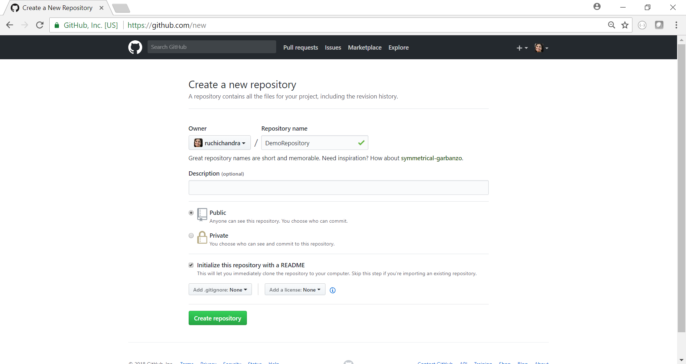

3. Your new repository has been created and it looks like this. Now click on `Clone or download`  and copy the link associated with your new repository from GitHub.

  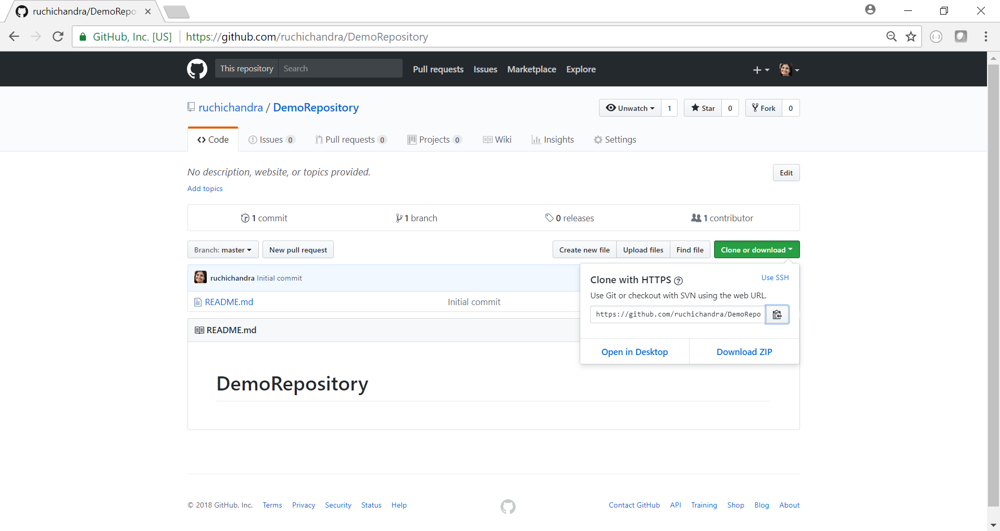

4. Open the Bash (or Terminal) window.

  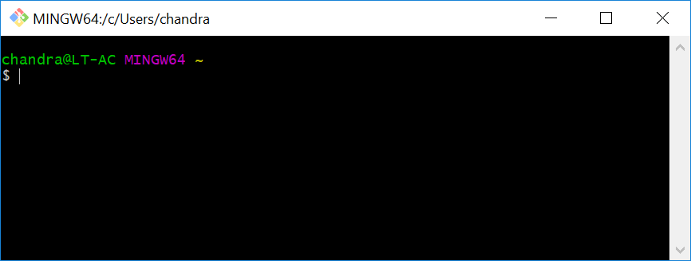
  
5. Using Console, navigate into a folder where you’d like to download your code. In this case, I’m navigating into a folder called RutgersDataBootcamp in my c: Drive. In your case, it can be anywhere on your computer where you want to download code. 

  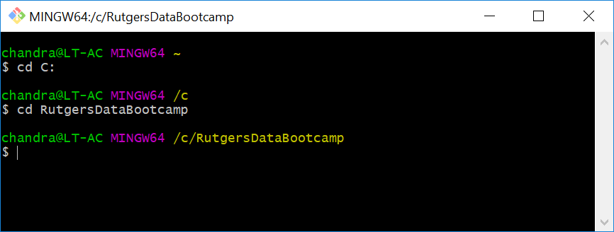

6. In console, type the command `git clone ` and paste the link to your GitHub repository in that blank space. Your screen should look something like this. If the URL that you copied in Step 3 is `https://github.com/ruchichandra/DemoRepository.git`, the command here would be `git clone https://github.com/ruchichandra/DemoRepository.git`.

  
 
7. If you navigate to that folder using file explorer / finder, you will see a new folder with the same name as your repository has been downloaded.

  
  
8. Go into that folder and you will see that it currently has a README file. This folder is now linked to Git.
 
  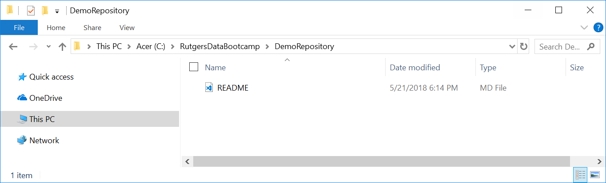

9. Create a new Python file (or use an old one). Save that file inside your local repository folder.

  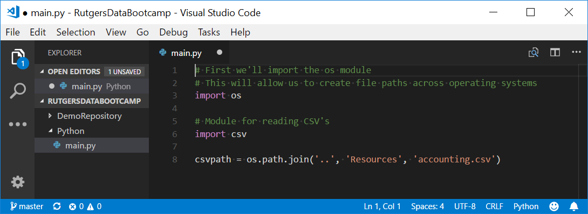

10. In console, navigate into the folder associated with your code using the cd command.

  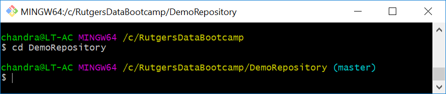

11. Next, type the command git add –A. This will tell git to notice the addition of the new Python file. If this command runs successfully, you shouldn’t see anything happen.

  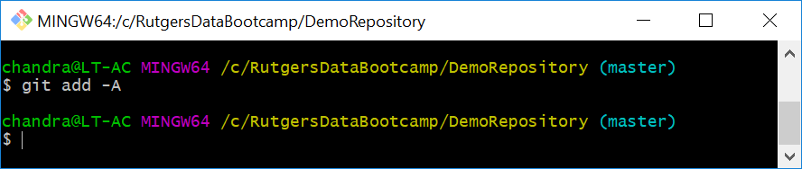

12. Type the command `git commit –m “_____”` and place a meaningful comment in the quotes. This will save your changes locally. For example, if adding a blank Python file, you might type, `git commit -m "initialize python file"`. Note that the message *must* be enclosed in quotation marks.

  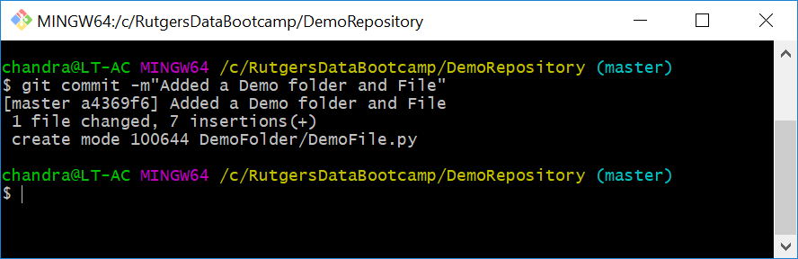

13. Type the final command, `git push origin master`. Enter your GitHub username and password if asked.

  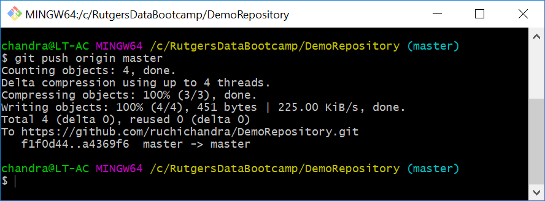
  
14. Go back to the GitHub repository, and you should see that your file has been uploaded.

  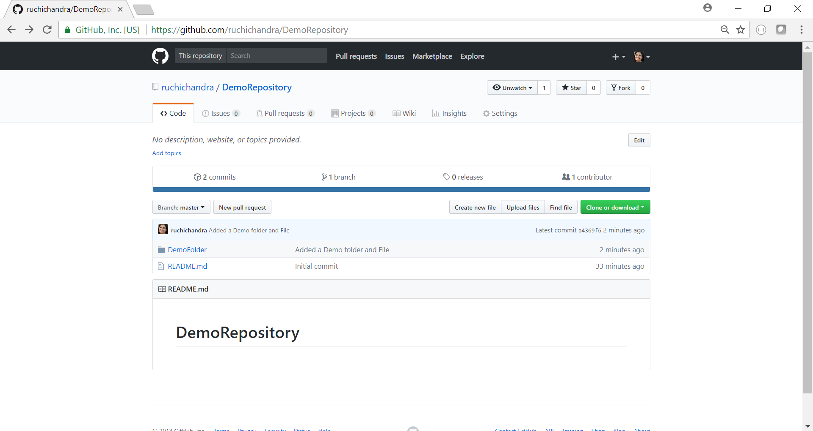
  
15. **Success!!**

  

