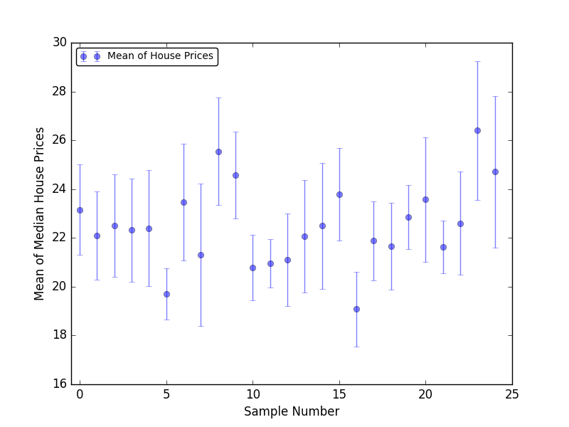

## 5.3 Lesson Plan - Introduction to Statistics

### Overview

Today's class formally treats a number of topics from basic statistics, including measures of central tendency; variance; standard errors; and error bars.

### Instructor Priorities

* Students should be able to describe the meaning of each of the three basic measures of central tendency — mean, median, and mode.

* Students should be able to choose the appropriate measure of central tendency to describe a given data set.

* Students should be able to describe what variance reveals about a data set.

* Students should be able to describe the difference between a sample and a population.

* Students should be able to describe the meaning of standard error.

* Students should be able to add error bars to plots generated with Matplotlib.

* Students should be able to describe the utility of fitting curves to data.

### Instructor Notes

* To minimize the extent to which today's lesson might feel thematic discontinuous with the previous days' work with Matplotlib, emphasize taking a _graphical_ approach to understanding today's concepts.

* The goal with today's material is to empower students to use statistical tools to describe and discuss data. To that end, emphasize a _conceptual_ understanding of the material, rather than familiarity with the formulas and formal definitions of each term and quantity.

* Have your TAs refer to the [Time Tracker](TimeTracker.xlsx) to keep pace.

### Sample Class Video (Highly Recommended)

* To view an example class lecture visit (Note video may not reflect latest lesson plan): [Class Video](https://codingbootcamp.hosted.panopto.com/Panopto/Pages/Viewer.aspx?id=34a319b8-0492-4c84-9e22-562643ad52d5)

- - -

### Class Objectives

* Students will be able to define **mean**, **median**, and **mode**, and choose which one is most appropriate to describe a given data set.

* Students will be able to explain the meaning of variance and standard deviation.

* Students will be able to describe standard error and the difference between a sample and a population.

* Students will be able to add error bars to their plots.

* Students will be able to fit lines to their data.

- - -

### 1. Instructor Do: Introduction to Statistics (0:10)

* Welcome students to class, and explain that today's lesson will focus on using statistics fundamentals with Matplotlib.

* Explain that class will begin with a review of mean, median, and mode, and when to use which measure to describe a data set.

* Begin by defining each term.

  * Explain that the **mode** of a data set is the **most frequently occurring element**.

  * For example, in a list like `[1, 1, 2]`, 1 would be the mode.

* Explain that the **median** of a data set is the middle element.

  * Explain that, to find the median, we first sort the data, and select the middle element. In `[1, 2, 3]`, 2 is the median.

  * Point out that, for even-length data sets, we have _two_ elements in the middle of the list.

* Explain that we generally return the **average** of the two elements as the median of such a list.

* Explain that the **mean** of a data set is what is commonly called the _average_ of a data set.

  * Remind students that, to calculate the mean, we sum all of the numbers in the data set, and divide by the length of the data set.

* Explain that the purpose of each of these numbers is to allow us to describe an entire data set with a single number.

  * Point out that, while each of these numbers allows us to describe a data set, they are not always equally descriptive.

* Explain that the median is a good choice for describing just about any data set.

  * Take, as example, these prices from a local department store: `[30, 31, 31, 32, 32, 40, 41, 41, 1000]`.

  * In this case, _most_ of the prices fall between 30 and 41.

  * Point out that the median, 32, is a reasonable description of the "average" price in the data set.

  * Point out that the mean, which works out to 142, does not describe the data very well — in fact, the mean is a different order of magnitude than _any_ of the prices in the data set!

  * Explain that this illustrates that the median tends to give relatively faithful descriptions even in the face of outliers, such as 1000.

  * Explain that, in general, the median is more "resistant" to extreme fluctuations in data than the mean.

  * Explain that this property often makes the median a better choice than the mean, in spite of the fact that the mean is more common.

  * Explain that students can [almost always safely use the median to describe their data](https://learnandteachstatistics.wordpress.com/2013/04/29/median/).

  * Explain that the median is particularly faithful for data sets that have a large number of values that are low, or a large number that are high.

  * Point out that our price data fits this description: Most of it is low, but there is _one_ value that is high.

  * Explain that data with this property is called _skewed_.

  * Point out that, in these cases, the extreme values _outside_ of the cluster of typical values changes the mean disproportionately, but the median remains relatively unaffected, and still faithfully represents the data.

* Point out that, sometimes, we might have data where values cluster in _several_ places.

* Consider this longer list of prices: `[30, 31, 31, 32, 32, 40, 41, 41, 1000, 1210, 1210, 1567]`

  * Point out that, in this case, the mean, 438.75, still differs from the typical price in either the low or high clusters by an order of magnitude.

  * Point out that the median, 40.5, also doesn't adequately describe the data.

  * _Most_ prices are close to 40.5, but a large number of them — 30% — are much higher.

* Explain that data like this, which has two or more _clusters_ of data that are spread apart from one another, is often best described by the **mode**.

* Explain that this is because a data set can only have one median or mean, but multiple modes; and that the list of modes is likely to contain numbers from each cluster.

  * Point out that, in this case, the modes are 31, 32, 41, and 1210, numbers which _do_ represent the spread of the data quite nicely.

* Point out that, if this data set had included only one instance of 1210, this "trick" would not work.

  * Explain that this is a valid concern, but that in data sets of sufficient size — like most real-world data sets students will work with — "big clusters" will each often contain a mode.

  * Point out that, if this is not the case, students can describe the data using the modes alongside the median.

* Finally, explain that the **mean** is most useful for describing data that are close together.

  * Consider the list of only low prices: `[30, 31, 31, 32, 32, 40, 41, 41]`.

  * In this case, the mean, 34.75, _is_ an accurate summary of the price data.

  * Point out that real data sets are often more "spread out" than this, and that it is difficult to guarantee that a data set does not contain extreme values that skew the mean.

  * Explain that, if our data _does_ have this property, the mean is a useful descriptor.

  * Reiterate that the median remains a good default statistic, even in these cases, as it will be fairly close to the mean — for this data set, the median is 32, which is just as "accurate" a summary as 34.75.

  * Explain that one important potential advantage of the mean over the median is that it factors in _every value of the data set_, which the median and mode do _not_.

* Briefly discuss the data sets in the samples file: [01-Ins_Mean_Median_Mode/samples.ipynb](Activities/01-Ins_Mean_Median_Mode/Unsolved/samples.ipynb).

  * Have students explain which measures would be best for each one.

  * The solutions to this exercise are available in the solved version of this file: [01-Ins_Mean_Median_Mode/samples.ipynb](Activities/01-Ins_Mean_Median_Mode/Solved/samples.ipynb).

* Slack out the solved directory: [01-Ins_Mean_Median_Mode/Solved](Activities/01-Ins_Mean_Median_Mode/Solved).

### 2. Instructor Do: Variance and Standard Score (0:10)

* Explain that, while the mean, median, and mode allow us to summarize our data succinctly, there are important aspects of data that they do not reveal.

* Explain that one of the most important aspects that they fail to describe is how _spread out_ the data is.

* For example, consider these two lists: `[3, 4, 5, 6, 7]` and `[-1525, -200, 5, 745, 1000]`.

  * For both of these data sets, the mean and median are 5 — but they are _obviously_ different!

* Point out that these data sets are different in how _spread out_ the data is, something that the mean, median, and mode cannot capture.

* Explain that important statistics that measure spread are **variance**, **standard deviation**, and **z-score**.

  * Explain that the **variance** of a data set is a single number that describes how "far apart" its values are.

  * Optionally, [display the formula for variance](http://davidmlane.com/hyperstat/A16252.html).

  * Briefly explain that variance is calculated by subtracting the mean of the data set from every number in the data set; squaring each difference; summing the squares; and then dividing the sum by the number of items in the data set.

  * Do not belabor the definition, and emphasize that students do not need to remember it — all of the numerical libraries they will work with have functions for calculating variance built-in.

* Explain that the more "spread out" a data set is, the higher its variance.

  * Explain that, for the data set `[3, 4, 5, 6, 7]`, the variance is 2.

  * Explain that, for the data set `[-1525, -200, 5, 745, 1000]`, the variance is 784,110.

  * Point out that this suits are intuition: The second data set _spreads_ more than the first, so its variance should be higher.

* Explain that the **standard deviation** is simply the square root of the variance.

* Explain that, when we take the variance of data, it is measured in units _squared_.

  * For example, the variance of a data set containing the heights of average Australians would be in units of inches (or centimeters) _squared_.

  * Point out that it is not natural to talk about how much a data set measured in inches spreads in terms of _square_ inches — it makes more sense to talk about how much data measured in inches spreads in terms of _inches_.

* Explain that this is one of the motivators for using the standard deviation instead of the variance: It is easier to interpret.

  * Point out that the standard deviation for the data set `[3, 4, 5, 6, 7]` is approximately 1.414.

  * Point out that the standard deviation for the data set `[-1525, -200, 5, 745, 1000]` is approximately 885.5.

  * Point out that these numbers intuitively make more sense relative to the data sets they describe than the variances do.

* Explain that NumPy, Pandas, etc., also provide functions for calculating the standard deviation of a data set.

* Explain that the we often use the standard deviation as a unit to describe how far individual numbers in a data set are away from the mean.

  * Intuitively, the standard deviation tells us how far away from average any number in the data set is.

  * For example, consider the price data we had before: `[30, 31, 31, 32, 32, 40, 41, 41, 1000]`.

  * Point out that 1000 is very far away from average.

* Explain that, if you run the numbers, 1000 would 2.83 standard deviations away from average, meaning it is _far_ above the mean.

  * For comparison, 41 is only -0.3 standard deviations away from average, meaning it is _just a little below_ the mean.

  * Point out that, while 2.83 and -0.3 seem like somewhat arbitrary, numbers they fit our intuition — 1000 is further away from "normal", and so has a higher standard deviation.

* Finally, point out that the variance and standard deviation are _single_ numbers that describe the _whole_ data set.

  * Explain that the **z-score** is a statistic that describes how far away from the mean any _single_ number in the data set is.

  * Explain that the z-score for a number in a data set tells us how many standard deviations away from the mean that number is.

  * Point out that the numbers we just calculated for our prices are z-scores.

  * Explicitly, the z-score for 1000 in our price data set is about 2.83, whereas for 41, it is -0.3.

* Explain that students do not have to remember formulas for calculating z-scores, as the libraries they will work with — namely [SciPy](https://www.scipy.org/) — have them built-in.

* Open [02-Ins_Variance_and_Z_Score/sample.ipynb](Activities/02-Ins_Variance_and_Z_Score/Solved/samples.ipynb) and go through the code showing example of variance in code.

### 3. Instructor Do: Misleading Statistics & Quartiles (0:10)

* Point out again that extreme values in a data set can skew descriptive statistics like the mean.

  * Remind students that extreme values are known as **outliers**.

* Explain that we do not necessarily have to keep these points — if it makes sense, we can _sometimes_ choose to ignore them.

* Explain that extreme values often do not describe the data, and are the result of factors other than what we are trying to understand.

  * Explain that this is not _always_ the case, however, so we cannot remove _all_ extreme values _all_ of the time.

* Explain that it is okay to remove outliers if any of the following are true.

  * The data is due to bad measurements. If your data includes reaction time measurements, and one of the values is 1ms, you should probably remove it — human reaction times are _at least_ 100ms, so 1ms is clearly bad data.

  * If the outliers _create_ trends that wouldn't exist without them, you _should_ drop them.

    

* The outliers do _not_ change your results. In this case, it is okay to drop them, but it is best to make a note of having done so.

  

* If your outlier _does_ change your results, you _should not_ drop it.

  

* The above plots are from an article on removing outliers on [The Analysis Factor](http://www.theanalysisfactor.com/outliers-to-drop-or-not-to-drop/).

* Point out that interesting data sets are generally to large to apply these rules by hand, but that they are good guidelines to use after graphing data to determine if there are any points that should obviously be considered for removal.

* Point out that, while useful, these essentially graphical guidelines are a little "fuzzy".

* Explain that there are multiple ways to remove outliers from data sets that rely on "hard numbers".

  * Explain that the simplest of these relies on removing data that is "far away" from the median.

  * Explain that, to quantify this, we need to understand the idea of **quartiles**.

* Explain that **quartiles** are a way to divide our data into well-defined regions.

  * Remind students that the median is the midpoint of a data set — it divides the list in two.

* Explain that we can think of everything above the median and everything below the median as two separate data sets.

* Explain that the median of the upper list is called the **upper quartile**, and the median of the lower list is called the **lower quartile**.

* Explain that a simple but common way to remove outliers is to throw away anything _above_ the upper quartile, and everything _below_ the lower quartile.

* Open up the example file: [03-Ins_Quartiles_and_Outliers/samples.ipynb](Activities/03-Ins_Quartiles_and_Outliers/Solved/samples.ipynb).

* Explain that the median, lower quartile, and upper quartile of this data set are 6, 4, and 8, respectively.

  

* Finally, explain that subtracting the lower quartile from the upper quartile gives us the **interquartile range**, which is another measure of how "spread out" a data set is.

### 4. Students Do: Handling Outliers (0:25)

* **Files**:

* [README](Activities/04-Stu_Quartiles_and_Outliers/README.md).

* [04-Stu_Quartiles_and_Outliers/quartile_outliers.ipynb](Activities/04-Stu_Quartiles_and_Outliers/Unsolved/quartile_outliers.ipynb)

* [04-Stu_Quartiles_and_Outliers/stats.py](Activities/04-Stu_Quartiles_and_Outliers/Unsolved/stats.py)

* **Instruction:**

  * Take a look at the list in the in the `quartile_outliers` notebook. Identify the median, upper quartile, and lower quartiles by hand.

* Use code to determine the lower and upper quartiles and be sure to account for both odd and even lengths of a data set.

  * Reference <https://en.wikipedia.org/wiki/Quartile> to choose a method for best handling this.

  * Use [numpy.percentile](https://het.as.utexas.edu/HET/Software/Numpy/reference/generated/numpy.percentile.html) to help with the calculations.

* The difference between the upper and lower quartile is called the **interquartile range**, or IQR.

  * Like the standard deviation, the IQR describes how "spread out" the data set is.

  * Calculate the IQR for this list.

* Determine the outliers

  * Lower outliers are points that fall below the result of the equation Q1 - 1.5 \* IQR

  * Upper outliers are points that above the result of the equation Q3 + 1.5 \* IQR

* * Finally create a box plot of that data.

### 5. Instructor Do: Review Activity (0:10)

* Open up the solution to the previous activity: [04-Stu_Quartiles_and_Outliers/quartile_outliers.ipynb](Activities/04-Stu_Quartiles_and_Outliers/Solved/quartile_outliers.ipynb).

* Explain that, for the example list, the median is 14.55.

* Explain that, using numpy the percentile can be found to be 11.474 and 15.075.

* Explain that the **interquartile range** is simply the difference between these two numbers: 3.6.

  * Explain that the interquartile range measures spread, similar to standard deviation, but is less susceptible to outliers.

* Explain the boundaries can be found with the formulas `Q1 - 1.5 * IQR` and `Q3 + 1.5 * IQR`

* Explain that to check for outliers see what values fall outside the boundaries.

* Finally, explain that a boxplot can be used to visualize the quartiles and the outliers. The middle, box, section represents the interquartile range. The outliers are represented by the circles that are above and below the whiskers of the boxplot.

  

- - -

### 6. BREAK (0:40)

- - -

### 7. Instructor Do: SEM and Error Bars (0:10)

* Point out that measures like the median, standard deviation, and interquartile range are meaningless if we cannot trust the data used to generate them.

* Explain that there are many ways to establish measures of trust in a data set.

* Explain that, for now, we will focus on the notions of **standard error** and how well measurements of a section of a population (e.g., voting habits of Americans in cities) represent that population as a whole (e.g., all Americans).

* Consider the case of predicting election outcomes.

  * During election cycles, political scientists often make predictions as to who will win elections before the election is actually conducted.

* Explain that, to do this, they use data about peoples' voting habits.

  * Point out that the data they use cannot be perfect — in other words, they cannot make a prediction by asking every voter who they will vote for.

  * Point out that this is impossible because they do not know exactly who will vote, nor can they realistically poll millions of people before an election.

  * Point out that this implies they have to ask a _subset_ of the voting population about their voting habits, and _extrapolate_ from those results.

* For example, we might ask 1,000 random voters whom they will vote for, and try to guess the winner of the election based on their answers.

  * Explain that, in this example, the 1,000 random voters we poll are called the **sample**, while the entire voting population that they represent is called the **population**.

  * Explain that we can use the data collected from the _sample_ to predict how the _population_ will behave.

* Point out that this process can lead to imperfect predictions, and ask students to suggest a few reasons why.

  * Good answers include the fact that a small sample might not realistically represent a large population, and that even a large sample, if chosen poorly, might not describe the population at large.

  * For example, if we poll only college students and people who live in cities, we will almost certainly make bad predictions, because this sample does not represent the entire population.

* Explain that students should always think about how well samples represent the populations they describe, but that, for today's purposes, we will assume the samples we discuss are well-chosen.

  * Given this assumption, let's say we read election predictions from two different sources.

  * One source made predictions from a sample of 1,000 people; the other made predictions from a sample of 10,000. Ask students which we would trust more, and why.

  * We would, of course, trust the second prediction more — all other things equal, a larger sample is more likely to represent the population than a smaller one.

* Explain that we can use statistics to make this intuition rigorous.

  * Explain that, if we _could_ ask the entire voting population what decisions they will make, we would have a "perfect" data set.

  * Explain that this data set would have all the characteristics we have discussed so far — a mean, a variance, etc.

* Point out that, since we cannot poll the entire population, we cannot know these numbers precisely, even though they do exist.

  * Explain that, since the sample is itself just a data set, it _also_ has a mean, a variance, etc.

  * Explain that this is the motivation for polling _samples_: We can _estimate_ population statistics by _extrapolating_ from the sample's statistics.

  * Explain that the reason we trust a larger sample more than a smaller one is because it is intuitively obvious that it is more likely to produce good estimates of how the population behaves.

* Point out that, since a sample is just a subset of the whole population, we can poll _multiple_ samples to get more accurate estimates of how the population behaves.

  * For example, we might take one sample of 10,000 people, and find that 52% say they will vote Democratic.

  * Then, we might take another sample of 10,000 people, and find that 49% say they will vote Democratic.

  * We can use the numbers from these _different_ samples to guess how the whole population will behave more accurately than we could if we only had _one_ sample.

* Point out that, if we take multiple samples, the collection of samples _themselves_ is a data set.

  * Explain that, if we have 100 samples, we create a list of the samples' standard deviations.

  * Explain that we can use these numbers to calculate something called **standard error**, which is an estimate how well the samples represent the population.

  * Explain that each sample's _standard error_ describes how far its mean is from the population's "true" mean.

  * Reassure students that the formula is unimportant — there is a [function in SciPy](https://docs.scipy.org/doc/scipy/reference/generated/scipy.stats.sem.html) that does this for us.

* Open the example file: [05-Ins_Standard_Error/standard_error.ipynb](Activities/05-Ins_Standard_Error/Solved/standard_error.ipynb).

  * Explain that this code generates 10 lists with 100 random "yes" or "no" answers to the question: "Will you vote for a Republican in this election?"

  * Explain that each of these lists is a "sample" of the whole population of voters.

* Explain that we then calculate the mean of each sample.

  * Point out that this list of means is itself a data set that we can do statistics on!

* Finally, explain that we can use SciPy to calculate the standard error of each sample.

  

* Reiterate that the standard error essentially tells us how likely it is that the sample's mean is "close" to the population's mean — the one we actually care about.

  * Point out that it can be useful to show people who read our analyses how much we trust each data point.

  * Explain that we can easily plot the standard error of each data point using Matplotlib's [errorbar](http://matplotlib.org/api/pyplot_api.html#matplotlib.pyplot.errorbar) function.

  * Explain that, as a good rule of thumb, if errorbars for different data points overlap, it is safe to assume they are "close" — i.e, that the difference between the means they estimate is not significant.

* Run the file to demonstrate the plot, and that the errorbars indicate the means all seem to be in the same neighborhood.

  

### 8. Students Do: SEM and Error Bars (0:25)

* **Files**:

* [README](Activities/06-Stu_Standard_Error/README.md).

* [06-Stu_Standard_Error/samples.ipynb](Activities/06-Stu_Standard_Error/Unsolved/samples.ipynb)

* [06-Stu_Standard_Error/samples_challenge.ipynb](Activities/06-Stu_Standard_Error/Unsolved/samples_challenge.ipynb)

* **Instructions**

  * Open the starter file provided, and begin by inspecting the data. Which column contains house prices?

  * Create a number of samples of house prices.

    * If you work with the `sample.ipynb` file, this step is done for you.

  * Calculate the means for each sample.

  * Calculate the standard error for each sample.

  * Create a plot displaying the means for each sample, with the standard error as error bars.

### 9. Instructor Do: Review Activity (0:10)

* Open the solution to the previous activity: [06-Stu_Standard_Error/samples.ipynb](Activities/06-Stu_Standard_Error/Solved/samples.ipynb).

* Explain that the first few lines simply read and shuffle the housing data, to ensure that our samples are randomly chosen from the population.

  

* Explain that, to define our samples, we create lists of every other 20 prices from the data set.

  

* The next two lines of computation simply calculate the means and standard errors of our samples.

  

* Finally, explain that the final piece of code is standard Matplotlib for plotting means with errorbars.

  

* Point out that most of these error bars overlap.

  

* Slack out the solution for students to review later.

### 10. Instructor Do: Student's _t_-test (0:10)

* Explain that, in the last activity, we plotted errorbars to provide a visual indicator as to how confident we were in the proximity of our sample means to the "true" population mean.

* Point out that most of the error bars in the plot we generated overlapped.

  

* Point out that, if this _were not_ the case, it would raise questions about the data.

  * Suppose, for instance, that about half of the means had error bars that overlapped one another, and the other half had error bars that overlapped one another, but neither cluster's error bars overlapped the others.

    

* In this case, we might expect that the two clusters _were not_ randomly selected from the same population — in our case, housing prices in Boston suburbs.

  * Remind students about the importance of ensuring your samples are all representative of the population at large.

  * Explain that one way we might end up with an effect like this would be to generate one sample with prices from a rich neighborhood and another with prices from a poor neighborhood.

  * In this case, we would end up with two wildly different means, with error bars that (probably) would not overlap.

  

* This is precisely what we would expect — two samples from two fundamentally different populations should look fundamentally different.

  * Point out that it is intuitively clear that these means come from fundamentally different data sets.

  * Open the [07-Ins_Students_t_test/silly_sample.ipynb](Activities/07-Ins_Students_t_test/Solved/silly_sample.ipynb), and demonstrate the essential differences in how these data sets are generated.

    

* Explain that statistics provides tools we can use to determine how likely it is that two sample means represent the same underlying population.

* Explain that one powerful tool for determining whether two sample means represent the same population is **Student's _t_-test**.

  * Point out that Student's _t_-test can only be used to test _two_ sample means against each other.

* Consider the problem of collecting house price data.

  * Let's say we collect two "random" samples of housing data in Boston, and calculate their means to estimate how housing prices look in the city "on average".

  * Since our samples are only estimates of the "true" mean, we expect them to differ slightly.

  * Students _t_-test essentially tells us whether we should expect that the differences between sample means are "noise" due to random chance — i.e., different to the extent that we expect them to be — or that the differences arise because the samples are taken from two fundamentally different populations.

  * Explain that [SciPy has a built-in _t_-test function](https://docs.scipy.org/doc/scipy/reference/generated/scipy.stats.ttest_ind.html), which takes two data sets and returns something called a _t_ statistic, and a _p_ value.

  * The _t_ statistic tells us how likely it is the differences are significant. The higher the _t_-statistic, the higher the chances they are significant.

  * For our purposes, the more important quantity is the _p_ value. If p &lt; 0.05 (or 0.01, depending on your standards for confidence), we should assume that the differences _are not_ due to change.

* Explain that, with this housing data, we would expect the differences between the high and low prices to be significant.

* Open the [07-Ins_Students_t_test/silly_samples_ttest.ipynb](Activities/07-Ins_Students_t_test/Solved/silly_samples_ttest.ipynb).

  * First, point out that we import SciPy's `ttest_ind` function at the top.

* Then, scroll to the bottom of the file, and demonstrate how to use the function.

  * Point out that it returns a _t_ statistic and a _p_ value.

  * Point out that we do not make use of the _t_ statistic — we only check the _p_ value.

* Finally, explain that, given our intuition, we expect the if branch to report that the differences between the high and low prices are significant.

  * Run the code, and demonstrate that this is, indeed, what the _t_-test will report.

* Slack out the code for students to review later.

### 11. Students Do: Student's _t_-test (0:25)

* **Files:**

  * [README](Activities/08-Stu_Students_t_test/README.md).

  * [wba_data.csv](Activities/08-Stu_Students_t_test/Resources/wba_data.csv)

  * [general_heights](Activities/08-Stu_Students_t_test/Resources/general_heights.csv)

* **Instructions:**

  * Using the data, read both into a Pandas DataFrame.

  * Print the mean height of WBA players (last column in the DataFrame).

  * Print the mean height of women sampled.

  * Using a T-test, determine if difference in sample height means is significant or not and print a message stating the case.

  * Plot an error bar of the height means and include the standard error of the means.

  * Use an integer index starting at 0 for the X-axis and the list of means as the Y-axis.

### 12. Instructor Do: Review Activity (0:10)

* Open the [08-Stu_Students_t_test/ttest.ipynb](Activities/08-Stu_Students_t_test/Solved/ttest.ipynb).

* Point out that most people would expect professional basketball players to be significantly taller than average people.

  * _Using_ intuition is an important aspect of being a data scientist, but _relying_ on it is dangerous — let's _t_-test that intuition!

* Explain that the first step is simply to load the data.

  * Point out that, since the CSV containing average heights only has a single column, we do not have to do anything special to prepare it to plot.

  * Point out that the WBA data contains information other than heights, so we have to slice out the column we want.

* Next, we perform the _t_-test, and report whether the differences in the height data are significant.

  * In this case, we should get a _p_ value _much_ less than 0.05, indicating that it is unlikely the differences are simply due to chance.

    

* Finally, point out that the final piece of code is essentially identical to the errorbar plots we produced previously.

* Slack out the solution file for students to review later.

### 13. Instructor Do: Fits & Regression (0:08)

* Explain that the final important piece of statistics for the day is the subject of **regressions**.

* Remind students that regression analysis allows us to take a data set and "reverse engineer" an equation describing it.

  * Point out that measures like the median, variance, and IQR _describe_ data sets, but do not allow us to make _predictions_ with it.

  * Remind students that it is tools like regression that allow us to predict where data points we _did not_ measure might end up if we _had_ collected more data.

  * Remind students that it is such tools that allow us to predict house prices, stock market movements, and the weather — regression is a truly powerful tool.

* Reassure students that we will not dive into the mathematical details of regression — rather, we will focus on how to use SciPy to generate a regression line.

* Open the regression example file: [09-Ins_Fits_and_Regression/regression.ipynb](Activities/09-Ins_Fits_and_Regression/Solved/regression.ipynb).

  * Explain that the appropriate function for this task is [SciPy's linregress function](https://docs.scipy.org/doc/scipy/reference/generated/scipy.stats.linregress.html).

  * Point out that the first thing we do is generate fake data.

  * Here, we have done this to make the behavior of `linregress` easy to see in the plot produced later.

  * Next, we call `linregress` with `x_axis` and our fake data.

  * Point out that `linregress` returns a lot of values, most of which we throw away.

  * For our purposes, the most important are the slope and intercept values, which we use to define the regression line — the rest are discussed in the documentation linked above.

  * Finally, explain how we define the regression line.

  * Remind students that the equation for a line looks like: `line = slope * x_axis_values + y_intercept`.

  * Here, we create an array containing the points of the line by simply writing this equation directly, with the values returned by `linregress`.

    

* Briefly display the rest of the code, pointing out that it is standard Matplotlib.

* Run the code to demonstrate the results of plotting the data and over-plotting the regression line.

  

* Slack out the code for students to refer to during the next activity.

### 14. Students Do: Fits & Regression (0:25)

* **Files:**

  * [README](Activities/10-Stu_Fits_and_Regression/README.md).

  * [crime_data.csv](Activities/10-Stu_Fits_and_Regression/Resources/crime_data.csv)

* **Instructions:**

  * Import `stats` from the scipy module, along with `numpy` and `pandas`.

  * Use Pandas to read in the data.

  * Use `iloc` to isolate the year column.

  * Use `iloc` to isolate the total violent crime rate, murder rate, and aggravated assault rate columns.

  * Use `stats.linregress` to perform a linear regression with the year and violent crime rate columns.

  * Use `stats.linregress` to perform a linear regression with the year and murder rate columns.

  * Finally, use `stats.linregress` to perform a linear regression with the year and aggravated assault rate columns.

  * Use the information returned by `stats.linregress` to create an equation for a line describing each of the linear regressions you performed (see the hint below).

    * You should end up with three separate lines.

  * Use `subplots` to create a figure with subplots that share an x-axis.

  * Use `plot` to plot each of the lines you created against the year.

  * Display the plot.

* **Bonus**

  * Use the line you created for the total violent crime rate to determine what the violent crime rate will be in 2019.

* **Hints**

  * See the documentation for [stats.linregress](https://docs.scipy.org/doc/scipy-0.19.0/reference/generated/scipy.stats.linregress.html).

  * Recall that `stats.linregress` returns a slope, called `m`, and a y-intercept, called `b`. These let you define a line for each fit by simply writing: `fit = m * year + b`, for each linear regression you perform.

### 15. Instructor Do: Review Activity (0:10)

* Open the solution to the previous activity: [10-Stu_Fits_and_Regression/crime.ipynb](Activities/10-Stu_Fits_and_Regression/Solved/crime.ipynb).

* Explain that the first step is simply to load the data and extract the appropriate columns.

  

* Explain that the next step is to calculate the parameters of the regression line for each data set, and then calculate the line of fit.

  * Point out that, here, the solution has retained all of the return values from `linregress`.

  * Explain that this is not necessary for this assignment, but that the parameters are included simply to demonstrate what it would look like if we _did_ want to use them later.

* Point out that most of the remaining code is simple Matplotlib. Here, we have taken advantage of the class interface to produce an impressive array of subplots.

* Jump to the bottom of the file, and explain how we make predictions as to what the crime rate will be in the year 2019.

  * Remind students that the equation of a regression line is given by `line = slope * x_value + intercept`.

  * Explain that we can use this equation to predict the value of a point _not_ in our data set by replacing `x_value` with a specific number — in this case, 2019.

* Run the code to demonstrate the output.

  

* Slack out the solution for students to refer to later, and congratulate them on their hard work — today's lesson is difficult material, and producing an array of subplots with regression lines from _real_ crime data released by the FBI is an extremely impressive accomplishment!

### 16. Instructor Do: Video Guide and Close Class (0:02)

* Before finishing up for the night, slack out the [Video Guide](../VideoGuide.md) containing walkthroughs of this week's key activities. Encourage students to review them later and utilize office hours if they have further questions.
- - -

### LessonPlan & Slideshow Instructor Feedback

* Please click the link which best represents your overall feeling regarding today's class. It will link you to a form which allows you to submit additional (optional) feedback.

* [:heart_eyes: Great](https://www.surveygizmo.com/s3/4381674/DataViz-Instructor-Feedback?section=5.3&lp_useful=great)

* [:grinning: Like](https://www.surveygizmo.com/s3/4381674/DataViz-Instructor-Feedback?section=5.3&lp_useful=like)

* [:neutral_face: Neutral](https://www.surveygizmo.com/s3/4381674/DataViz-Instructor-Feedback?section=5.3&lp_useful=neutral)

* [:confounded: Dislike](https://www.surveygizmo.com/s3/4381674/DataViz-Instructor-Feedback?section=5.3&lp_useful=dislike)

* [:triumph: Not Great](https://www.surveygizmo.com/s3/4381674/DataViz-Instructor-Feedback?section=5.3&lp_useful=not%great)

- - -

### Copyright

Trilogy Education Services © 2018. All Rights Reserved.
