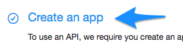
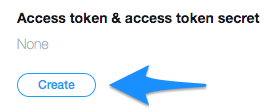

# Creating Your Twitter Developer Account

As of July 2018, Twitter has imposed a stricter policy for creating Developer Accounts. These new policies require additional time to request and receive API tokens.

Follow the instructions below to complete and troubleshoot the process.

- - -

* For the purpose of this course, it is recommended that new Twitter accounts are created for class activities; visit the [Twitter developer homepage](https://developer.twitter.com/) to begin.

  * **NOTE** you use Gmail, you can create a new Twitter account by simply adding an additional period somewhere within the original account (ex: John.D.oe@gmail.com vs. John.Doe@gmail.com). Verification emails will still come to your original inbox.

* Follow the on-screen prompts to finish creating a new account.

  * Because this is an account used for testing, avoid importing contacts or selecting other accounts to follow.

  * In the next window, verify your new Twitter account via both phone and email verification.

  * **NOTE** If you haven't received a confirmation email yet, resend the confirmation from the Twitter webpage.

  * **NOTE** You may encounter an error if you auto-fill your phone number, resulting in locked accounts. To unlock, you will only need to pass a simple captcha and SMS challenge.

    

* Once new accounts have been created and you are signed in, move on to the next step.

* Return [Twitter developer homepage](https://developer.twitter.com/) and click `Apply` on the upper right corner of the page to get started (you should automatically be signed in with your newly created account).

    

  * The next page encourages users to apply for a developer account. Click the purple button to get started.

    

  * On the next page, click the blue `Continue` button to select your new Twitter profile and move on to the next step.

  * Continue moving through the prompts; tick the selection for a personal account, name the account (ex: "Practice"), select the primary country of origin, and click `Continue`.

    

* The next page requires project information. Walk through the following steps:

  * Select the applicable use cases.

  * Enter a project description.

  * **NOTE** This is **very** specific. Encourage students to follow the Twitter-provided prompts to create their project descriptions.

    

  * **IMPORTANT** Twitter will review these project descriptions and failure to comply with their requirements will delay the process.

  * It is important that every student answers each specific question and meets the minimum character requirement.

  * Respond with "No" to the last question and click the blue `Continue` button.

  * Next, scroll through the Terms of Service and select the box signifying agreement of terms and click continue.

  * With the next step, Twitter will send an email to verify your Twitter Developer Account. After you confirm your email by clicking the orange button, you will be automatically routed to the `Getting Started` account webpage.

  * **NOTE**: In some cases, this step will not be instant and it may take a few days to receive confirmation. Monitor your email for confirmation and utilize office hours if needed.

* Once you have an account, walk through the following steps:

  * From the [Twitter developer page](https://developer.twitter.com/en/apps), click the `Create App` link, then click the blue `Create an app` button on the upper right of the webpage.

    

    

* Then move on to complete the app details, which require:

  * App name.

  * Application description.

  * Website URL (suggest that students provide a link to their GitHub profile, remember to include `https://` in the link).

  * A description of how the app will be used.

* Once the required fields have been completed, click the blue `Create` button at the bottom of the page.

* A window to review developer terms will automatically appear; click `Create` to move on to the next step.

* Now that the app has been created, navigate to the `Keys and tokens` tab.

  

* From this page, you should be able to view your Consumer API keys. If not, click `Regenerate`.

* Additionally, an access token and access token secret will be needed. Click `Create` to generate those.

  
