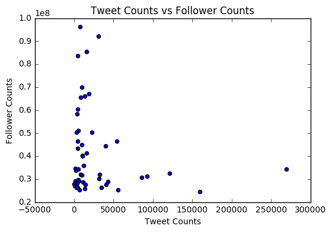

# Plot Popular Accounts

## Instructions

* In this activity, you will use MatPlotLib to render three scatterplot charts of the results from the last activity.

1. The first scatterplot will plot Tweet Counts (x-axis) vs Follower Counts (y-axis) to determine a relationship, if any, between the two sets of values. It should look like this:

2. Likewise, build a scatterplot for Number Following (x-axis) vs Follower Counts (y-axis).

3. Finally, build a scatterplot for Number of Favorites (x-axis) vs Follower Counts (y-axis).
