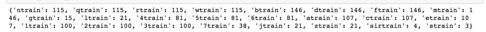

# Subway Delays in New York City

## Instructions

* In this activity, you will use data gathered from Twitter to plot which trains in the NYC subway system most frequently cause delays.

* The Twitter account **SubwayStats** announces delays and changes in the NYC subway system.

* Your goal is to pull the 1,000 most recent tweets from that account and use MatPlotLib to generate a bar chart of the number of delays per each train:

  

* Accomplish this task by first compiling a Python dictionary, whose key value pairs consist of each train and the number of delays:

  

* In order to build such a dictionary, you will need to filter the tweet texts.

* See the Jupyter Notebook file for more specific instructions at each step. Good luck!
