## 7.1 Lesson Plan - Getting Twitter Data

### Overview

In today's class, students will learn how to use Tweepy, a Python library that lets you interact with the Twitter API.

### Class Objectives

* Students will be able to access Twitter's API using the Tweepy library.
* Students will be able to use Tweepy to retrieve tweets from a specific account.
* Students will be able to use Tweepy to retrieve tweets based on a search term.
* Students will be able to use Tweepy to retrieve tweets based on a hashtag.
* Students will be able to use Tweepy to perform data analytics using data from Twitter.
* Students will be able to visualize Tweepy data using matplotlib.

### Instructor Notes

* Today's class relies on the Tweepy API. After the first couple examples, students should feel comfortable with the syntax and different methods for accessing data from Twitter.

* This lesson also dives into formatting JSON responses and using Python's `datetime` library. Remind students that the docs are there for them and they should consult them frequently, especially for `datetime` syntax.

### Sample Class Video (Highly Recommended)

* To view an example class lecture visit (Note video may not reflect latest lesson plan): [Class Video](https://codingbootcamp.hosted.panopto.com/Panopto/Pages/Viewer.aspx?id=9f8ad393-d55e-4e41-8cbd-1b1ca001da87)

- - -

### 1. Everyone Do: Twitter Intro (0:10)

* Welcome the class, and inform students that the week ahead will be a fun week, in which they will apply their Python skills into social analytics using the Twitter platform.

* Slack out the [Student Guide](../StudentGuide.md) for the students to use as reference as they advance through this week's activities.

* Inform students that before we get started, we will have to finish getting set up on Twitter by acquiring API tokens.

* Navigate to [https://developer.twitter.com](https://developer.twitter.com) and login with the account created during Unit 5.

* Once everyone has logged in, navigate to the [Twitter developer page](https://developer.twitter.com/en/apps) and click the blue `Create an app` button on the upper right of the webpage.

    

    

* Then move on to complete the app details, which require:

  * App name.

  * Application description.

  * Full website URL (suggest that students provide a link to their GitHub profile, remember to include `https://` in the link).

  * A description of how the app will be used.

* Once the required fields have been completed, click the blue `Create` button at the bottom of the page.

* A window to review developer terms will automatically appear; click `Create` to move on to the next step.

* Now that the app has been created, navigate to the `Keys and tokens` tab.

  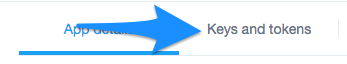

* From this page, you should be able to view your Consumer API keys. If not, click `Regenerate`.

* Additionally, an access token and access token secret will be needed. Click `Create` to generate those.

  

  * Have students save this information to a `config.py` that can be used throughout class.

    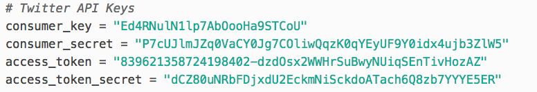

### 2. Everyone Do: The Twitter API (0:10)

* If appropriate, have a recap discussion of what API stands for, what it means, and how a Twitter API might be used.

  * An API, or Application Programming Interface, is simply a way of getting access to information or services.

  * In the case of Twitter, the company has created many doorways we can use to use their services. For example, let's say that we are interested in retrieving the ten most recent tweets sent out by a user.

  * Without an API, we would copy and paste their tweets from a desktop or a mobile app. Using Twitter's API, however, we can write a program that will directly retrieve the tweets from Twitter's server.

  * Likewise, we can also leverage the API to post tweets from our accounts as well. In fact, some 40-50 million Twitter accounts are thought to be bots, or programs, that post tweets automatically.

  * Just as some doors are unlocked and others require a key, some APIs are open to use for all, some require a free key, and that others require payment for use.

* Slack out the link to the [Tweepy documentation](http://docs.tweepy.org/en/v3.5.0/getting_started.html?)
  so that students who finish early may begin reading it.

### 3. Instructor Do: Get Home Tweets (0:10)

**Note**  If you don not have Tweepy installed, run `pip install tweepy` in your console to install it.

* Open up [Activities/01-Ins_Get_Home_Tweets/Solved/Ins_Get_Home_Tweets.ipynb](Activities/01-Ins_Get_Home_Tweets/Solved/Ins_Get_Home_Tweets.ipynb) in your terminal.

  * Introduce Tweepy, a Python library created to access the Twitter API that lets us read and send tweets.

* Go to [https://twitter.com/DaDataBootcamp](https://twitter.com/DaDataBootcamp/following). Point out that this Twitter account follows the activities of other Twitter accounts.

  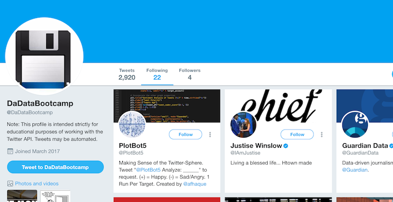

  * Explain that a home timeline in Twitter is a stream of Twitter accounts that one follows.

* Next, run [Activities/01-Ins_Get_Home_Tweets/Solved/Ins_Get_Home_Tweets.ipynb](Activities/01-Ins_Get_Home_Tweets/Solved/Ins_Get_Home_Tweets.ipynb) from the console. It should pull a JSON of the tweets in the home timeline.

  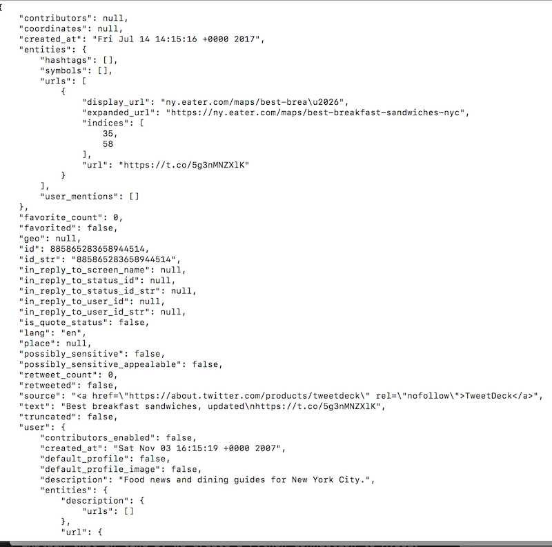

  * Point out that the response from Twitter to the API call, or request, has been formatted as JSON.

  * Each response not only contains information displayed on the screen, such as the author and the text of the tweet, but a whole bunch of metadata as well.

* Open the code in Jupyter Notebook, and walk through its features.

  * We first import the libraries we need: `tweepy` and `json`.

    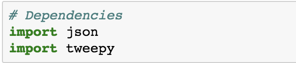

  * We then import the API keys and secrets necessary to interact with Twitter's API from config.py.

    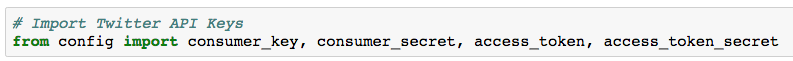

  * Next, we set up the authentication for the Twitter API. Explain that this is boilerplate code.

    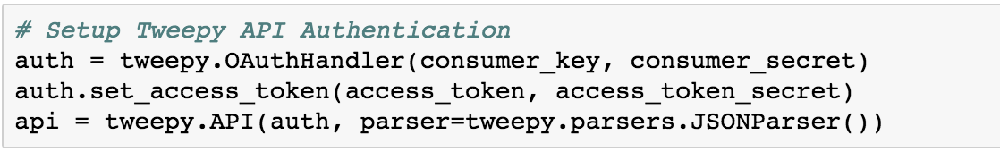

  * In the next line, we actually retrieve the tweets from the home feed!

    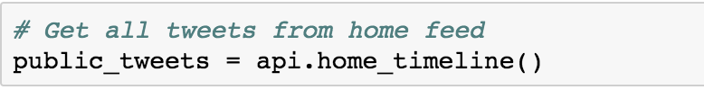

  * In the final portion, we run a for-loop to format each tweet as a string with `json.dumps()`, then print it.

    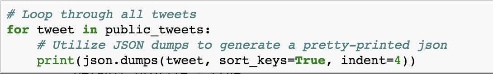

* Slack out the code to the class, [Activities/01-Ins_Get_Home_Tweets/Solved/Ins_Get_Home_Tweets.ipynb](Activities/01-Ins_Get_Home_Tweets/Solved/Ins_Get_Home_Tweets.ipynb) and answer any questions before moving on.

### 4. Students Do: Get My Tweets (0:10)

* In this activity, students will use Tweepy to get the twenty most recent tweets sent out from their accounts.

  * Open up [Activities/02-Stu_Get_My_Tweets/Solved/Stu_Get_My_Tweets.ipynb)](Activities/02-Stu_Get_My_Tweets/Solved/Stu_Get_My_Tweets.ipynb) and demo the solved code.

  * Now Slack out [Activities/02-Stu_Get_My_Tweets/Unsolved/GetMyTweets_UNSOLVED.ipynb](Activities/02-Stu_Get_My_Tweets/Unsolved/GetMyTweets_UNSOLVED.ipynb)

* **File:**

* [Activities/02-Stu_Get_My_Tweets/Unsolved/GetMyTweets_UNSOLVED.ipynb](Activities/02-Stu_Get_My_Tweets/Unsolved/GetMyTweets_UNSOLVED.ipynb)

* **Instructions:** [Activities/02-Stu_Get_My_Tweets/Readme.md](Activities/02-Stu_Get_My_Tweets/Readme.md)

  * Import the necessary libraries needed to talk to Twitter's API.

  * Import your keys from your `config.py` file.

  * Set up Tweepy authentication.

  * Write code to fetch all tweets from your home feed.

  * Loop through and print out tweets.

* **Hint:**

* Consult the [Tweepy](http://docs.tweepy.org/en/v3.5.0/api.html?) documentation for the method used to accomplish this task.

* **Bonus:**

* If you finish the activity early, try tweaking the parameters. For example, can you fetch ten tweets with the script? If you haven't yet sent out more than ten tweets from your account, do that first.

### 5. Review Get My Tweets (0:02)

* Slack out the solved code [Activities/02-Stu_Get_My_Tweets/Solved/Stu_Get_My_Tweets.ipynb)](Activities/02-Stu_Get_My_Tweets/Solved/Stu_Get_My_Tweets.ipynb).

* The only difference between this code and the previous one is the method used.

* Previously, we used the `api.home_timeline()` method from the Tweepy library to retrieve our home timeline tweets.

* In this activity, we simply used another method to retrieve tweets from our own account: the `api.user_timeline()` method.  This method only retrieves tweets produced by the user while `home_timeline()` also retrieves tweets of users the user is following.

* `user_timeline()` allows retrieving of tweets from another user by passing a parameter of the user's screen name or user id.  See the [Tweepy Documentation](http://docs.tweepy.org/en/v3.5.0/api.html#API.user_timeline) for more information.

  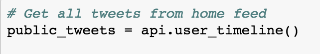

### 6. Students Do: Get Others' Tweets (0:05)

* So far, we have been able to pull tweets from our home feed, and tweets sent from our accounts.

* In this activity, we will retrieve tweets sent out by any account of our choosing!

* **Instructions:** [Activities/03-Stu_Get_Other_Tweets/Readme.md](Activities/03-Stu_Get_Other_Tweets/Readme.md)

  * Choose a twitter account and save the screen name to a variable.

  * Retrieve the latest tweets sent out from that account.

  * Use the code from the previous activities to get you started!

  * Consult the [Tweepy Docs](http://docs.tweepy.org/en/v3.5.0/api.html) as needed.

### 7. Instructor Do: Review Get Others' Tweets (0:02)

* Slack out
  [Activities/03-Stu_Get_Other_Tweets/Solved/Stu_Get_Other_Tweets.ipynb](Activities/03-Stu_Get_Other_Tweets/Solved/Stu_Get_Other_Tweets.ipynb) to the class.

* This activity is very similar to the last one.

* We used Tweepy's `API.user_timeline()` method to retrieve the tweets of a specified user.

* Run the code to demonstrate it.

* You may use `HamillHimself` (aka Luke Skywalker) as an account name, or you may supply your own.

* Highlight the following as you explain the code:

  * We set a `target_user` variable and point it to "HamillHimself".

  * Then, we feed the variable as an argument into the `api.user_timeline()` method.

  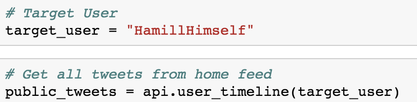

  * Just as in previous exercises, we loop through the tweet and print them using `json.dumps()`

  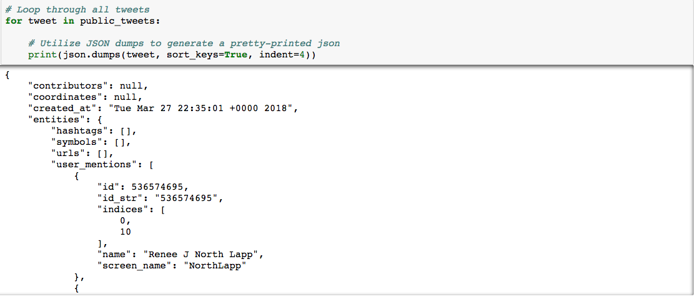

* Answer any questions before moving on.

### 8. Everyone Do: JSON and the Tweeternauts (0:15)

* Up to this point, we have been printing an entire JSON containing a lot of information for each tweet.  While comprehensive, it is not easy to read!

* We will now work on parsing a JSON data to extract only the data that we need.

* **Files:**

  * [Activities/04-Evr_Break_Tweet_JSON/Solved/Evr_Tweet_Breaker.ipynb](Activities/04-Evr_Break_Tweet_JSON/Solved/Evr_Tweet_Breaker.ipynb)

  * [Activities/04-Evr_Break_Tweet_JSON/Unsolved/Evr_Tweet_Breaker_Unsolved.ipynb](Activities/04-Evr_Break_Tweet_JSON/Unsolved/Evr_Tweet_Breaker_Unsolved.ipynb)

* Run the solved file, [Activities/04-Evr_Break_Tweet_JSON/Solved/Evr_Tweet_Breaker.ipynb](Activities/04-Evr_Break_Tweet_JSON/Solved/Evr_Tweet_Breaker.ipynb) and demo the formatted response.

* In order to extract the data items we need, we'll need to examine the structure of the JSON of each status.

* Slack out the unsolved activity to the class [Activities/04-Evr_Break_Tweet_JSON/Unsolved/Evr_Tweet_Breaker_Unsolved.ipynb](Activities/04-Evr_Break_Tweet_JSON/Unsolved/Evr_Tweet_Breaker_Unsolved.ipynb) going over the code explaining:

  * That `sample_data` is the entire JSON file.

  * A function is created to takes in a jsonfile as an argument then opens and loads the file.

  * The function is then run on the sample data and the first result is returned.

  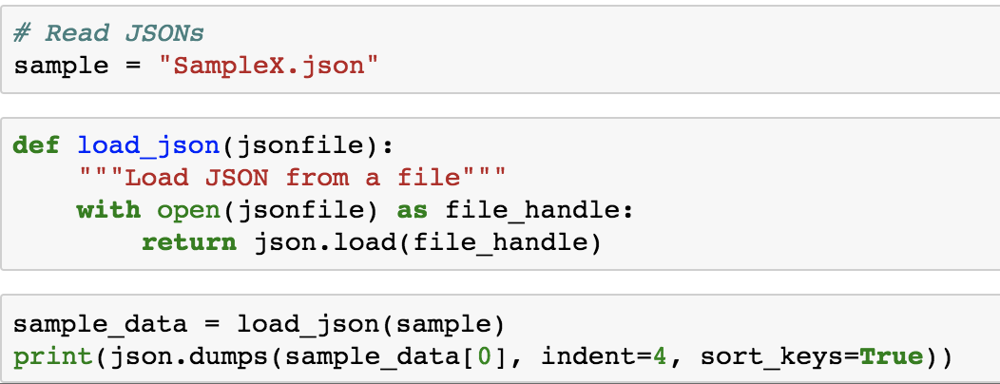

* Have the students run the Python script, it should return the JSON for `sample_data[0]`.

* Go through the questions in the code highlighting the following:

  * For question **one**, in order to filter the JSON for our purpose, we need to first find the key for the user. That will be represented by `sample_data[0]["user"]`.

  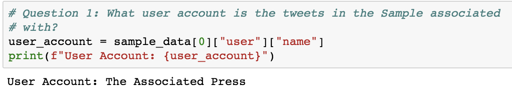

  * The `user` object to identify the user account name: `"name"`. In other words, we can print the account name with `sample_data[0]["user"]["name']`.

  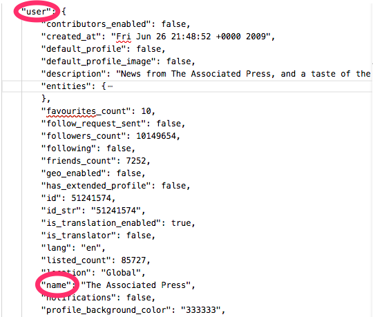

  * Questions **two**, **four**  and **five** will be answered in a similar way.

    * Question three simply uses the `len` function on the entire data set.

    * Question six requires a for loop that will loop everything in the `sample_data` and print out the text for each tweet.

    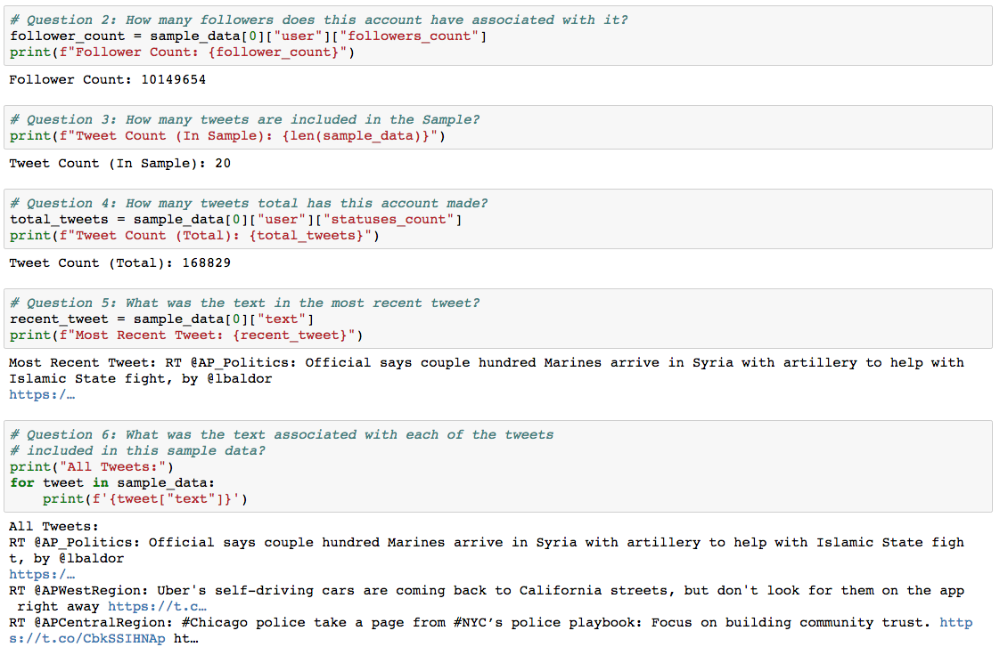

    * Finally, for the bonus another for loop is used only this time conditions are set to track the most retweets, an `if` statement is used to check if one tweet had more retweets than the previous best.

    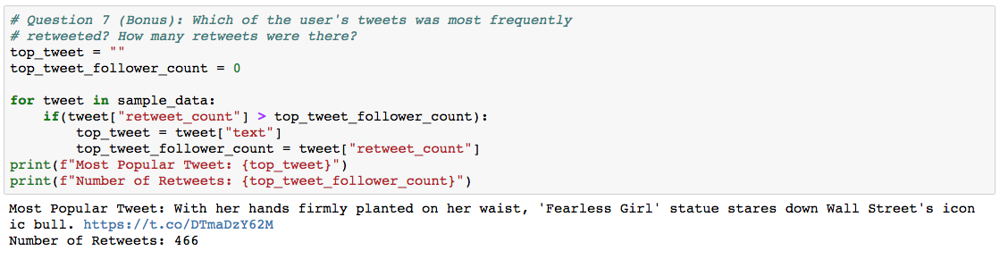

* Answer any questions before moving on to the next exercise.

### 9. Students Do: Popular Users (0:10)

* In this activity, students will incorporate Tweepy and pandas libraries to perform data analysis on the most popular Twitter accounts.

* In order to demonstrate to students what their assignment should look like, open Jupyter Notebook, and run [Activities/05-Stu_Popular_Users/Solved/Stu_Popular_Tweeters.ipynb](Activities/05-Stu_Popular_Users/Solved/Stu_Popular_Tweeters.ipynb).

* After a few moments, a new CSV file named `PopularAccounts_New.csv` should appear in the directory.

* Open it and show it to the students:

  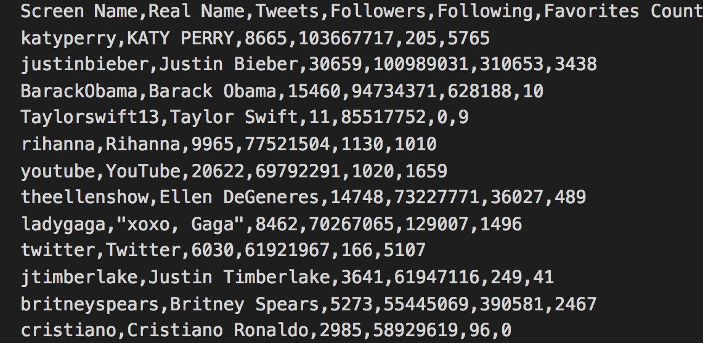

* **Files:**

  * [Activities/05-Stu_Popular_Users/Unsolved/PopularTweeters_UNSOLVED.ipynb](Activities/05-Stu_Popular_Users/Unsolved/PopularTweeters_UNSOLVED.ipynb)

  * [Activities/05-Stu_Popular_Users/Resources/PopularAccounts.csv](Activities/05-Stu_Popular_Users/Resources/PopularAccounts.csv)

* **Instructions:** [Activities/05-Stu_Popular_Users/Unsolved/Readme.md](Activities/05-Stu_Popular_Users/Readme.md)

* In this activity, you are given an incomplete CSV file of Twitter's most popular accounts. You will use this CSV file in conjunction with Tweepy's API to create a pandas DataFrame.

* Consult the Jupyter Notebook file for instructions, but here are your tasks:

  * The "PopularAccounts.csv" file has columns whose info needs to be filled in.

  * Import the CSV into a pandas DataFrame.

  * Iterate over the rows and use Tweepy to retrieve the info for the missing columns.  Add the information to the DataFrame.

  * Export the results to a new CSV file called "PopularAccounts_New.csv"

  * Calculate the averages of each column and create a DataFrame of the averages.

* **Hints:**

  * Make sure to use the appropriate method from the [Tweepy Docs](http://docs.tweepy.org/en/v3.5.0/api.html)

  * You may have to use try/except to avoid missing users.

### 10. Instructor Do: Review Popular Accounts (0:05)

* **File:** [Activities/05-Stu_Popular_Users/Solved/Stu_Popular_Tweeters.ipynb](Activities/05-Stu_Popular_Users/Solved/Stu_Popular_Tweeters.ipynb)

* Take a few minutes to go over the salient points from the last activity, as well as to answer any questions from students.

* To reinforce the concepts, have your students explain the code back to you.

* Make you cover the following:

  * `.iterrows()` is used to iterate over each row of the DataFrame.

  * `try/except` is used to handle any missing users or information.  Any user's with errors will be dropped from the DataFrame.

  * A new user method from Tweepy is used: `get_user()` to return user information.

  * The desired information is extracted from the returned JSON and saved in variables.

  * Then, the information is inserted into the DataFrame using `.at()`.

  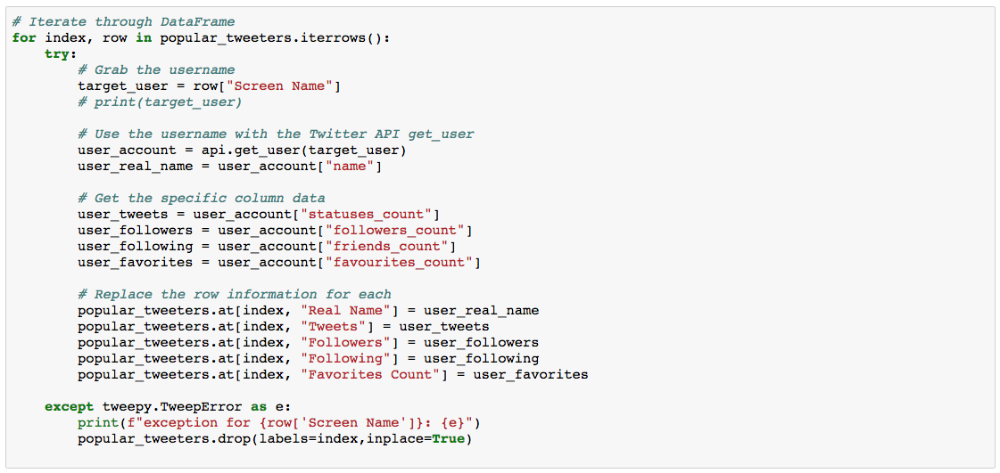

  * The data is exported to a new csv, and previewed using `head()`.

  * The averages of each column are calculated using `.mean()` and a new DataFrame is defined with those averages.

  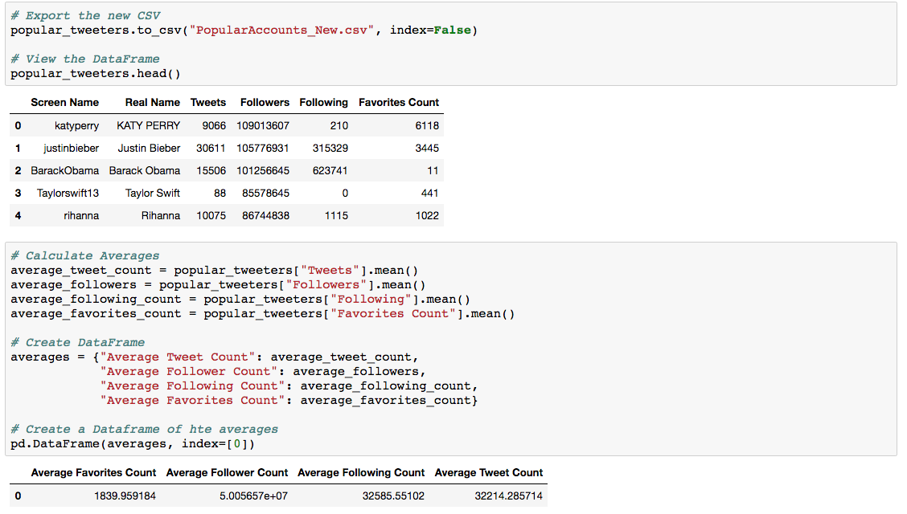

### 11. Students Do: Plot Popular Accounts (0:05)

* In this activity, students will use MatPlotLib to plot their results from the last activity.

* As this activity is a simple revisit of earlier MatPlotLib activities, there is no review activity.

* Feel free, however, to do a quick review if you deem one appropriate.

* **Files:**

  * [Activities/06-Stu_Popular_Users_Plots/Unsolved/Stu_Popular_Tweeters_Plots_Unsolved.ipynb](Activities/06-Stu_Popular_Users_Plots/Unsolved/Stu_Popular_Tweeters_Plots_Unsolved.ipynb)

  * [Activities/05-Stu_Popular_Users/Resources/PopularAccounts.csv](Activities/05-Stu_Popular_Users/Resources/PopularAccounts.csv)

* **Instructions:** [Activities/06-Stu_Popular_Users_Plots/Unsolved/Readme.md](Activities/06-Stu_Popular_Users_Plots/Readme.md)

* In this activity, you will use MatPlotLib to render three scatterplot charts of the results from the last activity.

* The first scatterplot will plot Tweet Counts (x-axis) vs Follower Counts (y-axis) to determine a relationship, if any, between the two sets of values. It should look like this:

* Likewise, build a scatterplot for Number Following (x-axis) vs Follower Counts (y-axis).

* Finally, build a scatterplot for Number of Favorites (x-axis) vs Follower Counts (y-axis).

### 12. Instructor Do: Tweet Pagination (0:05)

* This short activity will be a demonstration of Tweepy's pagination option.

* First, Slack out the folder [Activities/07-Ins_Tweet_Pagination/Solved](Activities/07-Ins_Tweet_Pagination/Solved) to the class.

* Run [Activities/07-Ins_Tweet_Pagination/Solved/NoPagination.ipynb](Activities/07-Ins_Tweet_Pagination/Solved/Ins_No_Pagination.ipynb) from the console.

* Explain that we're retrieving the tweet texts from the account **GuardianData**, associated with the British newspaper **_The Guardian._** Explain also that we perform a for-loop of all the tweet texts that are returned from Twitter's API.

  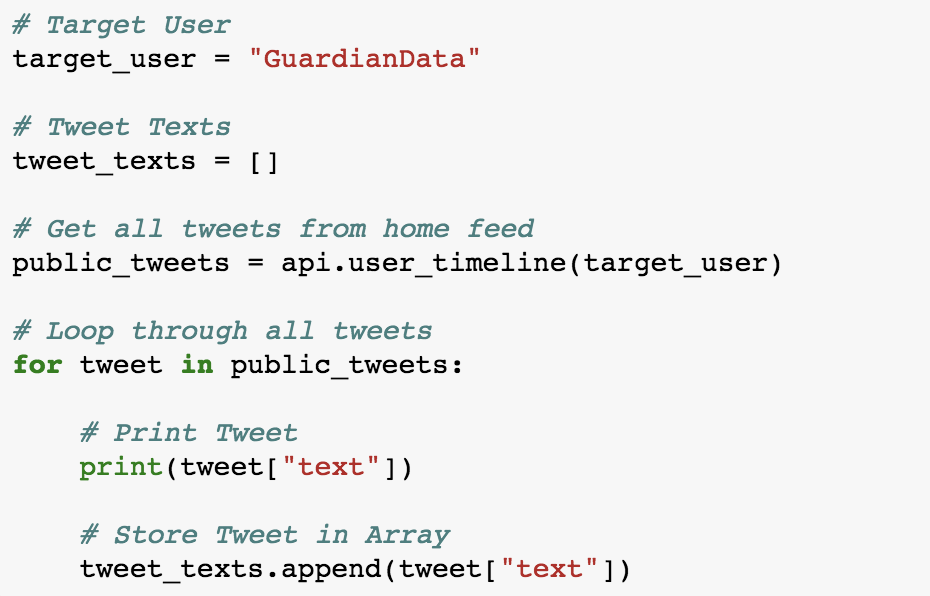

* The results should look something like the following:

  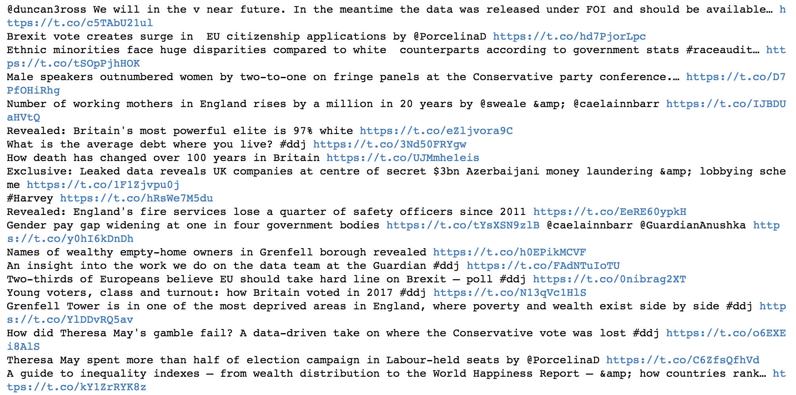

* The bottom of the results should say, `Tweet Count: 20`.

* Great! So we've been able to pull the twenty most recent tweets sent out by **GuardianData**. But what if we want to pull a greater number of tweets?

* Run [Activities/07-Ins_Tweet_Pagination/Solved/NoPagination.ipynb](Activities/07-Ins_Tweet_Pagination/Solved/Ins_No_Pagination.ipynb) next from the console, and scroll to the bottom of the results. It should say, `Tweet Count: 200`, meaning that we pulled 200 tweets instead of 20.

* Give the class a minute to examine the code.

* Ask for a volunteer to explain the code, specifically the differences between this version and the previous one:

* The for-loop is wrapped in another for-loop, this time to run ten times.

* This means that, if each request retrieves twenty tweets, a total of two hundred tweets (10 \* 20 = 200) will be fetched.

* The `api.user_timeline()` method has a `page=x` argument. The `x` here corresponds to the `x` from the outer for-loop, and stands for each page (out of a total of 10, from the outer loop) that is retrieved.  Note that `range(10)` will not work here in the for loop.  The Twitter API treats page 0 and 1 as the same page so using `range(10)` instead of `range(1,11)` will return the first 20 newest tweets twice.

* Answer any questions before moving on.

### 13. Everyone Do: Time Objects in Python (0:10)

* **File:** [Activities/08-Evr_Datetime_Objects/Unsolved/Evr_DateTime_Objects_Unsolved.ipynb](Activities/08-Evr_Datetime_Objects/Unsolved/Evr_DateTime_Objects_Unsolved.ipynb)

* This activity will deal with converting datetime strings to Python `DateTime` objects. It will be necessary for the next activity, in which we will plot the frequency of a Twitter user's tweets.

* Explain that the status returned from Twitter contains information on the date and time that a tweet was sent out. However, this datetime is a string so no math can applied until it is converted.

* Slack out the activity folder, [Activities/08-Evr_Datetime_Objects/Unsolved/](Activities/08-Evr_Datetime_Objects/Unsolved/), to the class.

* Navigate to and run [Activities/08-Evr_Datetime_Objects/Unsolved/Evr_DateTime_Objects_Unsolved.ipynb](Activities/08-Evr_Datetime_Objects/Unsolved/Evr_DateTime_Objects_Unsolved.ipynb) from Jupyter Notebook then go through the code explaining:

  * Loop through the `target_user`'s tweets grabbing the the timestamp and appending to a list.

  * Using the  `datetime` library, the timestamps are converted to datetime objects.

    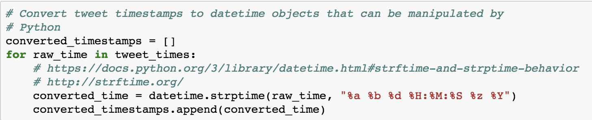

  * Print the original times and converted times to show the difference.

  * With the converted timestamp, the times can manipulated with Python.

    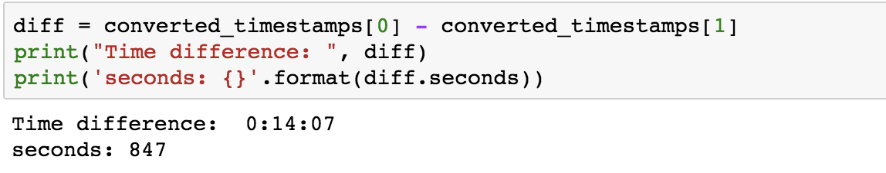

  * Finally, show that time difference can be printed out in many different formats.

    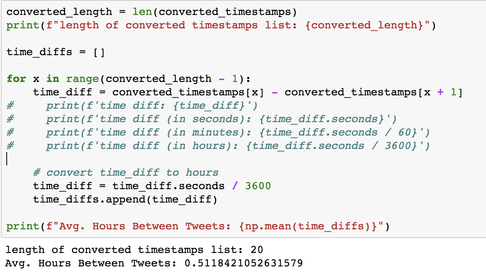

- - -

### 14. BREAK (0:15)

- - -

### 15. Partners Do: Twitter Velocity (0:14)

* In this activity, students will work in pairs to plot the **frequency** of a Twitter user's tweets. In other words, how often does a Twitter user send out tweets? In still other words, what is the average time between sent tweets?

* **File:**  [Activities/09-Stu_Tweet_Velocity/Unsolved/Stu_Tweet_Velocity_Unsolved.ipynb](Activities/09-Stu_Tweet_Velocity/Unsolved/Stu_Tweet_Velocity_Unsolved.ipynb)

* **Instructions:** [Activities/09-Stu_Tweet_Velocity/Unsolved/Readme.md](Activities/09-Stu_Tweet_Velocity/Readme.md)

* You are a political data consultant, and have been asked to evaluate how frequently Donald Trump tweets.

* As a savvy data visualization specialist, you decide on the following course of action: first, you will collect the timestamps of the 500 most recent tweets sent out by Trump.

* After making a list of the timestamps, you will convert the timestamps into datetime objects. Then you will calculate the time difference from one tweet to the next, and plot those data points in a scatterplot chart.

* The tools you will use for this task are Tweepy and MatPlotLib. You will also need to use the `datetime` library to convert Twitter timestamps to Python datetime objects.

* Your plot should look something like this:

  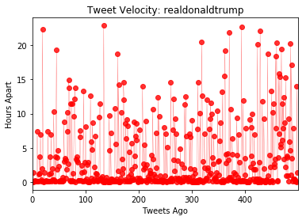

* This handy chart visually demonstrates Trump's tweet pattern: the majority of his tweets are sent within five hours of each other, but he goes up to 24 hours without tweeting!

* See, in contrast, the tweet pattern of a major news organization, the LA Times, whose tweets are sent out much more frequently:

  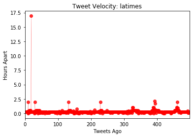

* **Note**: This will be a challenging activity for students that will require them to integrate the various skills they've learned up to this point.

* Be sure that you and the TAs check on students and give help where it is needed.

### 16. Instructor Do: Review Twitter Velocity (0:10)

* **File:** [Activities/09-Stu_Tweet_Velocity/Solved/Stu_Tweet_Velocity_SOLVED.ipynb](Activities/09-Stu_Tweet_Velocity/Solved/Stu_Tweet_Velocity_SOLVED.ipynb)

* In this review, try to focus the class's attention on the trickier parts of the code.

* Slack out the solution [Activities/09-Stu_Tweet_Velocity/Solved/Stu_Tweet_Velocity_SOLVED.ipynb](Activities/09-Stu_Tweet_Velocity/Solved/Stu_Tweet_Velocity_SOLVED.ipynb).

* Begin by explaining that we looped through the 500 most recent tweets, and extracted their timestamps into a list.

* Point out that each `public_tweets` pulls twenty tweets, and that we're running it inside a for-loop of 25 iterations, totaling 500.

* Before running the for-loop, we created an empty list to hold that timestamps. We then extract the timestamps with `tweet["created_at"]`.  We also create a counter to preview and verify the timestamps every 100 tweets.

  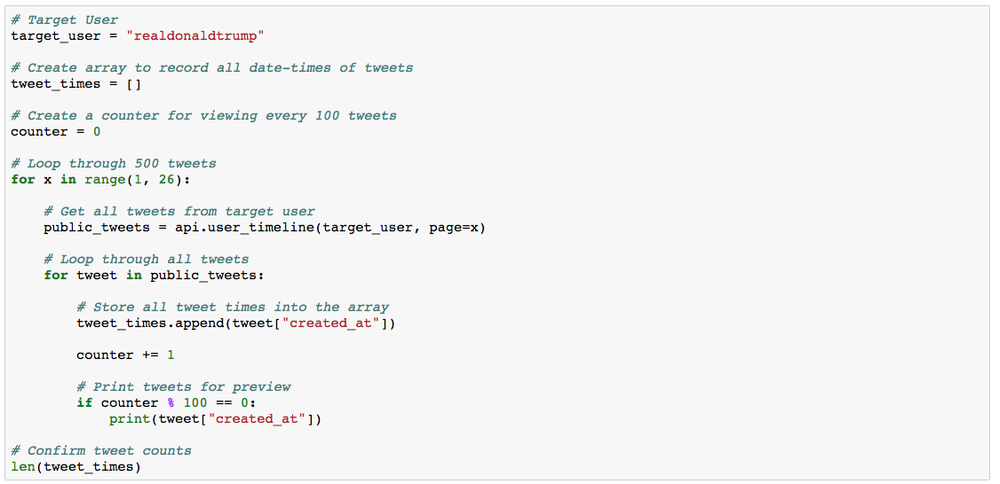

* We next create another empty list, where we put Python datetime objects that have been converted from Python `DateTime` objects:

  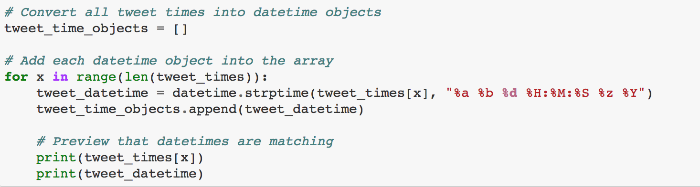

* Next, explain that we create yet another list called `time_in_between` here, this time to hold the amount of time that had passed between one tweet and the next one.

  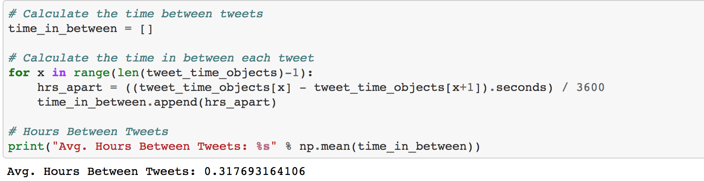

* Ask why the for-loop might be expressed as `for x in range(len(tweet_time_objects)-1):`.

  * We subtract the datetime of a tweet from that of a more recent tweet, as seen in `tweet_time_objects[x] - tweet_time_objects[x+1]`, where the more recent tweet is `tweet_time_objects[x]` and a prior tweet is `tweet_time_objects[x+1]`.

  * The loop should therefore terminate after subtracting the datetime of the last tweet from the datetime of the penultimate, or second-to-last, tweet.

* Lastly, quickly go over the major features of the plotting if you feel it necessary.

  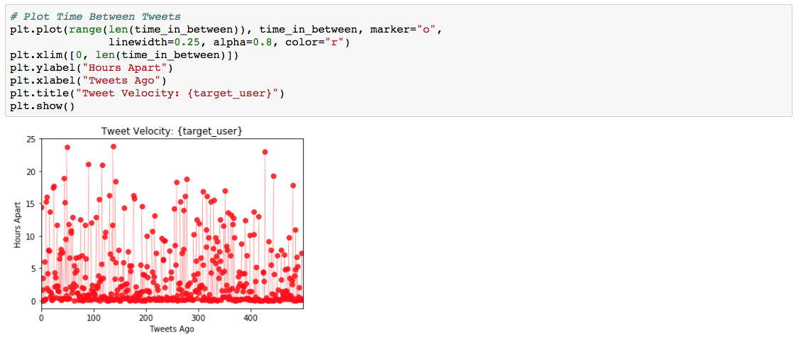

* Answer any questions before moving on.

### 17. Instructor Do: Search Tweets (0:05)

* In this activity, you will demonstrate searching through the Twitter universe for tweets that contain particular search terms.

* Navigate to and run the following script. [Activities/10-Ins_Search_Tweets/Solved/Ins_Search_Tweets.ipynb](Activities/10-Ins_Search_Tweets/Solved/Ins_Search_Tweets.ipynb).

* When prompted for a search term, feel free to enter something quirky!

* For example, on July 25, 2017, a search for "hungry hippos" returned the following:

  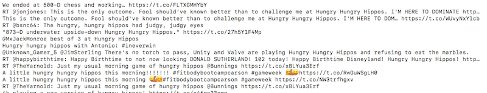

* Take a few seconds to examine the code.

  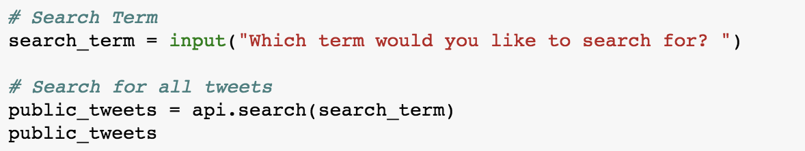

* Slack out the code to the class [Activities/10-Ins_Search_Tweets/Solved/Ins_Search_Tweets.ipynb](Activities/10-Ins_Search_Tweets/Solved/Ins_Search_Tweets.ipynb).

* For the remainder of the activity, students will examine the code, and consult the Tweepy documentation for what the argument `rpp=10` means.

  * <http://docs.tweepy.org/en/v3.5.0/api.html?highlight=rpp>
  * `rpp – The number of tweets to return per page, up to a max of 100.`

### 18. Students Do: Hashtag Popularity (0:10)

* In this activity, students will identify the frequency of tweets that contain certain hashtag keywords.

* They will apply the skills they acquired in the last activity.

* **File:** [Activities/11-Stu_Hashtag_Popularity/Unsolved/Stu_Trending_Tags_UNSOLVED.ipynb](Activities/11-Stu_Hashtag_Popularity/Unsolved/Stu_Trending_Tags_UNSOLVED.ipynb)

* **Instructions:** [Activities/11-Stu_Hashtag_Popularity/Readme.md](Activities/11-Stu_Hashtag_Popularity/Readme.md)

* In this activity, you will calculate the frequency of tweets containing the following hashtags: **#bigdata, #ai, #vr, #foreverchuck**

* Accomplish this task by using Tweepy to search for tweets containing these search terms (Hint: use a loop), then identifying how frequently tweets are sent that contain these keywords.

* You may, of course, use other hashtags.

* You can do this. Good luck!

### 19. Instructor Do: Review Hashtag Popularity (0:05)

* The approach to solving this activity is essentially the same as that of the last activity.

* Use your discretion regarding how much of the code to explain.

* You may wish to point out that for each hashtag in the list, we run a giant loop that contains the rest of the code.

  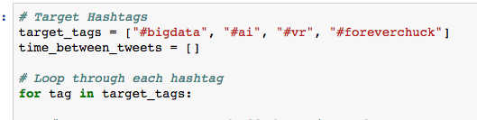

* Quickly recap that we:

  1. Create a list to hold the datetime strings
  2. Iterate through tweets to extract the datetime strings
  3. Create a list to hold the converted datetime objects
  4. Iterate through datetime strings to convert them to datetime objects
  5. Create a list to hold the interval between each tweet and the next
  6. Iterate through the datetime objects to calculate the interval

  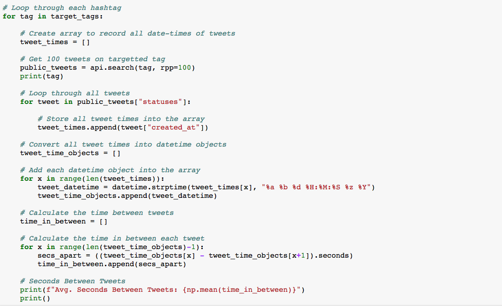

### 20. Students Do: Plot Train Delays (0:15)

* In this final and challenging activity, students will use data from Twitter to plot the most frequently delayed subway trains in NYC.

* **File:**
  [Activities/12-Stu_Plot_Train_Delays/Unsolved/SubwayDelays_UNSOLVED.ipynb](Activities/12-Stu_Plot_Train_Delays/Unsolved/SubwayDelays_UNSOLVED.ipynb)

* **Instructions:** [Activities/12-Stu_Plot_Train_Delays/Unsolved/Readme.md](Activities/12-Stu_Plot_Train_Delays/Readme.md)

* In this activity, you will use data gathered from Twitter to plot which trains in the NYC subway system most frequently cause delays.

* The Twitter account **SubwayStats** announces delays and changes in the NYC subway system.

* Your goal is to pull the 1,000 most recent tweets from that account and use MatPlotLib to generate a bar chart of the number of delays per each train:

  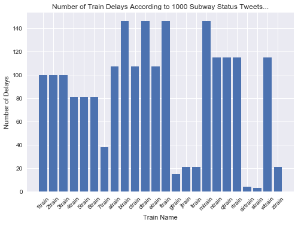

* Accomplish this task by first compiling a Python dictionary, whose key value pairs consist of each train and the number of delays:

  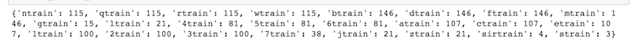

* In order to build such a dictionary, you will need to filter the tweet texts.

* See the Jupyter Notebook file for more specific instructions at each step. Good luck!

* In the likely event that students are unable to finish the activity on time, slack out the solution, [Activities/12-Stu_Plot_Train_Delays/Solved/SubwayDelays_SOLVED.ipynb](Activities/12-Stu_Plot_Train_Delays/Solved/SubwayDelays_SOLVED.ipynb), to the class. Remind them that it will be worthwhile to examine the solution!

### 21. Everybody Do: Review Plot Train Delays (0:05)

### 22. Instructor Do: Homework Solution & Close Class (0:02)

* Before finishing up for the night, slack out the links for the Unit 5 homework solutions:

  * [Pyber](https://youtu.be/ruu_yOA-5SI)

  * [Pymaceuticals Inc.](https://youtu.be/2tL261mqqFI)

* Encourage students to review them later and utilize office hours if they have further questions.

- - -

### LessonPlan & Slideshow Instructor Feedback

* Please click the link which best represents your overall feeling regarding today's class. It will link you to a form which allows you to submit additional (optional) feedback.

* [:heart_eyes: Great](https://www.surveygizmo.com/s3/4381674/DataViz-Instructor-Feedback?section=7.1&lp_useful=great)

* [:grinning: Like](https://www.surveygizmo.com/s3/4381674/DataViz-Instructor-Feedback?section=7.1&lp_useful=like)

* [:neutral_face: Neutral](https://www.surveygizmo.com/s3/4381674/DataViz-Instructor-Feedback?section=7.1&lp_useful=neutral)

* [:confounded: Dislike](https://www.surveygizmo.com/s3/4381674/DataViz-Instructor-Feedback?section=7.1&lp_useful=dislike)

* [:triumph: Not Great](https://www.surveygizmo.com/s3/4381674/DataViz-Instructor-Feedback?section=7.1&lp_useful=not%great)

- - -

### Copyright

Trilogy Education Services © 2018. All Rights Reserved.
