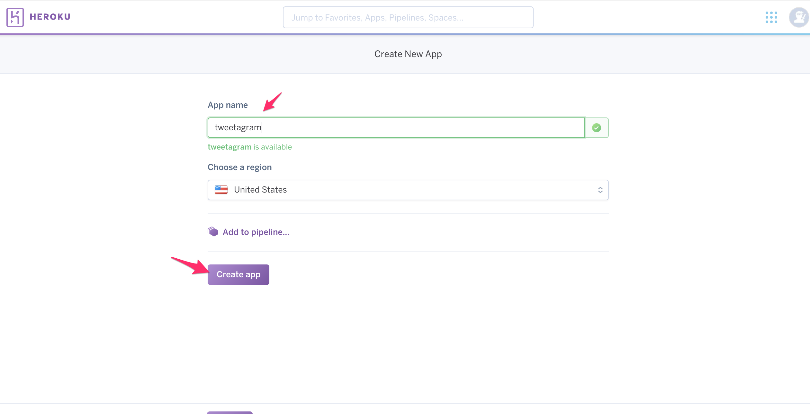
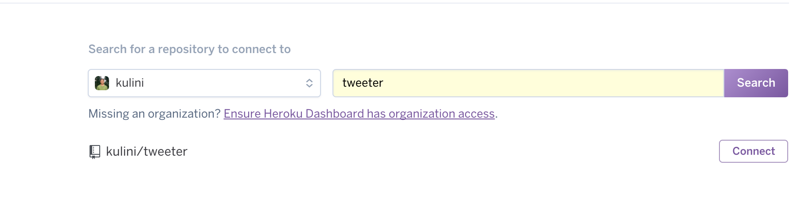
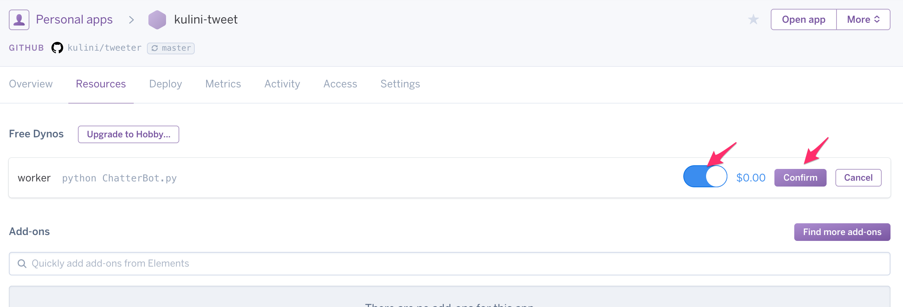

## Heroku Deployment Guide

* Heroku is a cloud application platform. This means that we can run our scripts on Heroku's servers! Here are the steps to do get our apps running on Heroku.

* Important: before deploying your code to a cloud server, verify that it runs without error locally (i.e. be able to run it from your console or in Jupyter Notebook without errors).

* Push your code to Github. Include both the `Procfile` and `requirements.txt` files in the directory. 

* Open your `Procfile` with a text editor, and replace `ChatterBot.py` with the name of your Python script.

  

* Your `requirements.txt` should list the required modules, and their versions. Here, we require only the `tweepy` module, version `3.5.0`. You can run `conda list` from your console to display all the modules you have installed, as well as their version numbers.

  

* Next, go to [heroku.com](heroku.com) and create an account.

* After registering, click on `New`, then on `Create new app`. You will create a new `app` for each program.

  

* In the next screen, create your `App name`, a unique and meaningful name for your app. Click on `Create app`. 

  

* Next, select `Connect to Github`, and click the button at the bottom.

  

* In the field `repo-name`, enter the name of your Github repo, and click `Search`.

  

* Click `Connect` to link your Heroku app with your Github repo.

    

* Click on `Enable Automatic Deploys`, which will allow the Heroku server to restart your app whenever you push a change to your Github repo.

    

* Finally, click on the `Resources` tab, followed by clicking the `edit` button with the pencil icon.

  

* Slide the worker switch to the right, then click on `Confirm`.

    

* Your app should now be deployed!  
