## 7.3 Lesson Plan - Hosting Twitter Apps On Heroku (10:00 AM)

### Overview

* Today's class will be a fun! We are going to take our newly acquired Twitter skills and deploy them live to Heroku. By the end of class, students will have deployed bots capable of applying Machine Learning to Social Media data!

### Class Objectives

* Students will be able to apply Machine Learning and Natural Language Processing with SpaCy.
* Students will be able to successfully deploy applications to Heroku.
* Students will be able to create an automated Twitter bot capable of applying Machine Learning to Social Media data.

### Instructor Notes

* Today's activities require students to host their applications on Heroku. If you are not familiar with the process, take a few minutes to go over the class videos and instructions prior to class.

* Important: for the instructor demo activities, replace the API keys and Twitter bot account with your own as the keys and accounts provided may no longer be valid by the time you teach your class.

### Sample Class Video (Highly Recommended)

* To view an example class lecture visit (Note that the video may not reflect latest lesson plan): [Class Video](https://codingbootcamp.hosted.panopto.com/Panopto/Pages/Viewer.aspx?id=747153b6-2ab7-4811-aeb9-a85e0169db28)

- - -

### 1. Instructor Do: Welcome Class (5 mins)

* Welcome students to class and mention that class will start with a few warm up exercises.

* Let the class know that today they will be working toward creating their own Twitter bots. Conversational bots are powerful for a variety of reasons: they can process a large amount of requests, there is more interaction between an organization ands its users, and data, trends, and metrics can be recorded for analysis.

### 2. Student Do: Sentiment Recap (15 mins)

* **Instructions** [Activities/01-Stu_Recap_Sentiment/README.md](Activities/01-Stu_Recap_Sentiment/README.md)

  * Run VADER analysis on the passage.

  * Print the analysis.

* **File** [Activities/01-Stu_Recap_Sentiment/Unsolved/Hamlet.ipynb](Activities/01-Stu_Recap_Sentiment/Unsolved/Hamlet.ipynb)

### 3. Instructor Do: Review Recap (5 mins)

* Open [Activities/01-Stu_Recap_Sentiment/Solved/Hamlet.ipynb](Activities/01-Stu_Recap_Sentiment/Solved/Hamlet.ipynb) in your browser and run the code.

  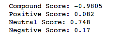

* Explain that we ran analysis on the Hamlet passage, just as we did last class.

* Show that we can easily print the results.

### 4. Students Do: Breaking News Analysis (20 mins)

* **Instructions** [Activities/02-Stu_Recap_Tweet_Analysis/README.md](Activities/02-Stu_Recap_Tweet_Analysis/README.md)

* We are going to analyze 25 tweets and run sentiment analysis on them.

  * Add List to hold sentiment

  * Grab 25 tweets

  * Loop through all tweets

  * Run Vader Analysis on each tweet

  * Add each value to the appropriate array

  * Store the Average Sentiments

  * Print the Sentiments

* **File** [Activities/Unsolved/02-Stu_Recap_Tweet_Analysis/BreakingNews.ipynb](Activities/02-Stu_Recap_Tweet_Analysis/Unsolved/BreakingNews.ipynb)

### 5. Instructor Do: Review Breaking News (5 mins)

* Open [Activities/02-Stu_Recap_Tweet_Analysis/Solved/BreakingNews.ipynb](Activities/02-Stu_Recap_Tweet_Analysis/Solved/BreakingNews.ipynb) in your browser and run the code.

* Explain that we create a list for each of the sentiments.

  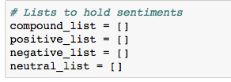

* We then search for the most recent tweets.

  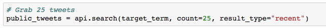

* Then loop through all the tweets, run the sentiment analysis and append them to our list.

  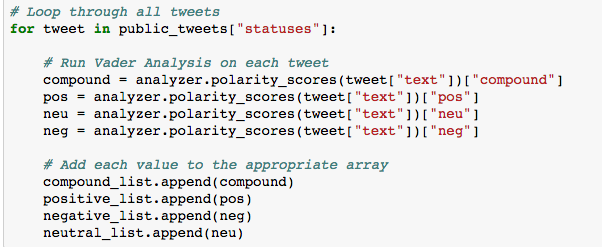

* Store the averages and print.

  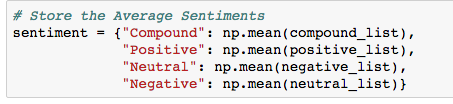

### 6. Students Do: Post a Compliment (15 mins)

* **File:** [Activities/03-Stu_Recap_Post_Tweets/Unsolved/Complimenter.ipynb](Activities/03-Stu_Recap_Post_Tweets/Unsolved/Complimenter.ipynb)

* **Instructions:** [Activities/03-Stu_Recap_Post_Tweets/README.md](Activities/03-Stu_Recap_Post_Tweets/README.md)

  * Create a complimentary status update with a mention to another user.

### 7. Instructor Do: Review a Compliment Exercise (5 mins)

* Open [Activities/03-Stu_Recap_Post_Tweets/Solved/Complimenter.ipynb](Activities/03-Stu_Recap_Post_Tweets/Solved/Complimenter.ipynb) and run the solved code.

* Feel free to run it a few times and change the message.

  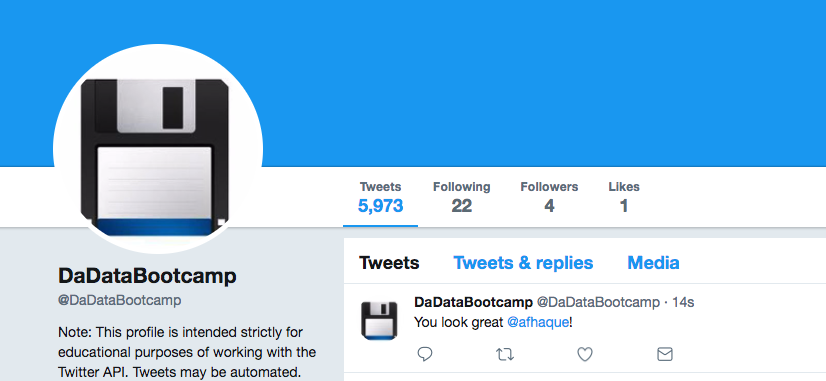

* Point out that `update_status()` will post a tweet for us.

### 8. Instructor Do: Intro To Timers (10 mins)

* Open [Activities/04-Ins_Intro_to_Timers/Solved/Multi_Tweet_No_Timer.ipynb](Activities/04-Ins_Intro_to_Timers/Solved/Multi_Tweet_No_Timer.ipynb) and run the code.

  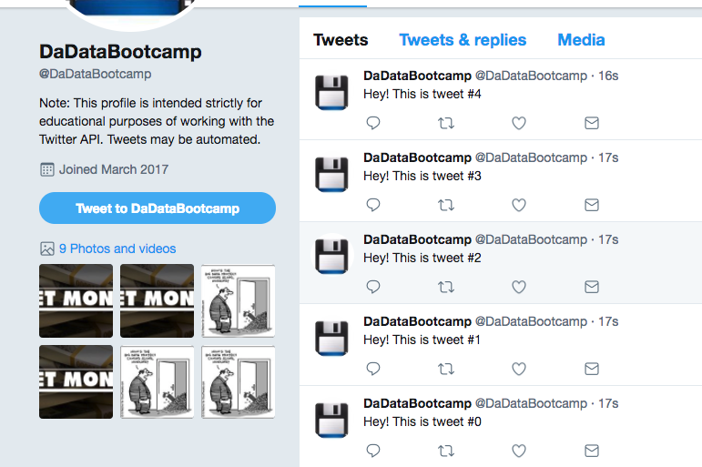

* Next visit your Twitter account page to show the result, e.g. <https://twitter.com/DaDataBootcamp>.

* It would be better space out your tweets, so we aren't spamming, so let's do that now!

* Open [Activities/04-Ins_Intro_to_Timers/Solved/Multi_Tweet_With_Timer.ipynb](Activities/04-Ins_Intro_to_Timers/Solved/Multi_Tweet_With_Timer.ipynb) in your browser and run the code.

  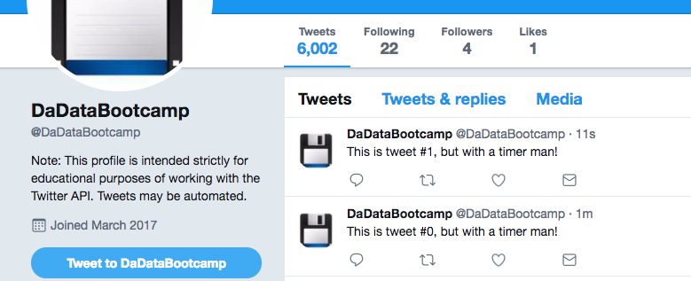

* With a little creativity we can create a python script with timer.

* Take a few minutes to step through the code.

  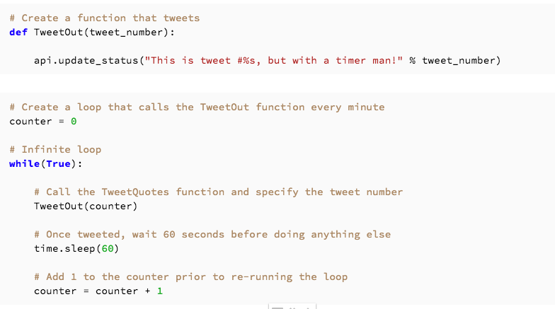

* Ask the students how they could break out of this infinite loop.

  * We would need to set a condition that returns False.

### 9. Students Do: Tweeting the Weather (20 mins)

* Students will create a function that gets the weather in London and Tweets it.

* **Instructions** [05-Stu_Weather_Tweets/README.md](Activities/05-Stu_Weather_Tweets/README.md)

  * Construct a Query URL for the OpenWeatherMap.

  * Perform the API call to get the weather.

  * Set up your Twitter credentials.

  * Tweet the weather.

  * Print the success message.

  * Set timer to run every 1 hour.

* **File** [Activities/05-Stu_Weather_Tweets/Unsolved/Weather_Tweets.ipynb](Activities/05-Stu_Weather_Tweets/Unsolved/Weather_Tweets.ipynb)

### 10. Instructors Do: Reviewing the Weather (5 mins)

* Open [Activities/Solved/05-Stu_Weather_Tweets/Weather_Tweets.ipynb](Activities/05-Stu_Weather_Tweets/Solved/Weather_Tweets.ipynb) in your browser and run the code.

* Next visit your Twitter account page and show the tweet.

  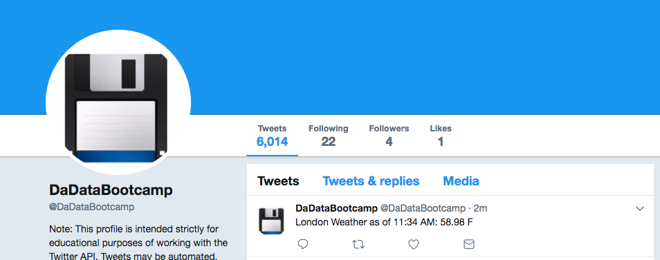

* Now take a moment to step through the code.

  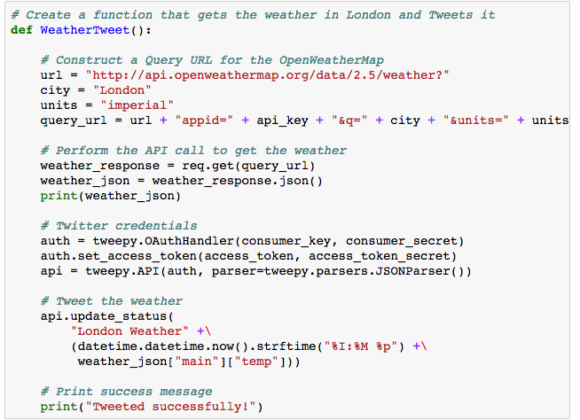

* Some of the takeaways to point out:

  * We build our query string and pass it into `req.get`.

    * Review what a GET request is if needed.

  * We print our response as JSON, by calling `json` on `weather_response`.

  * We use the `datetime` library to get the current time.

  * We traverse the JSON to get the current temperature using bracket notation.

  * We set a timer to update the weather every hour.

* There is a lot going on in this code, so take your time and check for understanding.

- - -

### 11. BREAK (40 mins)

- - -

### 12. Instructor Do: Introduction to NER with spaCy (15 mins)

* Slack out the following installation instructions for SpaCy:

  ```python
  pip install -U spacy
  pip install spacymoji
  python -m spacy download en
  python -m spacy download en_core_web_sm
  python -m spacy download en_core_web_md
  ```

* Begin this activity by introducing students to spaCy: an open-sourced library for use in Natural Language Processing (NLP).

* Be sure to cover the following points:

  * Natural Language Processing is a specialized subset of Machine Learning and Artificial Intelligence. NLP is used to make sense out of text data.

  * spaCy is a library used for NLP concepts and machine learning; It is designed to build applications that processes and "understands" large volumes of text and then pre-process it for deep learning.

* This activity teaches students to use spaCy for Named Entity Recognition (NER).

* Explain that a named entity is a real-world object assigned a name, such as a person, a company, or a country.

* spaCy possesses the ability to recognize various types of named entities in a text or document. Note that:

  * spaCy recognizes entities by asking a model for a prediction.

  * While spaCy has prepacked models ready for use, they don't always fit perfectly with your data and may need additional training.

  * Training models and Machine Learning will be addressed later in the curriculum.

* Open [06-Ins_Intro_to_NER/Unsolved/Intro_to_NER.ipynb](Activities/06-Ins_Intro_to_NER/Unsolved/Intro_to_NER.ipynb) and live code the following, explaining each step as you go:

  * First, save a sentence to run through NLP.

  ```python
  doc = nlp(u"Amazon is already hiring near the nation's capital — and Boston.")
  ```

  * Next, create a `for loop` that will print the entity text, starting character, ending character, and entity label.

  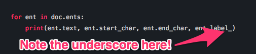

  * `spacy.explain()` can be used to provide additional information about tags or labels.

  * Printing the entity attributes can be useful in identifying entity location in a large text.

* spaCy can also render visualizations of named entities. Continue coding the next example where a visualization will be rendered from an article snippet.

  * First, save the snippet as a variable.

  ```python
  news_article = """Amazon (AMZN) is considered to be one of the greatest growth stocks of our generation. After a mixed but overall positive Prime Day, AMZN reached an all time high price of $1860, reflecting a market capitalization greater than $900 billion, which would make it the second most valuable company in the world after Apple (NASDAQ:AAPL)."""
  ```

  * Next, prepare the article for NLP. A title can also be added for clarity.

  ```python
  doc2 = nlp(news_article)
  doc2.user_data['title'] = 'News Snippet'
  ```

  * Lastly, render the visualization using displacy, spaCy's built-in NER visualizer.

  ```python
  displacy.render(doc2, style='ent', jupyter=True)
  ```

  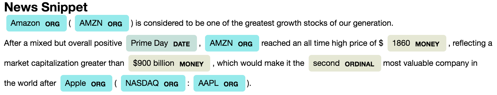

* Next, walk through the necessary steps to convert a Jupyter Notebook to a Python file.

  * With the Intro_to_NER.ipynb file still open, navigate to the File tab and hover over the `Download as` option in the dropdown list.

  * Click `Python (.py)` to download a copy of the notebook.

  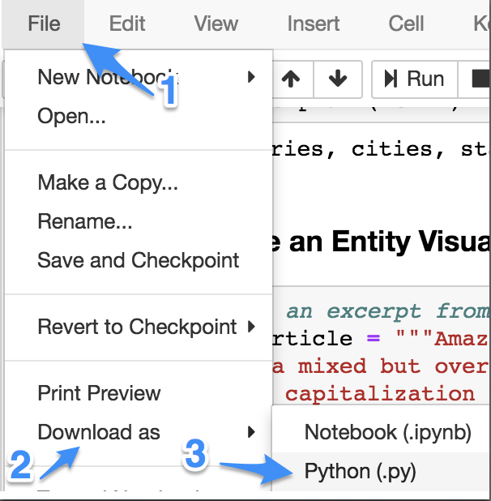

  * Select `Keep` if a warning message appears on your browser.

  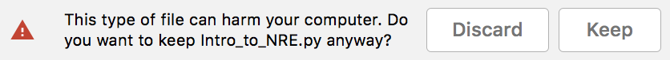

  * Once downloaded, navigate to your `Downloads` folder and open the file.

  * Explain to students that even though there is now a python file containing the code, it is not yet viable.

  * Point out that the extra blank spaces and unnecessary comments should be removed to best follow the Python styling guidelines.

    * **Note**: There are several of these scattered throughout the code.

  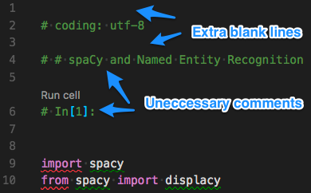

  * Additionally, to render the visualization using a Python script, there are two syntax changes:

  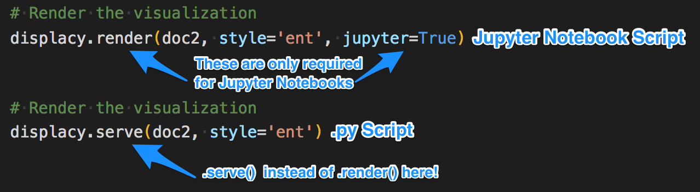

  * **NOTE**: if anyone encounters errors when rendering the display, the following code adjustments can be implemented:

    * Add `from IPython.core.display import display, HTML` to the import statements.

    * Adjust the final line of code to render with html:

  ```python
  # Render the visualization
  html = displacy.render(doc2, style='ent')
  display(HTML(html))
  ```

  * After the code has been tidied, the final step before testing is to relocate the new Python file to the same folder as the Jupyter Notebook file.

  * Once this has been accomplished, open a terminal window and navigate to the directory containing your scripts.

  * Within the terminal, use the following line to activate the Python script: `python Intro_to_NER.py`.

    * As in the Jupyter Notebook, the terminal will have printed the following messages:

    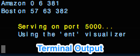

    * The visualization is automatically rendered on your computer's localhost; enter the [localhost address](http://127.0.0.1:5000/) into your browser's address bar to view the image.

    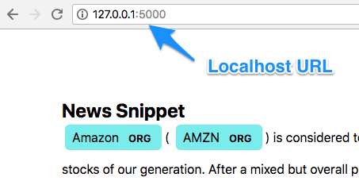

### 13. Students Do: NER and Tweepy (20 mins)

* **Files**

  * [Unsolved/Tweepy_NER.ipynb](Activities/07-Stu_NER_Tweepy/Unsolved/Tweepy_NER.ipynb)

* **Instructions**

  * [README.md](Activities/07-Stu_NER_Tweepy/README.md)

### 14. Instructor Do: Review Activity (5 mins)

* Open the [solution](Activities/07-Stu_NER_Tweepy/Solved/Tweepy_NER.ipynb) in Jupyter Notebook and and highlight the following:

  * The model is loaded using the spacy load function, `nlp = spacy.load("en")`.

  * This model will be used to process the tweet text.

  * An empty dictionary is created that will store the text and label entities.

  * User tweets are retrieved using Tweepy's `api.user_timeline("PaulONeillYES")`.

  * The resulting JSON data is then iterated over to pull out each tweet text.

  * The tweets are stored in `tweet["text"]`, which is then passed to the `nlp` function for processing.

  * Not every tweet will have detected entities, so `if not doc.ents` is used to handle this case.

  * The resulting entities will be appended to the dictionary and displayed using `spacy.displacy.render(doc, style='ent', jupyter=True)`.

  * Finally, the dictionary is passed into a pandas DataFrame.

* Answer any questions before moving on to the Bonus.

* Walk through the bonus and explain the following:

  * The DataFrame is grouped by labels and uses `count` to aggregate the results.

  * The DataFrame is then plotted with `label_frequency.plot.bar()`.

### 15. Everyone Do: Deploy to Heroku (40 mins) (Critical)

* **Files**

  * [Activities/08-Evr_Heroku_Deployment/Solved/app.py](Activities/08-Evr_Heroku_Deployment/Solved/app.py)

  * [Activities/08-Evr_Heroku_Deployment/Solved/Procfile](Activities/08-Evr_Heroku_Deployment/Solved/Procfile)

  * [Activities/08-Evr_Heroku_Deployment/Solved/requirements.t
  xt](Activities/08-Evr_Heroku_Deployment/Solved/requirements.txt)

* Encourage all students to follow the steps listed in the [Heroku deployment guide](Supplemental/HerokuGuide/README.md) and ask TAs if they need help.

* Once everyone has created a Heroku app, explain that:

  * The Github repo is initially empty, so nothing will happen at first.

  * Heroku will run `python app.py` on its server, so the script should behave the same on Heroku as it does locally. It is often good practice to test the code locally and then deploy to Heroku.

* Next, slack out [app.py](Activities/08-Evr_Heroku_Deployment/Solved/app.py), [Procfile](Activities/08-Evr_Heroku_Deployment/Solved/Procfile), and [requirements.txt](Activities/08-Evr_Heroku_Deployment/Solved/requirements.txt) and have students add these files to their repo using:

  ```shell
  git add app.py requirements.txt Procfile
  git commit -m "adding bot code and requirements"
  git push heroku master
  ```

* Open `app.py` and explain that this script retrieves the Twitter api keys through environment variables instead of through `config.py`. These variables will need to be manually added to Heroku under the application settings tab. Python is simply reading the environment variables into the script.

  ```python
  consumer_key = os.environ.get("consumer_key")
  consumer_secret = os.environ.get("consumer_secret")
  access_token = os.environ.get("access_token")
  access_token_secret = os.environ.get("access_token_secret")
  ```

* Walk through the following steps for manually setting the environment variables:

  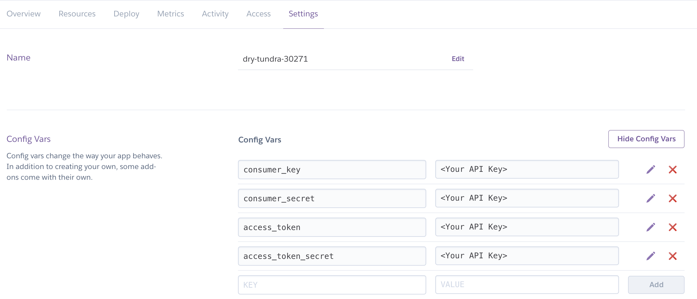

  1. Go to the project page on Heroku and navigate to the Settings tab.
  2. Find the option for **Config Vars**.
  3. Click `Reveal Config Vars`.
  4. Manually enter the Twitter API keys.

* Explain that manually entering the API keys in Heroku will allow the script to access the keys without exposing the keys through Github.

* Once the students have the code working locally, have them use the updated [requirements.txt](Activities/08-Evr_Heroku_Deployment/Solved/requirements.txt) and be sure to note the addition of the link that will download the model to use for NER.

* Walk through the remaining code in `app.py` and explain the following:

  * This app will listen for any tweets that contain: `@TraderData Analyze:`. It then uses the tweet message to determine which target account to collect and analyze.

  ```python
  mentions = api.search(q="@TraderData Analyze:")

    words = []

    try:
        command = mentions["statuses"][0]["text"]
        words = command.split("Analyze:")
        target_account = words[1].strip()
        user_tweets = api.user_timeline(target_account, page=1)
  ```

* Explain that the majority of the remaining code is ported over from the previous NER activity with the following exceptions:

  * The box plot is now being saved as an image and used to update the tweet status with media.

  * A while loop is used to control how often the bot searches for new requests for data analysis.

* Visit the deployed bot to demonstrate the analysis request with a custom tweet: `@TraderData Analyze: @moonpie`. Note: you may need to adjust the loop timing to quickly see the analysis results. Also, please use your own account and bot name for this demonstration.

* Encourage the students to try and deploy their own bots over the next week and ask TAs for help during office hours.

### 16. Everyone Do: SpaCy Emoji (15 mins)

* Live-code the following example with the class and highlight the following points:

  * `spacymoji` is a plugin to the SpaCy library that processes emoji characters from text.

  * The example tweet uses emojis to tell a story. In this case, the text is supposed to represent "Miley Cyrus".

  * The Emoji processor is added as a pipeline to spaCy. This allows the emoji processor to be added or removed as needed.

    ```python
    nlp = spacy.load('en')
    emoji = Emoji(nlp)
    nlp.add_pipe(emoji)
    ```

  * The decoded emoji is available as part of the doc object.

    ```python
    doc._.emoji
    ```

* Encourage students to experiment with their own emoji strings.

- - -

### LessonPlan & Slideshow Instructor Feedback

* Please click the link which best represents your overall feeling regarding today's class. It will link you to a form which allows you to submit additional (optional) feedback.

* [:heart_eyes: Great](https://www.surveygizmo.com/s3/4381674/DataViz-Instructor-Feedback?section=7.3&lp_useful=great)

* [:grinning: Like](https://www.surveygizmo.com/s3/4381674/DataViz-Instructor-Feedback?section=7.3&lp_useful=like)

* [:neutral_face: Neutral](https://www.surveygizmo.com/s3/4381674/DataViz-Instructor-Feedback?section=7.3&lp_useful=neutral)

* [:confounded: Dislike](https://www.surveygizmo.com/s3/4381674/DataViz-Instructor-Feedback?section=7.3&lp_useful=dislike)

* [:triumph: Not Great](https://www.surveygizmo.com/s3/4381674/DataViz-Instructor-Feedback?section=7.3&lp_useful=not%great)

- - -

### Copyright

Trilogy Education Services © 2018. All Rights Reserved.
