## Git Collaboration Guide

This guide will give you the basic for getting started with group collaboration on GitHub.

### Adding Collaborators 

* You're already familiar with the basics of using Git and GitHub to manage individual projects&mdash;pushing and pulling. Now we will cover using Git/GitHub to work on a group project with fellow collaborators.

* Begin by creating a repository. Only one person in your group should create a repo, as the other members will push to, and pull from, it.

  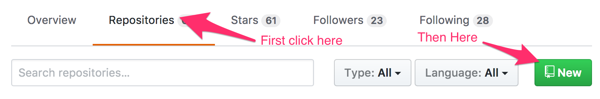

* Give your Repo a name and add a Readme if you'd like, then click `Create Repository`.

  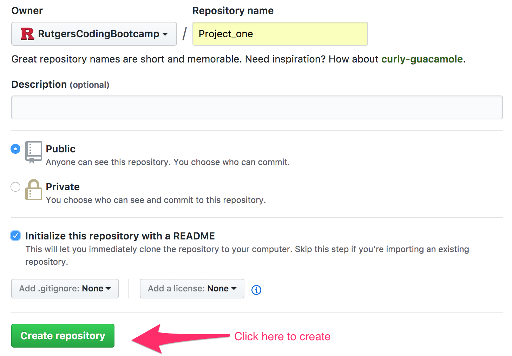

* In order for everyone to have the same access along with the all the same privileges as the owner, they need to be added as collaborators. To do so, click on the down arrow on the right side and then `settings`.

  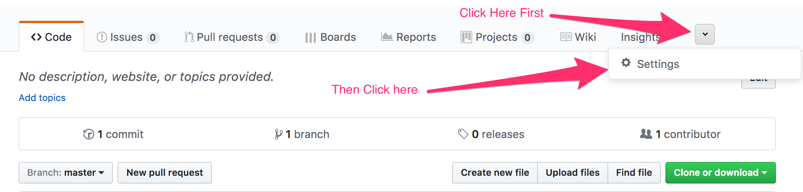

* Once you are in settings, click on the `Collaborators` link on the left hand side.

  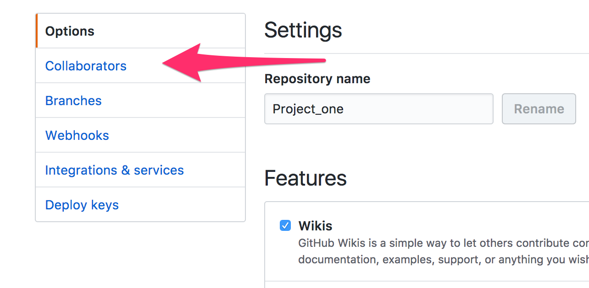

* Now you can search for you fellow classmates' GitHub name and add them a collaborators.

  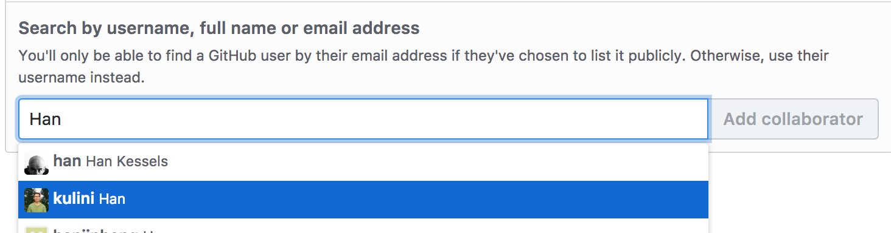

* Once they have been added you should see them pending an acceptance. Just have them check their email to confirm.

  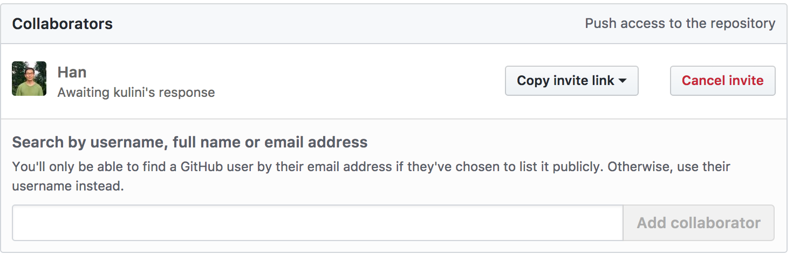

## Creating a Branch

* Up to this point, when working on your homework assignments, you've only had to deal with the `master` branch of you repo. What would happen if you and your groupmates simultaneously pushed up changes to the same file in a repo? Likely a lot of confusion! 

* Having each contributor create his or her own branch can help us avoid such problems. Each of you will have your own working copy that you can edit and test without having to worry about anyone else changing your code.

* To create a branch open up terminal and navigate to your repo. Then enter `git checkout -b <name of your branch>` and hit enter. This command means that you are creating a new branch, and then checking out, or switching, to it from master. Then hit `git branch` to see a list of your branches.

  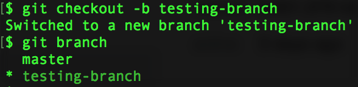

* The `*` located next to `master` indicates the branch we are currently working on. In order to switch to the branch we want to use, run `git checkout <name of your branch>`. Now when you run `git branch` you will see the star has move to your new branch.

  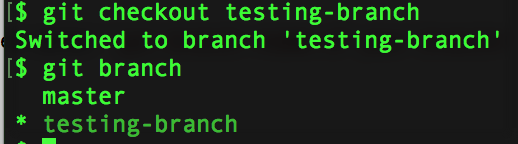

* You can now add, commit and push to your branch without affecting the master branch. 

## Pull Request

* You have created a branch, worked on files, and made some changes. Now it's time to merge into master. The best way to do this is to create a **pull request**, so you can have your code reviewed or check for any conflicts. A pull request, or PR, is a **request** to have your code **pulled** into the master branch.

* From your main repo, click on the `Pull request` tab and then `New pull request`.

    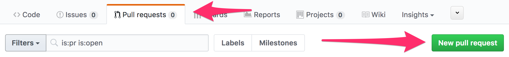

* From here, compare two branches. The branch on the right will be what you want to merge into branch on the left, generally `master`.

  

* Once the branch you want to merge has been selected click `Create pull request`.

  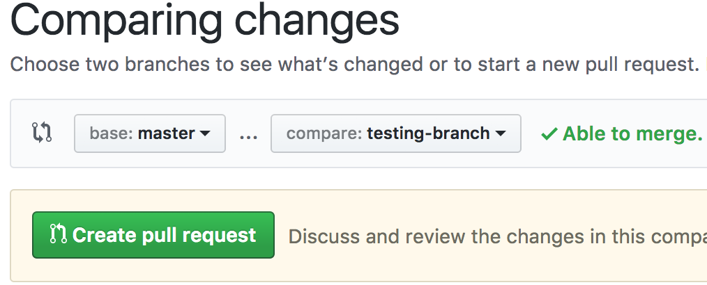

* Then type a brief description of your pull request and click on `Create pull request`.

  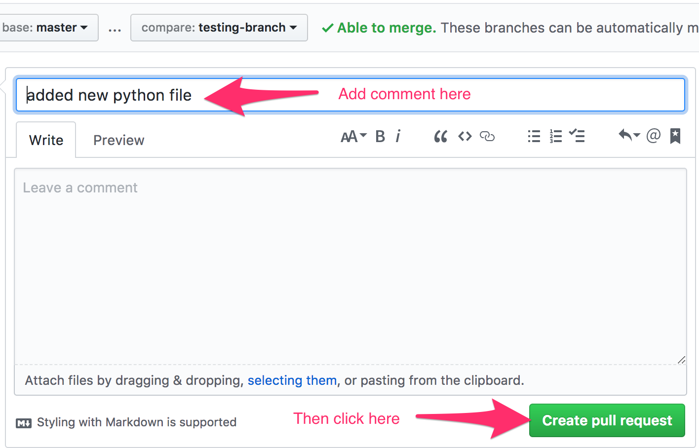

* Finally, if the code does not need a review or conflicts with any other files, you can merge your pull request into master. 

  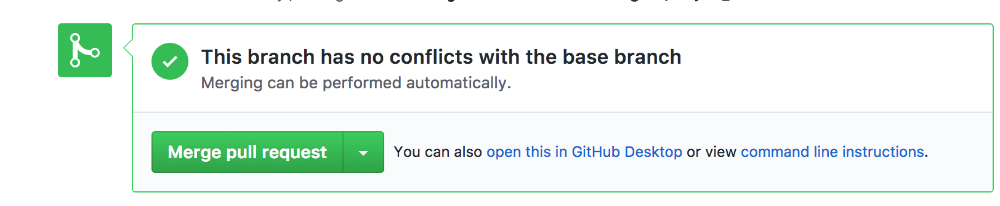

* Congrats! You have just created your first pull request. Now that you merged it you can go check out the main code page to see that your work is now on master.