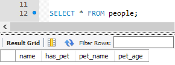

# Create a Table

## Instructions

* Now that there is a database on the server, it is possible to start digging into the real meat of MySQL and start creating tables within the new database!

* On the line underneath `CREATE DATABASE animals_db;` type the following lines of code and explain them line-by-line...

  

  * `USE animals_db;` tells MySQL that all of the code that follows will be affecting the data stored within the `animals_db` database.

  * `CREATE TABLE people (<COLUMNS>);` creates a table called `people` with the columns listed within the parentheses.

  * `name VARCHAR(30) NOT NULL` creates a column of `name` which can hold character strings within it of up to 30 characters and will not allow null fields.

  * `has_pet BOOLEAN NOT NULL` creates a column of `has_pet` which can hold either true or false within it and will not allow null fields.

  * `pet_name VARCHAR(30)` creates a column of `pet_name` which can hold character strings within it of up to 30 characters and will allow null fields.

  * `pet_age INTEGER(10)` creates a column of `pet_age` which can hold whole numbers with precision up to 11 places.

* After going through the code, hit the lightning-bolt button and make note of the error which appears at the bottom of the screen saying that "animals_db" already exists.

  * MySQL data is persistent and therefore is not deleted or overwritten when identical commands are run unless specifically commanded to. This means that when a database or table is created with an identical name to one which already exists, an error will occur telling the user that the database/table already exists.

  * Ask the class what they could do to avoid these kinds of errors. They will most likely come up with the fact that they could simply delete the offending line of code and then run the commands again. This would work, but point out how deleting working code is not something students want to get into the habit of doing.

  * Instead, show the class how it is possible to highlight the lines of code to run and then click the lightning-bolt symbol to only run the selection. This is a much better method of running SQL code than deleting past code.

    

* Highlight the above code and then hit the lightning-bolt symbol for MySQL Workbench. Reload the connection to the server and, using the navigator, point out how there is now a table called "people" within the database.

* Point out that the structure of a table can be visualized using `SELECT * FROM <table name>;`

  * In the future, the class will be able to view the structure of their table and all of the values contained within it using this same line of code.

    

* Answer whatever questions students may have before moving onto the next activity.
