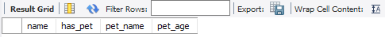
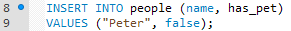
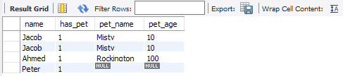

# Adding and Updating Data in Tables

## Instructions

* Once everyone has come back from break, ask the class whether or not there is any data within the tables created.

  * There is still no data stored within the server at this time. Unlike before, however, MySQL is now all set to start adding data to the server!

* Open up "animals_db" once more within MySQL Workbench and type `SELECT * FROM people;` into the editor. Before highlighting this line of code and running it, explain once more how this will bring up a visual of the table created.

  

  * Students should note that there is nothing stored within the table just yet but this will change very soon.

* Moving back into the editor, type the following code while explaining what it does line-by-line.

  

  * This code does pretty much what it says on the tin; it inserts data into the "people" table and then specifies which columns that data will be entered into.

  * The `VALUES` line places the data contained in the parentheses into the corresponding columns listed after the `INSERT INTO` statement.

* Edit the code within the editor so that it matches the screenshot below. Before running the the code, however, ask the class what they think will happen to the table.

  

  

  * The code WILL run, but the data from the first insert statement has been duplicated. This is because, unlike tables and databases, there can be identical data stored within a table. As such, students should make sure to be careful when adding insert statements into their code.

* Write the following lines of code into the editor underneath the last insert statement and ask the class what they think will happen to the table.

  

  * Highlight this line of code and the select statement to show how data has been added to only the "name" and "has_pet" columns of the table while the rest of the row has null values.

  * This is because only those columns that required data were filled in whilst those that did not require data were automatically filled with null values.

  

  * If users were to try to create a new row within the table without adding data into those columns requiring values, the code would return an error and would not be able to run.

* Oh! It looks like Peter actually DOES have a pet and the database should be changed to reflect this! Write the following statement and then see if anyone can figure out what it would do.

  

  * This code updates the data stored in the columns specified in the SET statement in the row where the data in the "name" column is equal to "Peter"

  

  * If we the `WHERE` statement was not included, then the `UPDATE` would have set the values for all columns instead of those of a specific row. That would have been a pretty major error and is why the `WHERE` statement is so important.
