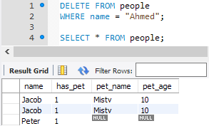
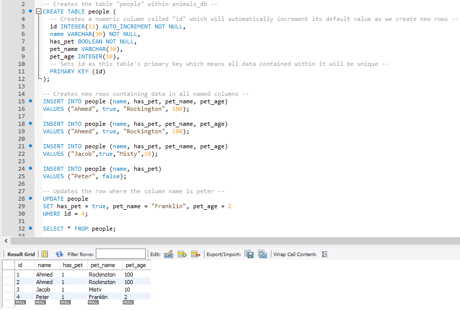

# The Value of Unique Values

## Instructions

* Duplicate data in that `animals_DB` table is starting to become something of an eyesore... thankfully there is an easy way to change that! Type in the following line of code which should remove the rows that contain the string "Ahmed" within the "name" column.

  

  * Well... It deleted the duplicate! Too bad it also deleted the original row as well. That's a little annoying. See if the class understands why this happened.

  * Because the name "Ahmed" appears twice within the table, SQL assumes that the user wants to delete every column that contains that name and does not understand that the user is simply trying to delete the duplicate row.

* To prevent this kind of thing from occurring, programmers will oftentimes want to create a column that automatically populates each new row with unique data. This allows them to select and affect that row more easily.

* Open up [06-Ins_ValueOfUniques](Solved/animalsDBWithID.sql) and copy the code into MySQL Workbench before running it.

  

  * Be sure to note how this code has replaced the old update statement with one in which the WHERE statement now uses the id column to select the row we want to affect.

  * Explain that a **primary key** uniquely identifies a row.

  * `AUTO_INCREMENT` generates a new value for each inserted record in the table. By default, the starting value for `AUTO_INCREMENT` is 1, and it will increment by 1 for each new record. We're using this with our unique `PRIMARY KEY` so we automatically get unique, incrementing values for each table row.

  * Point out that, because it auto-increments, each row's ID is guaranteed to be unique. This ensures that MySQL does not identify and update the wrong row when CRUD - Create, Read, Update, Delete - statements are implemented.

  * Point out that the insert statements have not changed, as they do not need to insert data specifically into the id column. MySQL automatically provides a value for this column, fulfilling the uniqueness constraint by automatically incrementing the last value used as an ID.

* Purposefully included within this code is the same kind of error that existed before where there are two identical rows. Thanks to the auto-incrementing primary key of id, however, it is easier to remove the duplicate using the following code.

  

  * This does precisely what was desired: Delete the duplicate and preserve the original.
