## 10.1 Lesson Plan - Intro To MySQL

### Overview

In today's class students will be introduced to MySQL databases and will learn how to create tables and simple queries.

### Instructor Notes

* Since MySQL has the potential to bring about a lot of errors on its inaugural setup, we have set aside portions of time for the critical assignments for you and your TA's to assist the class as necessary over the course of today's assignments. If some students finish the assignments without issue, then have them also go around and assist those who are still facing problems. Do your best to keep everyone in the class on the same page so that no one is left behind.

* **A few days before this class, tell everyone in your class over Slack to download MySQL Workbench so that everyone is using the same program when they get to class!**

* Do not be surprised if some of the students already have some experience with MySQL. Many of the professions that Data Visualization students tend to come from have provided them with exposure to the language. Embrace these students' knowledge of the language and have them offer up assistance in teaching their fellow students who may not know MySQL yet.

### Sample Class Video (Highly Recommended)

* To view an example class lecture visit (Note video may not reflect latest lesson plan): [Class Video](https://codingbootcamp.hosted.panopto.com/Panopto/Pages/Viewer.aspx?id=61dae8c2-e6dd-4a1a-8005-b650934186e8)

- - -

### Class Objectives

* Students will have MySQL Workbench or Sequel Pro installed and running on everyone's computers
* Students will create a localhost connection to a MySQL server and have everyone successfully connect to it
* Students will create, use, and populate a MySQL database with data
* Students will create, populate, and select data from a MySQL table

- - -

### 1. Instructor Do: Welcome Class (0:05)

* Welcome the class to class and congratulate them on making it through project week! They have come very far since the start of the course and should feel very proud of what they have accomplished thus far!

* Warn them that today's class will be going over something entirely new and that it may take them some time to pick up this new language since it is almost entirely unlike any of the other programs they have learned up to this point.

* Tell them not to worry though as, despite the difficulties many may face over the course of the class, there will be ample time given to make sure everyone is on the same page.

### 2. Introduction to SQL and MySQL (0:05)

* Before diving into any of this lesson's demos or even having the students install MySQL Workbench on their devices, take some time to go over the purpose SQL and MySQL.

  * SQL (often pronounced "Sequel") stands for "Structured Query Language" and is a powerful programming tool that was specifically designed to allow programmers  to create, populate, manipulate, and access databases, and to provide them with an easy method to deal with server-side storage.

  * MySQL (often pronounced "My Sequel") is a popular type of open source software that can be placed on a server to allow SQL commands to affect the data stored on the server.

  * Data using SQL is stored in tables on the server, much like spreadsheets you would create in Microsoft Excel, making the data easy to visualize and search.

* Slack out the [StudentGuide](../StudentGuide.md) containing this week's objectives as well as additional resource links.

* Slack out the [SQL Reference Guide](../Supplemental/SQL_reference_guide.pdf) for students to use as a reference during the activities this week.

### 3. Everyone Do: Install MySQL Workbench (0:13)

* Announce to the class that, in order to code in MySQL, they will require a coding environment other than that of Visual Studio Code.

* **Important** Alert students to download **MySQL Community Server 5.7** as the most recent release of version 8 will cause issues. Students with a Mac should not use `brew install` due to [versioning issues](https://stackoverflow.com/questions/50126503/homebrew-mysql-8-support)

* Slack out the links for students to download and install the following items:

  * [MySQL Server](https://dev.mysql.com/downloads/mysql/5.7.html#downloads)
  * [MySQL Workbench](https://www.mysql.com/products/workbench/)

* Again, alert students to download **5.7** and not **8**.

  * Remind students to specify their operating systems before beginning their downloads of MySQL Server and MySQL Workbench.

  * Let the class know that there are plenty of issues that may arise when installing and using MySQL for the first time on their computer. Tell them not to worry for the time being as time will be given to troubleshoot whatever problems they may encounter.

* Make sure that everyone has MySQL Workbench installed and booted up before continuing the lesson.

### 4. Instructor Do: Create a Localhost Connection Demo (0:10)

* Explain to the class how, since there is currently no defined server for them to connect to, they are first going to set up something called a "localhost connection" to connect to instead.

  * This type of connection allows users to create locally stored data on their computers as if they were an external server.

  * This is a much better alternative to spending hundreds to thousands of dollars on buying a physical server for the purposes of practicing on.

* Open up MySQL Workbench and click the (+) symbol next to the text which reads "MySQL Connections"

  * Enter "Local Instance MySQL" as the connection name

  * Make sure the connection is set to "Standard (TCP/IP)"

  * Enter "localhost" as the Hostname

  * Enter "3306" as the port for this connection. It is possible to leave this part out of the connection and still have a working instance. That is because MySQL uses port 3306 by default.

  * Enter your MySQL username into the Username section (Default is "root")

  * Click on the **Store In Vault...** button beside the Password option and enter in your MySQL password (Default is empty)

    * Mac users will see **Store in Keychain** instead

  * Leave the Default Schema field empty

    

* Click on the "Test Connection" button so as to ensure the new localhost connection was created correctly. If successful, hit okay and the new connection should appear on the main page.

  * Now double-click on that connection, enter your password if necessary, and the SQL editor will appear.

* Check to see if there are any questions and answer them as accurately as possible before moving onto the next activity.

### 5. Students Do: Create a Localhost Connection (0:20)

* Let the class know that MySQL Workbench can sometimes seem a little hard to comprehend when loaded up for the first time and that confusion is perfectly normal.

* Also let them know that there are some errors that are likely to pop up over the course of this assignment but that the instructional team will be walking around to help them with whatever issues make themselves known.

  * Students who have successfully created a localhost connection should be encouraged to help those who seem to be struggling, especially if they happened upon the same kind of error that the struggling student is having.

  * If students feel they cannot help their fellow students, have them start reading up on how databases are created and used in MySQL.

  

* **Instructions**:

  * Now it is your turn to set up a localhost connection! This may seem as if it will be an easy task, but there are some common errors and hurdles that might stand in your way as you work to create your first ever MySQL connection.

  * Start out by opening up MySQL Workbench and hitting the (+) button next to the text which reads "MySQL Connections". Sequel Pro will also have a (+) on the bottom left for new connections.

  * Enter the following credentials into the on-screen prompt...

    * Connection Name: Local Instance MySQL

    * Connection Method: Standard (TCP/IP)

    * Hostname: localhost

    * Port: 3306

    * Username: <Your MySQL Username> (Defaults to "root")

    * Password: <Your MySQL Password> (Defaults to empty)

    * Keep the Default Schema field empty

  * Hit "Test Connection" and, if the connection is successful, hit okay and double-click on the newly created field under the "MySQL Connections" text on the homepage

    * If the connection fails, raise your hand and one of us will come around to help you out. Until we come by, however, take this time to go online and see if there is anything online which might tell you what went wrong. Do not worry if you cannot find anything though, we will make sure to figure this out.

    * One of the best first steps when dealing with MySQL connection problems is to uninstall/reinstall MySQL Server using the MySQL Installer. For whatever reason, MySQL Server does not always seem to work properly when installed alongside MySQL Workbench and might function properly if reinstalled individually.

  * If your connection was successful and you have nothing else to do, feel free to help those around you in creating their connections.

* **Bonus**:

  * Look into how you can create and use databases using SQL commands

  * Look into the reasons why MySQL uses port 3306 as its default

### 6. Instructor Do: Connections Vs. Databases (0:03)

* Now that everyone has created a connection to the localhost and is comfortably inside the SQL editor, ask the students whether or not this means that they have created a database as well.

* The answer is that they have not... Yet.

  * Point out how the "SCHEMAS" section on the left side of their page is pretty much empty other than including the built-in sys, sakila, and world databases. These databases would not appear on external servers.

    

* Connecting to a server does not mean that there is a database on that server. This means that, even if users wanted to, they could not yet populate their localhost connection with data until they create a database to house the data.

  * The connection is a road which leads to an empty lot. Before the are can be populated, the foundations for houses must be made (create a database), and houses must be built (create a table).

### 7. Instructor Do: Creating a MySQL Database (0:05)

* Within the MySQL Workbench editor, type `CREATE DATABASE animals_db;`

  * Explain to the class how this line of code will, when executed, create a MySQL database on the server they are connected to.

  * Also make certain to point out the semicolon at the end of the statement that tells MySQL that this line of code has concluded. While MySQL will execute code without the semicolon, it is good practice to include it at the end of each statement.

* Next, find the lightning-bolt symbol just above the editor and click on it to execute the code.

  

* Point out how, on the bottom of the screen, there is a confirmation stating that the database has successfully been created.

  

* Something seems off though... See if anyone in the class can figure it out and give them a few seconds to think it through before answering.

  * The database never appeared in the navigator on the left side of the page! Does that mean that our code actually failed?

  * Nope! MySQL Workbench just needs to reload the connection and the "animals_db" database will now appear within the navigator.

### 8. Instructor Do: Creating a Table (0:10)

* Now that there is a database on the server, it is possible to start digging into the real meat of MySQL and start creating tables within the new database!

* On the line underneath `CREATE DATABASE animals_db;` type the following lines of code and explain them line-by-line...

  ```sql
  CREATE DATABASE animals_db;

  USE animals_db;

  CREATE TABLE people (
    name VARCHAR(30) NOT NULL,
    has_pet BOOLEAN DEFAULT false,
    pet_name VARCHAR(30),
    pet_age INT
  );
  ```

  * `USE animals_db;` tells MySQL that all of the code that follows will be affecting the data stored within the `animals_db` database.

  * `CREATE TABLE people (<COLUMNS>);` creates a table called `people` with the columns listed within the parentheses.

  * `name VARCHAR(30) NOT NULL` creates a column of `name` which can hold character strings within it of up to 30 characters and will not allow null fields.

  * `has_pet BOOLEAN DEFAULT false` creates a column of `has_pet` that holds either true or false within it, though the default value is now set as false.

  * `pet_name VARCHAR(30)` creates a column of `pet_name` which can hold character strings within it of up to 30 characters and will allow null fields.

  * `pet_age INT` creates a column of `pet_age` which can hold whole numbers.

* After going through the code, hit the lightning-bolt button and make note of the error which appears at the bottom of the screen saying that "animals_db" already exists.

  * MySQL data is persistent and therefore is not deleted or overwritten when identical commands are run unless specifically commanded to. This means that when a database or table is created with an identical name to one which already exists, an error will occur telling the user that the database/table already exists.

  * Ask the class what they could do to avoid these kinds of errors. They will most likely come up with the fact that they could simply delete the offending line of code and then run the commands again. This would work, but point out how deleting working code is not something students want to get into the habit of doing.

  * Instead, show the class how it is possible to highlight the lines of code to run and then click the lightning-bolt symbol to only run the selection. This is a much better method of running SQL code than deleting past code.

    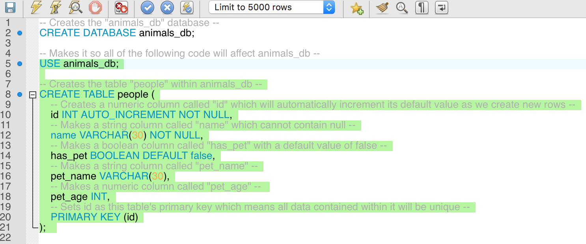

* Highlight the above code and then hit the lightning-bolt symbol for MySQL Workbench. Reload the connection to the server and, using the navigator, point out how there is now a table called "people" within the database.

* Point out that the structure of a table can be visualized using `SELECT * FROM <table name>;`

  * Explain that using the asterisk in this manner tells MySQL to select "all fields" from the table.

  * In the future, the class will be able to view the structure of their table and all of the values contained within it using this same line of code.

    

* Answer whatever questions students may have before moving onto the next activity.

### 9. Students Do: Setting Up FavoriteDB (0:10)

* Students will now create a database and a set of three tables to keep track of some of their favorite things.

* **Instructions**:

  * Create a new Database called `favorite_db` within MySQL Workbench and use the database for the remainder of this activity.

  * Create a table called `favorite_foods` and add the following to it...

    * Create the column "food" which can take in a 50 character string and cannot be NULL
    * Create the column "score" which can take in an integer

  * For the table `favorite_songs` and add the following to it...

    * Create the column "song" which can take in a 100 character string and cannot be NULL
    * Create the column "artist" which can take in a 50 character string
    * Create the column "score" which can take in an integer

  * For the table `favorite_movies` and add the following to it...

    * Create the column "film" which can take in a string and cannot be NULL
    * Create the column "five_times" which can take in a boolean
    * create the column "score" which can take in an integer

* **Bonus**:

  * Go online and look into how one might go about adding data into a table.

### 10. Everyone Do: Go Over FavoriteDB (0:12)

* Copy and paste the data inside of [01-Stu_FavoriteDB](Activities/02-Ins_CreateDatabase/Solved/CreateDB.sql) into MySQL Workbench or Sequel Pro to go over what each line of code does once more.

  * Especially make sure to point out how `DEFAULT` works in this example, as this will help with the homework and make SQL easier to handle.

  * `DEFAULT` is used to insert a default value into a column. In this case, it is used to set the default `BOOLEAN` value for the `five_time` column to `false`.

    ```sql
    -- Drops the favorite_db if it exists currently --
    DROP DATABASE IF EXISTS favorite_db;
    -- Creates the "favorite_db" database --
    CREATE DATABASE favorite_db;

    -- Makes it so all of the following code will affect favorite_db --
    USE favorite_db;

    -- Creates the table "favorite_foods" within favorite_db --
    CREATE TABLE favorite_foods (
      -- Makes a string column called "food" which cannot contain null --
      food VARCHAR(50) NOT NULL,
      -- Makes a numeric column called "score" --
      score INT
    );

    -- Creates the table "favorite_songs" within favorite_db --
    CREATE TABLE favorite_songs (
      song VARCHAR(100) NOT NULL,
      artist VARCHAR(50),
      score INT
    );

    -- Creates the "favorite_movies" table within favorite_db --
    CREATE TABLE favorite_movies (
      movie VARCHAR(100) NOT NULL,
      -- Creates a boolean column called "five_times" that sets the value to false if nothing is entered --
      five_times BOOLEAN DEFAULT false,
      score INT
    );
    ```

- - -

### 11. BREAK TIME (0:15)

- - -

### 12. Instructor Do: Adding and Updating Data In Tables (0:15)

* Once everyone has come back from break, ask the class whether or not there is any data within the tables created.

  * There is still no data stored within the server at this time. Unlike before, however, MySQL is now all set to start adding data to the server!

* Open up "animals_db" once more within MySQL Workbench and type `SELECT * FROM people;` into the editor. Before highlighting this line of code and running it, explain once more how this will bring up a visual of the table created.

  

  * Students should note that there is nothing stored within the table just yet but this will change very soon.

* Moving back into the editor, type the following code while explaining what it does line-by-line.

  

  * This code does pretty much what it says on the tin, it inserts data into the "people" table and then specifies what columns that data will be entered into.

  * The `VALUES` line places the data contained in the parentheses into the corresponding columns listed after the `INSERT INTO` statement.

* Edit the code within the editor so that it matches the screenshot below. Before running the code, however, ask the class what they think will happen to the table.

  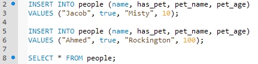

  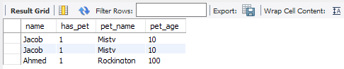

  * The code WILL run, but the data from the first insert statement has been duplicated. This is because, unlike tables and databases, there can be identical data stored within a table. As such, students should make sure to be careful when adding insert statements into their code.

* Write the following lines of code into the editor underneath the last insert statement and ask the class what they think will happen to the table.

  

  * Highlight this line of code and the select statement to show how data has been added to only the "name" and "has_pet" columns of the table while the rest of the row has null values.

  * This is because the column that required data and the column with a default value of "false" were filled whilst those that did not require data were automatically filled with null values.

  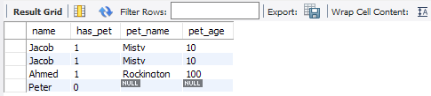

  * If users were to try to create a new row within the table without adding data into those columns requiring values, the code would return an error and would not be able to run.

* Oh! It looks like Peter actually DOES have a pet and the database should be changed to reflect this! Write the following statement and then see if anyone can figure out what it would do.

  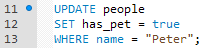

  * This code updates the data stored in the columns specified in the SET statement in the row where the data in the "name" column is equal to "Peter"

  

  * Take the time to point out how the `has_pet` column was changed to 1 after updating Peter's pet status. This is because boolean values are represented as zero and nonzero; in MySQL, a 0 indicates false and a 1 is true.

  * If the `WHERE` statement was not included, then the `UPDATE` would have set the values for all columns instead of those of a specific row. That would have been a pretty major error and is why the `WHERE` statement is so important.

### 13. Students Do: Adding Data to FavoriteDB (0:10)

* Students will now work to populate their tables within `favorite_db` with data. The values that they choose to add will be up to them but they will have to create at least three rows of data per table.

  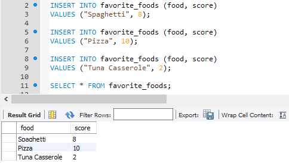

* **Instructions**

  * It is time to add some data into FavoriteDB! The data that you add should be unique to you and you should try to test your skills in not only adding new data, but also attempt to update old data as well!

  * Try to add at least three rows of data to each table.

* **Bonus**:

  * Look into how you might go about creating a column that can hold a default value within it and how default values work when creating new rows.

  * Look into how you might go about creating a column with a default value that automatically increases with each new row.

  * Look into the concept of making a column the "primary key."

  * Try to create a column called "id" in one of your tables that can contain an integer, is the primary key for the table, cannot be NULL, and automatically increments with each new row added.

### 14. Everyone Do: Review Adding Data to FavoriteDB (0:05)

* Copy the MySQL code from [05-Stu_FavoriteDBData](Activities/06-Stu_FavoriteDBData/Solved/AddingFavoriteRows.sql) into MySQL Workbench and run the code before going through the activity line-by-line so as to explain what each part of the application does.

  * The `favorite_foods` table only contains two columns for "food" and "score" and, as such, only requires a string and an integer to be entered for each row in the table.

  * The `favorite_songs` table contains three columns for "song", "artist", and "score". The first two columns require strings to be passed while the final column requires an integer.

    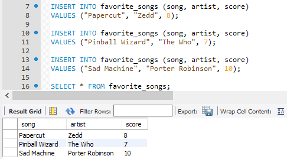

  * The `favorite_movies` table contains three columns for "movie", "five_times", and "score". The first column requires a string, the second column requires a boolean, and the final column requires an integer.

    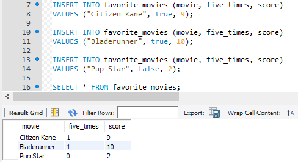

  * Go ahead an point out that multiple rows can be added into a table using a single `INSERT INTO` statement. This can be done by placing multiple sets of values in parentheses after the `VALUES` statement with a comma between each parentheses.

    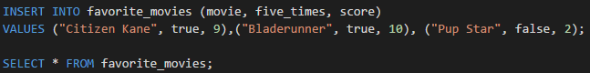

### 15. Instructor Do: The Value of Unique Values (0:05)

* Duplicate data in that `animals_DB` table is starting to become something of an eyesore... thankfully there is an easy way to change that! Type in the following line of code which should remove the rows that contain the string "Ahmed" within the "name" column.

  

  * Well... it deleted the duplicate! Too bad it also deleted the original row as well. That's a little annoying. See if the class understands why this happened.

  * Because the name "Ahmed" appears twice within the table, SQL assumes that the user wants to delete every column that contains that name and does not understand that the user is simply trying to delete the duplicate row.

* To prevent this kind of thing from occurring, programmers will oftentimes want to create a column that automatically populates each new row with unique data. This allows them to select and affect that row more easily.

* Open up [07-Ins_ValueOfUniques](Activities/07-Ins_ValueOfUniques/Solved/animalsDBWithID.sql) and copy the code into MySQL Workbench before running it.

  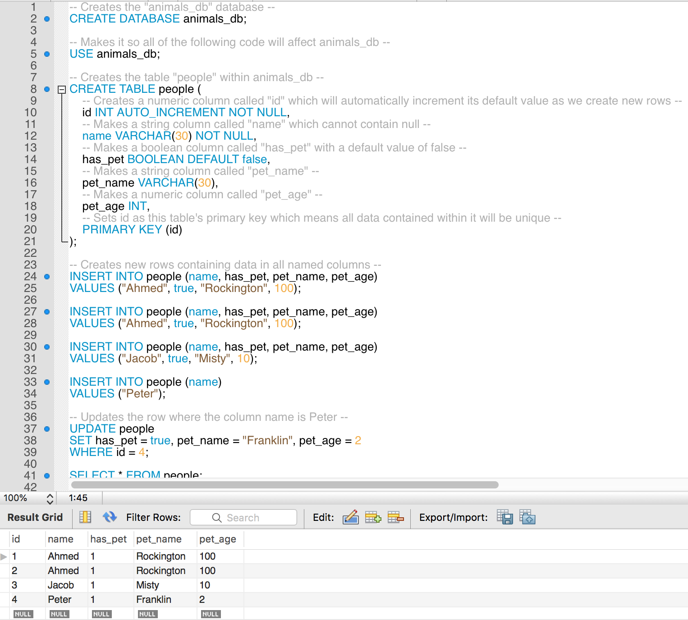

  * Be sure to note how this code has replaced the old update statement with one in which the WHERE statement now uses the id column to select the row we want to affect.

  * Explain that a **primary key** uniquely identifies a row.

  * `AUTO_INCREMENT` generates a new value for each inserted record in the table. By default, the starting value for `AUTO_INCREMENT` is 1, and it will increment by 1 for each new record. We're using this with our unique `PRIMARY KEY`, so we automatically get unique, incrementing values for each table row.

  * Point out that, because it auto-increments, each row's ID is guaranteed to be unique. This ensures that MySQL does not identify and update the wrong row when CRUD - Create, Read, Update, Delete - statements are implemented.

  * Point out that the insert statements have not changed, as they do not need to insert data specifically into the id column. MySQL automatically provides a value for this column, fulfilling the uniqueness constraint by automatically incrementing the last value used as an ID.

* Purposefully included within this code is the same kind of error that existed before where there are two identical rows. Thanks to the auto-incrementing primary key of id, however, it is easier to remove the duplicate through using the following code.

  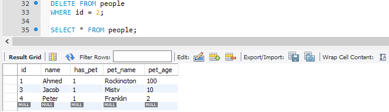

  * This does precisely what was desired: Delete the duplicate and preserve the original.

### 16. Students Do: Making and Using an ID Column (0:10)

* Slack out the following instructions

* **Instructions**:

  * Make a new database called "programming_db" and switch to it for this activity

  * Create a table called "programming_languages" which includes a primary key named "id" which will automatically increment with each new row created, a string column called "languages," and a numeric column called "rating."

  * Insert some data into the table and then modify the data using the id column.

* **Bonus**:

  * Study up on how to add columns to a table and then create a boolean column called "mastered" which has a default value of `true`.

  * Start looking into the concept of joins in SQL

### 17. Everyone Do: programming_db Solution (0:15)

* Open up [08-Stu_programmingDB](Activities/08-Stu_programmingDB/Solved/programmingDB.sql) and copy the code into MySQL Workbench.

* Go over the bits of code which create "id" and set it as the primary key once more. Make sure everyone understands how this works and explain how useful this will be in this week's homework.

### 18. Instructor Do: Breaking Into the Join (0:10)

* Now we are getting into one of the more difficult aspects of MySQL, but tell your class that this information will be very useful to them in the homework should they decide to attempt the challenge assignment.

* Joins allow those using MySQL to combine two or more individual tables using a value that is shared between them.

* Open up [09-Ins_booksDB](Activities/09-Ins_booksDB/Solved/books.sql) and then copy it into MySQL Workbench. Take a moment to demonstrate the structure of the `books` and `authors` tables.

  * Explain that we can utilize joins to combine and display data from both tables. Point out how the `books` table has a foreign key of `authorId` which corresponds to the `id` of a row in the `authors` table. Explain that these tables have what's known as a one-to-many relationship since a book can only have one author, but an author can have many books.

* Explain that foreign keys are most commonly used to relate tables since primary keys are unique and won't change. Demonstrate each query below, showing students the resulting table and explaining the differences between each join.

  * INNER JOIN: Combines tables where the specified data-values within a column match one-another

  * LEFT JOIN: Combines tables and shows all of the values of the first table specified while only the values which match on the second side will be shown

  * RIGHT JOIN: Combines tables and shows all of the values of the second table specified while only the values which match on the first table will be shown

### 19. Instructor Do: Sakila Download Instructions (0:02)

* Explain to students that future activities and homework will require Sakila, a popular MySQL sample database.

* Slack out the [Installation Instructions](../../../02-Homework/10-SQL/Instructions/README.md) and instruct students to install the database on their own.

* Lastly, encourage students to attend office hours if any issues occur during installation.

- - -

### LessonPlan & Slideshow Instructor Feedback

* Please click the link which best represents your overall feeling regarding today's class. It will link you to a form which allows you to submit additional (optional) feedback.

* [:heart_eyes: Great](https://www.surveygizmo.com/s3/4381674/DataViz-Instructor-Feedback?section=10.1&lp_useful=great)

* [:grinning: Like](https://www.surveygizmo.com/s3/4381674/DataViz-Instructor-Feedback?section=10.1&lp_useful=like)

* [:neutral_face: Neutral](https://www.surveygizmo.com/s3/4381674/DataViz-Instructor-Feedback?section=10.1&lp_useful=neutral)

* [:confounded: Dislike](https://www.surveygizmo.com/s3/4381674/DataViz-Instructor-Feedback?section=10.1&lp_useful=dislike)

* [:triumph: Not Great](https://www.surveygizmo.com/s3/4381674/DataViz-Instructor-Feedback?section=10.1&lp_useful=not%great)

- - -

### Copyright

Trilogy Education Services © 2018. All Rights Reserved.
