## 10.2 Lesson Plan - MySQL Queries and Joins

### Overview

In today's class students will be diving more deeply into MySQL and will learn how to perform complex queries and joins on databases.

### Instructor Priorities

* Students will understand how to import csv files in a SQL database.

* Students will understand how to select rows based on conditions.

* Students will understand how to Join tables.

### Instructor Notes

* Today's lesson will have students continue to dive into MySQL, there is not installation today so there will be time to make sure all activities will be covered. Today will deal a lot with importing CSV files into tables, be sure to refresh your MySQL workbench to constantly update the tables.

* Some CSV files may take a few minutes to upload into the database so make sure TA's are staying on top of slacking out files.

* Have your TAs refer to the [TimeTracker](TimeTracker.xlsx) to stay on track.

- - -

### Sample Class Video (Highly Recommended)

* To view an example class lecture visit (Note video may not reflect latest lesson plan): [Class Video](https://codingbootcamp.hosted.panopto.com/Panopto/Pages/Viewer.aspx?id=5d31971d-581e-4118-8eb6-a8a90182be60)

### Class Objectives

* Students will be able to import large CSV datasets into MySQL Workbench using the import wizard

* Students will be able to use MySQL to select specific rows/columns of data out from a table

* Students will understand the different kinds of joins and how to use them to create new tables in MySQL

- - -

### 1. Instructor Do: Welcome Class (0:05)

* Welcome the class to their second day of MySQL. The previous lesson was likely a challenging one for those of them who had never dealt with MySQL before but thankfully they will be getting plenty more practice today.

* Today's lesson will focus much more intently on querying large databases and dealing with larger datasets. As such, it will be a much more hands-on class than the last.

### 2. Students Do: MySQL Warmup (0:10)

* Before diving into any new material for the day, let the class know that they will be starting today's class off with a short warmup activity.

* For this activity, students will be creating a new database and table using MySQL workbench and will have to fill this table with some very specific pieces of data.

* **Instructions**:

  * Create a new database called `Second_International_Bank` using MySQL Workbench

    * Within this new database, create a table called `Customers` with six columns that are capable of holding the following values...

      * `ID`: An integer that will be used as the primary key for the table and automatically increments

      * `FirstName`: A string which will hold a customer's first name

      * `LastName`: A string which will hold a customer's last name

      * `Loan`: A boolean which will let users know if the customer has any unpaid loans

      * `Checking`: A decimal value which will let users know how much money a customer has in their checking account

      * `Savings`: A decimal values which will let users know how much money a customer has in their savings account

    * Create five new rows of data to fill up the `Customers` table with some data

* **Bonus**:

  * Look into the [decimal](https://dev.mysql.com/doc/refman/5.7/en/precision-math-decimal-characteristics.html) datatype in MySQL and convert the `Checkings` and `Savings` columns so that they can only hold values with two or less numbers after a decimal point

### 3. Everyone Do: MySQL Warmup Review (0:05)

* Open up [01-Stu_Warmup/SecondInternational.sql](Activities/01-Stu_Warmup/Solved/second_international.sql) within MySQL Workbench and go over the code provided line-by-line, explaining along the way:

  * Create and Use a database.

  * Create a table assigned the appropriate value types to each column.

  * Insert five rows worth of data into the table. Note there are two ways this can be done.

  * For the bonus `DECIMAL` takes two arguments. The first is maximum number of digits, the second is number of digits to the right of the decimal place.

  * Finally, select everything. from the table to view.

### 4. Instructor Do: The Import Wizard (0:05)

* Thus far the class has had to create their own tables and values manually using MySQL code. As one might imagine, this process would make translating large datasets from external sources very tedious, thankfully MySQL Workbench includes a built-in import wizard which can take CSV files and translate them into tables automatically.

* Open up MySQL Workbench, connect to `localhost`, and create a new database called "Miscellaneous_DB"

* Open up [02-Ins_ImportWizard/birdsong.csv](Activities/02-Ins_ImportWizard/Resources/birdsong.csv) within an IDE to show the class the dataset that will be imported into MySQL using the import wizard. Make certain to point out how the first row of this dataset includes headers.

  * While using "Miscellaneous_DB", right click on the "Tables" section within the explorer and select `Table Data Import Wizard` from the drop-down. **Note** if the DB doesn't immediately pop up click the refresh button next to "SCHEMAS".

    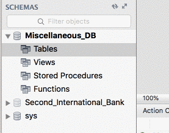

  * Navigate to the path for [Activities/02-Ins_ImportWizard/Resources/birdsong.csv](Activities/02-Ins_ImportWizard/Resources/birdsong.csv) and click "Next" to move onto the next step.

  * Enter in a new name for the table being created before clicking "Next". The initial name for new tables made this way will be the name of the file selected.

  * This new screen allows users to select what columns should be imported into the MySQL database and what datatype is inside of each column as well. It also provides the user with a small example of what the table will look like once imported.

      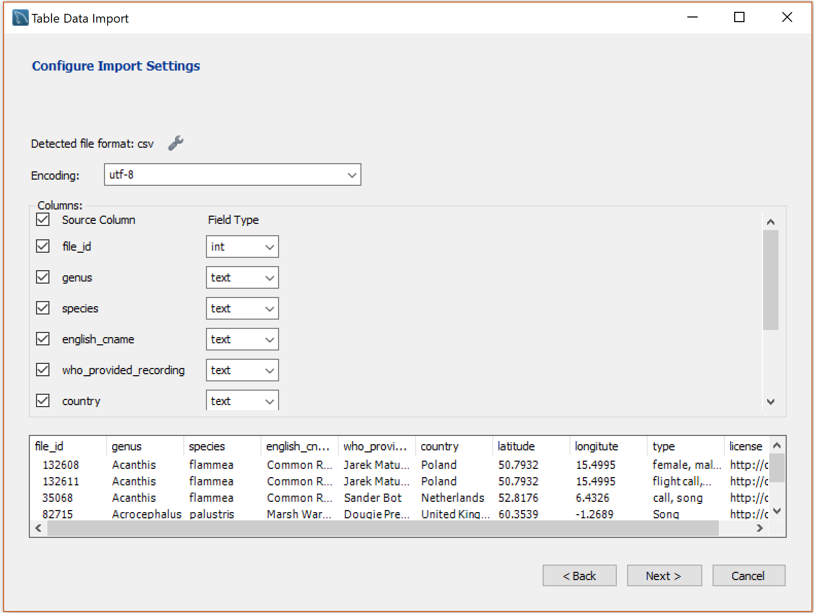

    * Clicking "Next" through the next couple of menus will then import all of the data into a new table on the database. Simply refresh the connection when the import wizard has concluded and the table will now exist with data inside.

    * Finally run `SELECT * FROM birdsong;` to confirm that data was successfully uploaded.

* MySQL also allows users to import values from a CSV into already existing tables so long as a primary key column exists.

  * The table created from the dataset imported does have a unique ID column but the import wizard does not recognize that automatically.

  * Thankfully it is very easy to correct this problem by right-clicking on the table and selecting `Alter Table` from the drop-down menu that appears.

  * Find the column to turn into a primary key and select the `PK` checkbox next to it, which automatically check off `NN` for not `Not NUll`. Then click "Apply" and run the MySQL code that Workbench generates within the pop-up menus.

    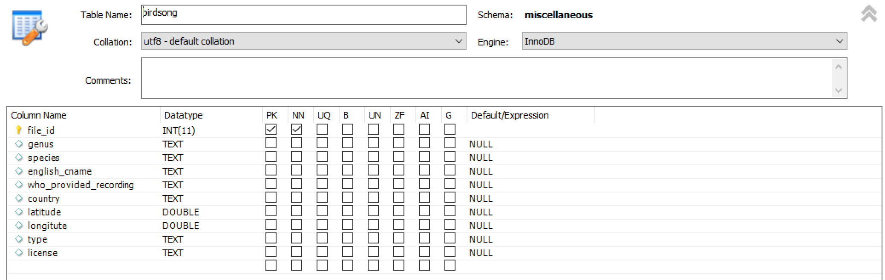

  * Once the table has been altered to include a primary key, the Table Data Import Wizard can be used once more but, instead of importing into a new table, import the data into the altered table.

* Let the class know that, the bigger a dataset is, the longer it will take for MySQL Workbench to import values. This can sometimes make the application look like it is frozen but reassure them that it is running.

### 5. Instructor Do: Introduction to Queries (0:15)

* So far, the class has only learned how to perform basic queries to search through data tables. There are plenty of ways in which to perform more complex searches though.

* Still using the [birdsong.csv](Activities/03-Ins_Intro_to_queries/Resources/birdsong.csv), go over the following blocks of MySQL code with the class. Using [03-Ins_Intro_to_queries/birdGenus.sql](Activities/03-Ins_Intro_to_queries/Solved/bird_genus.sql) as a guide explain:

  * Recall that, in order to select all of the data from a table, the code `SELECT * FROM <Tablename>` is used.

  * In order to select specific rows from a table based upon some values stored within a column, a `WHERE <column> = <value>` statement is added into the code.

  * For example, to select only those rows within the "birdsongs" table whose "genus" is "Acanthis", `SELECT * FROM birdsong WHERE genus = "Acanthis"` would be used.

    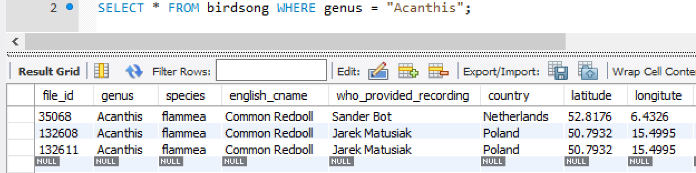

  * There may be cases in which users desire to search for rows where two conditions or more are met. MySQL allows this by using the `AND` statement.

  * For example, to select rows within the "birdsongs" table whose "genus" is "Acanthis" and whose "country" is "Netherlands, `SELECT * FROM birdsong WHERE genus = "Acanthis" AND country ="Netherlands"` would be used.

    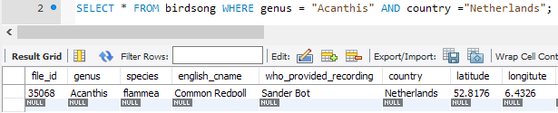

  * `OR` statements can also be used when creating queries to search for rows whose values match in one way or another. For example to select rows where the "genus" can be "Acanthis" or "Acrocephalus", `SELECT * FROM birdsong WHERE genus = "Acanthis" OR genus = "Acrocephalus"` would be used.

  * Finally it is also possible to search for results by excluding certain criteria by using the `WHERE NOT` statement. For example to find all row where "" is not the genus use `SELECT * FROM birdsong WHERE NOT genus = "Anthus";`

* Answer whatever questions the class may have before moving onto the next activity.

### 6. Students Do: Hide and Go Seek (0:15)

* Students will now take some time to test their MySQL querying skills by having to search through a large dataset and collecting information from specific rows.

    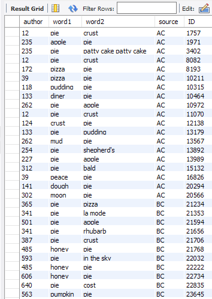

* **Files**:

  * [04-Stu_HideAndSeek/WordAssociation_AC.csv](Activities/04-Stu_HideAndSeek/Resources/WordAssociation_AC.csv)

  * [04-Stu_HideAndSeek/WordAssociation_BC.csv](Activities/04-Stu_HideAndSeek/Resources/WordAssociation_BC.csv)

  * [04-Stu_HideAndSeek/WordAssociation_CC.csv](Activities/04-Stu_HideAndSeek/Resources/WordAssociation_CC.csv)

* **Instructions**:

  * Start by using the Table Import Wizard to create a new table called `wordassociation` with the data stored within `WordAssociation-AC.csv`.

  * Come up with a means to add a new column to this table that will act as an "ID" column. This column should act as the primary key and auto-increment. By doing this, each row will now have a unique ID.

  * Import the values stored within `WordAssociation-BC.csv` and `WordAssociation-CC.csv` into the table created. This can take some time, so look through the CSV files or read through some [MySQL tutorials](https://www.w3schools.com/sql/) whilst waiting.

  * Create a query that collects all of the rows whose "source" is "AC"

  * Create a query that collects all of the rows whose "source" is "BC"

  * Create a query that collects all of the rows whose "source" is "CC"

  * Create a query that collects all of the rows whose author is within the range of 0-20

  * Create a query that searches for any rows that have "pie" in their "word1" or "word2" columns

* **Bonus**:

  * There are some functions in MySQL that allow users to perform simple calculations like `MIN()`, `MAX()`, `COUNT()`, `AVG()`, and `SUM()`. Look some of these functions up and then perform the following calculations...

  * Find the lowest "ID" for those rows with a "source" of "CC"

  * Count how many rows have an "author" of 12

### 7. Everyone Do: Hide and Go Seek Review (0:05)

* First explain to students that the csv can be imported using the Table import wizard and a name given to the newly create table. Next open up [04-Stu_HideAndSeek/04-Stu_HideAndSeek](Activities/04-Stu_HideAndSeek/Solved/word_association.sql) within MySQL Workbench and go over the code provided line-by-line explaining:

  * The table can be altered to add an `id` with `AUTO_INCREMENT` and a `PRIMARY KEY`. Using `FIRST` to place the column first in the table.

  * Next use the table import wizard to add in the next two CSV files.

  * The next few selection can be made by setting a `WHERE` statement equal to the source.

  * The `AND` and `OR` operators can be used to filter author and words that use pie.

  * Finally for the bonus solutions the `MIN()` and `COUNT()` functions are used.

### 8. Students Do: Seek, Create, Update, and Destroy (0:20)

* Let the class know that the `WHERE` clause can be used to not only formulate complex queries, they can also be used to update and delete rows from a table. This is what students will need to do in the following activity.

* This activity will involve quite a bit of research on the part of the students. Links are given to help them search for solutions to the problems they are likely to encounter.

    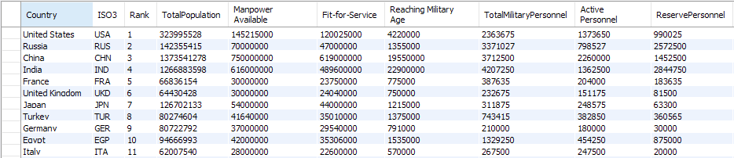

* **File**:

  * [06-Stu_SCUD/GlobalFirePower.csv](Activities/05-Stu_SCUD/Resources/GlobalFirePower.csv)

* **Instructions**:

  * Import the `GlobalFirePower.csv` into a new table within a localhost database.

    * Add a primary key to the table.

    * Find all of those rows that have a "ReservePersonnel" of 0 and then remove these rows from the dataset. **Note** MySQL often adds a safety measure to avoid deleting data check [Stack Overflow](https://stackoverflow.com/questions/11448068/mysql-error-code-1175-during-update-in-mysql-workbench) for help.

    * Every country in the world at least deserves one "FighterAircraft". Only seems fair. Lets add one to each nation that has none.

    * Oh no! By updating this column, the values within "TotalAircraftStrength" column are now off for those nations! We've got to [add one](https://stackoverflow.com/a/2680352) to the original number.

    * Find the [Averages](https://www.w3schools.com/sql/sql_count_avg_sum.asp) for `TotalMilitaryPersonnel`, `TotalAircraftStrength`, `TotalHelicopterStrength` and `TotalPopulation`. Record these averages.

    * A new nation has been founded and you are declared its leader! Congratulations! Unfortunately for you, every other nation is now looking to take over your land. Insert a new country with the averages values you have just calculated.

* **Bonus**:

  * After creating your new nation and some parts of your military strategies, go through each column in the newly created row and update their values in any way that you desire!

### 9. Everyone Do: Seek, Create, Update, and Destroy Review (0:05)

* Open up [05-Stu_SCUD/SCUD.sql](Activities/05-Stu_SCUD/Solved/SCUD.sql) within MySQL Workbench and go over explaining:

  * First to alter the table to add an `id`.

  * MySQL generally safe guards update to tables, so in order to get past that, the `SQL_SAFE_UPDATES` is turned off by setting it to 0.

  * Deletion and updates are made where the conditions are met.

  * Once completed the safe guard is turned backed on by setting `SQL_SAFE_UPDATES` to 1.

  * Multiple averages can be selected at once.

  * Value can be inserted into the table even though not every value is filled out.

  * Finally select everything to show the newly added country.

### 10. Instructor Do: Using the Workbench GUI (0:05)

* So long as the table that users are working with includes a primary key with unique values, it is actually possible to create, update, and delete values using MySQL Workbench's GUI.

* Create a new table within the database using [06-Ins_WorkbenchGUI/comcastFccComplaints.csv](Activities/06-Ins_WorkbenchGUI/Resources/comcastFccComplaints.csv) called `comcastfcccomplaints`, alter the table so that it has a primary key, and then run a `SELECT * FROM comcastfcccomplaints;` statement to open up the table viewer.

  * Double click on any value in any row and show the class how they can simply change these values within this area.

    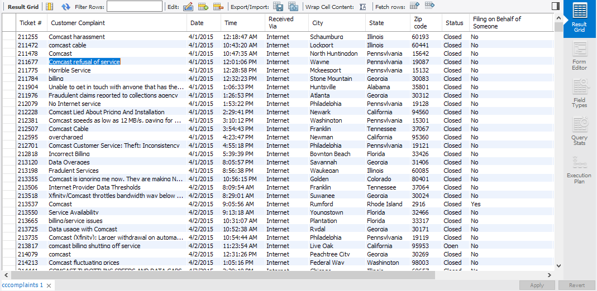

  * They can even add new rows entirely by scrolling down to the bottom of the table and filling in those cells that contain "NULL".

  * Want to delete a row? Simply select the row that should be deleted and click on the "Delete Selected Row" button at the top of the viewer.

    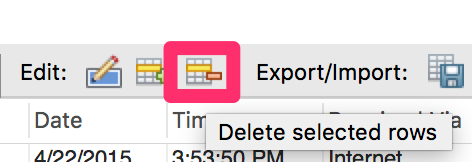

  * The crucial part about using the GUI for altering tables is that none of the changes are made permanent until the "APPLY" button is clicked in the lower right-hand portion of the viewer.

    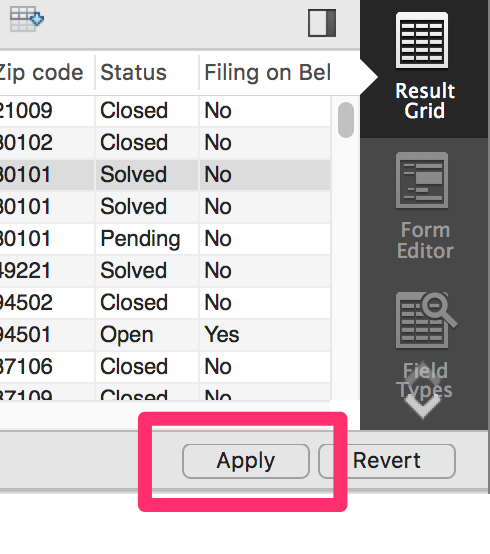

    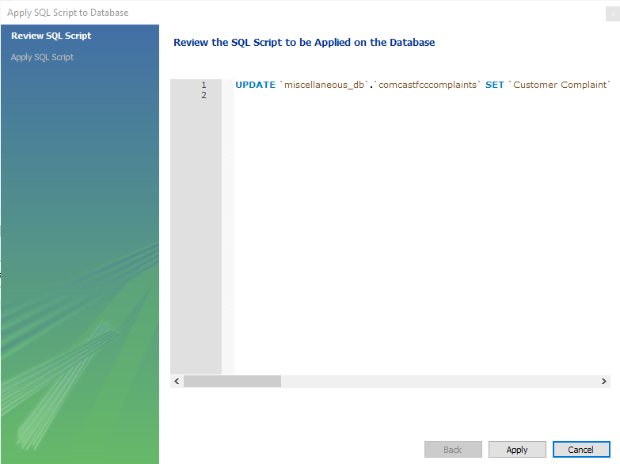

- - -

### 11. BREAK (0:15)

* During this break it would be wise to have the class import [08-Stu_JoiningTeam/Players.csv](Activities/08-Stu_JoiningTeam/Resources/Players.csv) and [08-Stu_JoiningTeam/Seasons_Stats.csv](Activities/08-Stu_JoiningTeam/Resources/Seasons_Stats.csv) since these files could take quite a bit of time to add into the database.

* If you have not already, import [07-Ins_Joins/players.csv](Activities/07-Ins_Joins/Resources/players.csv) and [07-Ins_Joins/matches.csv](Activities/07-Ins_Joins/Resources/matches.csv) into your database as well so that you can dive back into material quickly after break.

- - -

### 12. Instructor Do: MySQL Joins (0:10)

* Way back during the Pandas module, students may recall working with merges and joins to combine datasets. While MySQL is a vastly different language than Python is, it too includes the functionality to merge tables together.

* Create two new tables within MySQL workbench using [07-Ins_Joins/players.csv](Activities/07-Ins_Joins/Resources/players.csv) and [07-Ins_Joins/matches.csv](Activities/07-Ins_Joins/Resources/matches.csv) as the starting point.

  * Point out to the class how both of these tables have matching values within the `Player_ID` column of the "Players" table and the `Loser_ID`/`Winner_ID` columns of the "Matches" table.

  * Because there are values in common, it is possible to join these tables together!

  * Open [07-Ins_Joins/tennisJoin.sql](Activities/07-Ins_Joins/Solved/tennis_join.sql) and run the code in MySql workbench.

  * Point out one of the major differences between MySQL joins and Python joins is that the columns that should be viewed after the join must be declared in the initial `SELECT` statement.

    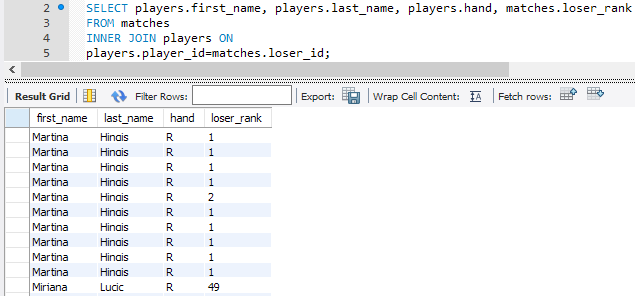

* There are three primary types of joins that can be used within MySQL:

  * The `INNER JOIN` Returns records that have matching values in both tables.

  * `LEFT JOIN` returns all records from the left table and the matched records from the right table.

  * `RIGHT JOIN` returns all records from the right table, and the matched records from the left table.

    

* Show the class a couple of different joins that can be performed before answering whatever questions they may have and moving onto the next activity.

### 13. Students Do: Joining the NBA (0:20)

* Students will now spend the next portion of class creating joins using NBA player data and their seasonal stats. They will start out by creating tables based upon images provided and then will be given time to experiment with joining the data.

* **Files**:

  * [08-Stu_JoiningTeam/Players.csv](Activities/08-Stu_JoiningTeam/Resources/Players.csv)

  * [08-Stu_JoiningTeam/Seasons_Stats.csv](Activities/08-Stu_JoiningTeam/Resources/Seasons_Stats.csv)

* **Instructions**:

  * Using tables made from `Players.csv` and `Seasons_Stats.csv`, perform joins that will create the following tables:

  * Basic Information Table:

    

  * Percent Stats:

    

### 14. Everyone Do: Joining the NBA Review (0:05)

* Open up [08-Stu_JoiningTeam/JoiningNBA.sql](Activities/08-Stu_JoiningTeam/Solved/joining_NBA.sql) within MySQL Workbench and go over the code provided explaining:

  * Since the data being select will be coming from two different tables the naming convention is `table_name.column_name`.

  * Next, determine which table to select from then which table to `INNER JOIN` with . Remember the inner join only selects data that has the matching values in both tables.

  * Finally determine the key which both tables will joined on.

### 15. Partners Do: SQL is Witchcraft! (0:30)

* Now that the class has a firm understanding of Joins and Queries, they will now split up into partners and work on creating new tables using the data collected from these methods.

* Open [sample_solution.sql](Activities/09-Par_SQLWitchcraft/Solved/sample_solution.sql)  to give students an idea of what they can look for. Explain that two inner joins are being used to link the `wdb_devilappearance` data set back to the `wdb_accused` data set.

* Explain to the class that, even though they are able to view the data collected from a join, the table that is shown is temporary and cannot be altered. This means that new tables must be created in order to modify joined datasets using MySQL alone.

* **Files**:

  * [09-Par_SQLWitchcraft/WitchCraft.zip](Activities/09-Par_SQLWitchcraft/Resources/WitchCraft.zip)

* **Instructions**:

  * Open up the zipped folder provided and look through the CSV files contained within. As you are examining these files, take note of how they reference each other using different ID columns.

  * While you are performing your investigation on one computers, start importing these CSV files into a MySQL database using another.

  * Once all of the files have been imported, begin to create joins between the tables that would allow users to view more detailed information per witchcraft trial.

  * As you are creating joins, attempt to create new permanent tables that contains the data collected by your joins. You can use this [Stack Overflow response](https://stackoverflow.com/a/6595301) as a good starting point to how this can be accomplished.

  * Attempt to create as comprehensive a table as possible. At the end of this activity, partners will share what their final tables look like and explain why they chose to make them this way.

### 16. Everyone Do: SQL is Witchcraft! Review (0:10)

* Once time has run out, have partners go over their final tables, the process they used to create them, and why they chose the columns/values they did.

  * If any group used a new method that was not discussed during this class, have them explain what that method was and how it can be used.

- - -

### LessonPlan & Slideshow Instructor Feedback

* Please click the link which best represents your overall feeling regarding today's class. It will link you to a form which allows you to submit additional (optional) feedback.

* [:heart_eyes: Great](https://www.surveygizmo.com/s3/4381674/DataViz-Instructor-Feedback?section=10.2&lp_useful=great)

* [:grinning: Like](https://www.surveygizmo.com/s3/4381674/DataViz-Instructor-Feedback?section=10.2&lp_useful=like)

* [:neutral_face: Neutral](https://www.surveygizmo.com/s3/4381674/DataViz-Instructor-Feedback?section=10.2&lp_useful=neutral)

* [:confounded: Dislike](https://www.surveygizmo.com/s3/4381674/DataViz-Instructor-Feedback?section=10.2&lp_useful=dislike)

* [:triumph: Not Great](https://www.surveygizmo.com/s3/4381674/DataViz-Instructor-Feedback?section=10.2&lp_useful=not%great)

- - -

### Copyright

Trilogy Education Services © 2018. All Rights Reserved.
