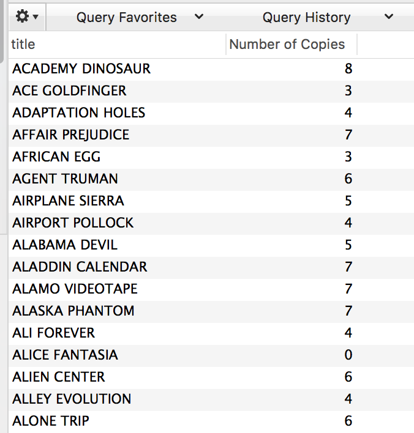

# A View with a Roomful of Queries

## Instructions

1. Write a MySQL statement to query a film title, and the numbers of copies that exist in the inventory for that title. The results should look like the below. Your challenge is to use a subquery--a query embedded within another query--instead of a join.

   

2. Create a view with the above query and run it. 

### Bonus

If you finish early, begin looking into indexing in MySQL. What does it do? What do we index, and how? Is it analogous to indexing in books?
