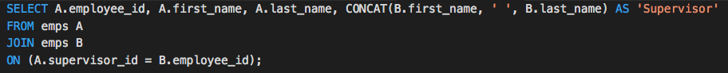
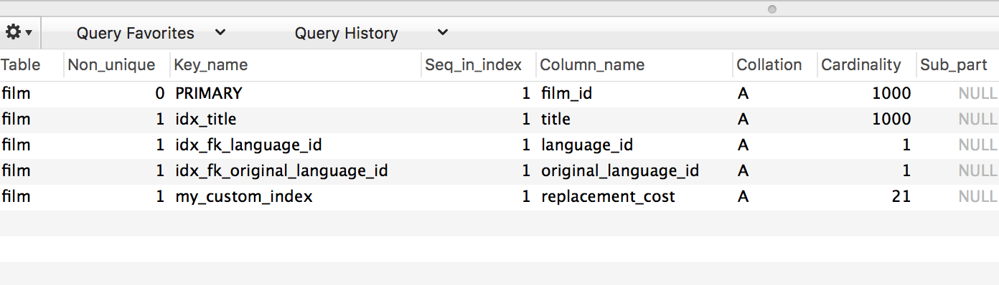

### 01. Everyone Do: Introduction to ACID (0:10) (Low)

* This activity will provide a brief overview of ACID, an important concept in database management. This is not a comprehensive treatment. Rather, it's an introduction that will provide a background for further exploration.

* Begin the activity by asking the class about the following scenarios in a bank that uses a MySQL database:

  1. What happens when multiple people who share the same account are depositing or withdrawing money at the same time? How does MySQL keep track of the overall balance?

  2. What happens if an electrical outage takes place while a MySQL database is being updated? Explain that, while most of the queries we have learned up to this point are nearly instantaneous in their execution, complex queries can take seconds, even minutes, to complete.

* Explain that `transactions` are a way of treating a set of MySQL statements as a single package.

* Explain to the class that ACID is a model of thinking about how a database such as MySQL should behave, especially in high-stakes situations. It stands for the following, which we'll explain momentarily:

  1. Atomicity
  2. Consistency
  3. Isolation
  4. Durability

* **Atomicity**: explain that atomicity means that a transaction is all-or-nothing. In other words, all parts of a SQL transaction should take place, or it should not take place at all.

* **Consistency**: this is the idea that all requirements for a transaction are met. This is a way of ensuring that a transaction is free of errors. For example, constraints such as primary keys must be met when the database is written to. In other words, a SQL transaction should be error-free, or it should not take place at all.

* **Isolation** refers to the idea that one SQL transaction should not affect another before completion. For example, say that a couple have a joint banking account with a balance of $100. If they are both withdrawing $20 from two different ATM at the same time, the database needs to complete one transaction before the other. Otherwise, it may lead to a situation in which the final balance after the two transactions ends up as $80 rather than $60. (In one transaction, the ATM sees an initial balance of $100 and subtracts $20 from the balance after the withdrawal. Without isolation, if the other ATM also may see an initial balance of $100 and return a balance of $80 after the withdrawal.)

* **Durability**: this means that once a transaction is saved, the data can't be lost due to occurrences like a power outage. Explain that MySQL transactions that are ACID-compliant are enabled by storage engines, which can store transactions and protect them against events like power failure. Run the following command in MySQL Workbench:

  ```sql
  SHOW ENGINES;
  ```

  

* Point out that InnoDB is the default storage engine, but that others are available.

* Slack out the following link as an example of a MySQL transaction:

  [SQL transaction](http://www.mysqltutorial.org/mysql-transaction.aspx)

* Have students pair up with a partner to discuss and clarify ACID to one another.

* Address any questions before moving on.

### 02. Everyone Do: Introduction to Self-Joins (0:05)(Low)

* The remainder of the class will be more relaxed. We will first go over a form of joins called a self join.

* Explain that it is possible to join a table to itself. For example,  a self-join can be used in `sakila` to find customers who live in the same city. Run the following query:

  ```sql
  SELECT A.NAME, B.NAME, A.CITY
  FROM customer_list A
  JOIN customer_list B
  USING (city)
  WHERE A.ID <> B.ID;
  ```

* Ask a student to explain the code. We list the same table, `customer_list`, under different aliases, A and B. We then find customers who live in the same city (`USING (city)`), but have different ID numbers (`WHERE A.ID <> B.ID`).

* Answer any questions before moving on to the next activity, in which students will practice self joins.

### 03. Students Do: Self Joins (0:10)(Low)

* **Files**:

  * [Activities/10-Stu_Self_Joins/README.md](Activities/10-Stu_Self_Joins/README.md)
  * [Activities/10-Stu_Self_Joins/Resources/employees.sql](Activities/10-Stu_Self_Joins/Resources/employees.sql)
  * [Activities/10-Stu_Self_Joins/Images/self_join.png](Activities/10-Stu_Self_Joins/Images/self_join.png)

* In this activity, students will be exposed to a very common scenario for self joins: a table of employees and their supervisors.

### 04. Instructor Do: Review Self Joins (0:05)(Low)

* **Files**:

  * [Activities/10-Stu_Self_Joins/Solved/self_join.sql](Activities/10-Stu_Self_Joins/Solved/self_join.sql)

* Here, joining a table to itself is simply a matter of creating different aliases for the same table.

  

  * The employee first and last name are retrieved from the `emps` table with the alias `A`.
  * The supervisor's name is retrieved from `emps B`. In self-join, A and B are treated as though they are separate tables.
  * Note also that the `CONCAT` function was used to create a single column for the supervisor.

### 27. Instructor Do: Indexes (0:05)(Low)

* We'll spend the last several minutes of class touching on indexing. Let's think of a book. In order to locate a certain topic, we can scan the book line-by-line from the beginning, or use the index. Similarly, MySQL can use indexing to speed up its search.

* Explain that querying by using the primary key is extremely speedy. This is similar to having a table of contents, where the chapters are neatly ordered.

* However, when we need to make frequent queries that do not use a primary key, we can create an index to make searches faster.

* Indexing is easy. Run the following statement:

  ```sql
  CREATE INDEX my_custom_index
  ON film(replacement_cost);
  ```

* Next, run the following to display our indexes for the `film` table:

  ```sql
  SHOW INDEX
  FROM film;
  ```

  

* And it shows that `my_custom_index`, which we just created, keeps track of the `replacement_cost` column.

* This means that if we were to run a query that searched for films by replacement costs, instead of searching the whole table, it quickly scans the index for the pertinent information instead.

* Explain that one example of a column that benefits from indexing is a username column, which may be searched every time a user logs in. The same is true of email addresses, if used to log in.

* However, there is a cost to indexing. Explain that while it makes retrieval faster, it can slow down updating and inserting records, as indexing adds to the write time.

* Have the class spend the last minute or two identifying a column that's a good candidate for indexing, then creating an index for it. They can also look up how to delete, or drop, an index.
