## 10.3 Lesson Plan - The Practice & Theory of MySQL

### Overview

Today's class focuses on strengthening the student's skills in more complex MySQL queries, as well as discussions of some theoretical concerns, table design, and ACID.

### Instructor Notes

* Today's lesson presents a wide variety of topics in MySQL. The priority should be on skills that build on the previous lessons from this week. We will discuss some basics of MySQL theory, though they are lower in priority than more hands-on activities. Feel free to adjust the timing of the discussions and activities as needed.

### Sample Class Video (Highly Recommended)

* To view an example class lecture visit (Note video may not reflect latest lesson plan): [Class Video](https://codingbootcamp.hosted.panopto.com/Panopto/Pages/Viewer.aspx?id=9c9beff0-ddaf-4712-af1e-12ab5bab1fc5)

- - -

### Class Objectives

* Students will solidify the foundations of writing basic- to intermediate-level MySQL statements.

* Students will understand how to perform subqueries, and they should understand the difference between inner and outer joins.

* Students will develop an introductory understanding of table design and database management.

- - -

### 01. Instructor Do: Welcome Class (0:05)

* Welcome the class back to the third and final day of MySQL. Your students have learned a lot this week. Today, we'll continue to refine the skills learned in the first two days, and acquire new ones.

### 02. Instructor Do: Review of Joins (0:05)

* **Instructions**:

  [Activities/01-Warmup/README.md](Activities/01-Warmup/README.md)

* Have students use the `sakila` database with `use sakila;`. Students who do not have the database installed should do so now.

* As a warmup, have your students display addresses and the city in which they are located by joining the `address` and `city` tables.

  ```sql
  SELECT address, city
  FROM address a
  JOIN city c
  ON (a.city_id = c.city_id);
  ```

  * Mention also that `JOIN` and `INNER JOIN` are synonymous.

* After giving the class a few minutes to write the join, have a student explain the code.

* Let the class know that we can also use the keyword `USING` in place of `ON`. For example, let's look at the following query:

  ```sql
  SELECT address, city
  FROM address
  JOIN city
  USING (city_id);
  ```

* Explain again that instead of using `ON`, we can use the keyword `USING` if the two columns share the same name.

* Give your students another minute to practice.

### 03. Instructor Do: Aggregate Functions, Aliases, and Grouping (0:15)

* In this activity, students will follow along as the you, the instructor, run the queries.

* **Note:** We will be using the same sakila database from last class. If you need to download it again, it is available here: <http://downloads.mysql.com/docs/sakila-db.zip>.

* We start with `USE sakila;` to make sure that everyone is using the sakila database.

* Let's first take a look at the `film` table. Inform the class that, to get a bird's-eye view of the table, we can use `SELECT * FROM film;`, as we have done, or `DESCRIBE film;`, which will list columns, as well as their types, default values, whether NULL values are allowed, and other details:

  

* Let's say that we want to see how many films exist in our database. Is there a way to count the all the films in this table? Yes, we can run `SELECT * FROM film;` and count the number of rows. But there is a much better way:

  ```sql
  SELECT COUNT(film_id)
  FROM film;
  ```

  

* Sweet! We counted the number of `film_id` entries, and we can see that there are a total of 1,000 films in the table. However, `COUNT(*)` as a column name, which we see here, isn't very informative. Is there a way to change it to be more informative? Yes, and we call that process "aliasing" in SQL. In other words, we create an alias name for the column.

  ```sql
  SELECT COUNT(film_id) AS 'Total films'
  FROM film;
  ```

  

* Much better! Tell the class that using an alias does not change the table or the database in any way. It is only a measure of convenience used to view a column (which we have just seen), or to create shortcuts for columns or other data (which we will see later).

* So we are able to see the number of movies using `COUNT()`. But what if we wanted to break down the number of movies by its rating? How many G-rated movies are there? How about PG-13? We can group all the films in a ratings category with `GROUP BY`:

  ```sql
  SELECT rating, COUNT(film_id) AS 'Total films'
  FROM film
  GROUP BY rating;
  ```

  

* Very cool! We're now able to view the number of films by rating. The total films by rating add up to 1,000, as they should. It bears mentioning at this point that aggregate functions like `COUNT()` require `GROUP BY` to display their results.

* Let your students know that we can do more than count the number of items in a column, or by group. We can take their **sum**, **average**, and identify the smallest(**min**) and largest(**max**) numbers in a column or data selection.

* For example, movies can be rented anywhere from three to seven days. Ask a student (perhaps one of the stronger ones in the class) how he or she might query the average rental period of **all** movies.

  ```sql
  SELECT AVG(rental_duration)
  FROM film;
  ```

  

  * So it turns out that the average film rental period is just shy of five days.

  * You may want to ask another student how we can change the column heading from the rather unsightly `AVG(rental_duration)` to something a bit clearer and/or pleasing:

  ```sql
  SELECT AVG(rental_duration) AS 'Average rental period'
  FROM film;
  ```

* Let's extend this example. How would we group films by their `rental_duration`, that is, the number of days allowed for rental? Additionally, for each rental period, what is the average cost of rental? Type the following:

  ```sql
  SELECT  rental_duration, AVG(rental_rate) AS 'Average rental rate'
  FROM film
  GROUP BY rental_duration;
  ```

* Run it, and we should see these results:

  

* Ask a student to explain the query.

  * Movies that can be rented for three days cost, on average, $2.82 to rent
  * Movies that can be rented for three days cost, on average, $2.97 to rent, etc.

* Ask the class: what if we want to make the above query, but limit the results only to films whose `rental_duration` is less than seven days? How would we go about it? In the past, we have used `WHERE` for this purpose. Let's modify the query to the following and run it:

  ```sql
  SELECT  rental_duration, AVG(rental_rate) AS 'Average rental rate'
  FROM film
  GROUP BY rental_duration
  WHERE rental_duration < 7;
  ```

* Error! Explain that for aggregate functions, we use the keyword `HAVING` instead of `WHERE`:

  ```sql
  SELECT  rental_duration, AVG(rental_rate) AS 'Average rental rate'
  FROM film
  GROUP BY rental_duration
  HAVING rental_duration < 7;
  ```

  

* Aha! We were able to filter the results only for `rental_duration` of six days or fewer, using the keyword `HAVING`.

* It may be worth mentioning that these aggregate functions calculate and retrieve data, but they do not _alter_ the data. That is, they do not modify the database.

* We won't go over every aggregate function. Students will have to research some of them on their own in the next activity!

### 04. Students Do: Gregarious Aggregates (0:15)

* **Instructions**:

  [Activities/02-Stu_GregariousAggregates/README.md](Activities/02-Stu_GregariousAggregates/README.md)

* In this activity, students will practice writing queries with aggregate functions, with grouping, and with using aliases.

### 05. Instructor Do: Review Gregarious Aggregates (0:05)

* **Files**:

  [Activities/02-Stu_GregariousAggregates/Solved/aggregates.sql](Activities/02-Stu_GregariousAggregates/Solved/aggregates.sql)

* `GROUP BY` can be initially confusing for some students. Stress that it is similar to the `groupby` operations seen in pandas. If that's the case, you may want to go over one or two more additional examples.

### 06. Instructor Do: Introduction to Subqueries (0:10)

* Begin this activity by explaining to the class that in SQL, there is often more than one way of accomplishing a task. For example, suppose that we want to view the inventory information on a film called "Early Home." One way to do this would be to run several queries in succession. In the first, we would search by the title and obtain its `film_id` number.

  ```sql
  SELECT title, film_id
  FROM film
  WHERE title = 'Early Home';
  ```

  The `film_id` is 268. We can then use this information to search for information in the `inventory` table:

  ```sql
  SELECT *
  FROM inventory
  WHERE film_id = 268;
  ```

  

  So we see that there are two copies of this movie (as indicated by two separate `inventory_id` numbers), both located in store number 2.

* At this point, ask the class whether it might be possible to join (hint) these two queries into a single one:

  ```sql
  SELECT i.inventory_id, i.film_id, i.store_id
  FROM inventory i
  JOIN film f
  ON (i.film_id = f.film_id)
  WHERE f.title = 'Early Home';
  ```

* Great! The class should now start to feel more comfortable with joins. However, we can retrieve the same information differently, with a tool called subquery. Type in the following query:

  ```sql
  SELECT *
  FROM inventory
  WHERE film_id IN
  (
   SELECT film_id
   FROM film
   WHERE title = 'Early Home'
  );
  ```

* It may look a bit confusing or intimidating initially, so let's start with the inner query:

  ```sql
  SELECT film_id
  FROM film
  WHERE title = 'Early Home';
  ```

  This returns `film_id` of 268.

* So now--this is important--we plug in the 268 into the parentheses where the subquery was:

  ```sql
  SELECT *
  FROM inventory
  WHERE film_id IN (268);
  ```

  And voilà! We get the same result as the previous join:

  

* We have simplified the query by running the nested subquery first, then plugging in the results into the outer query. Explain that although MySQL doesn't necessarily run code in that order, it helps us to reduce subqueries to basic queries as building blocks. Feel free to Slack out this [link](https://sqlbolt.com/lesson/select_queries_order_of_execution), which explains the order of execution in SQL queries.

* Mention a note on performance: although we can often accomplish the same task with joins and subqueries, joins tend to be faster.

* Finally, note that `SELECT *` was used in this activity. While this is fine for exploration, in production code, it is standard practice to specify the fields.

* Answer any questions from students before moving on.

### 07. Student Do: Subqueries (0:10)

* **Instructions**: [Activities/03-Stu_Subqueries/README.md](Activities/03-Stu_Subqueries/README.md)

* In this activity, students will practice creating subqueries.

* Slack out the instructions to the class.

### 08. Instructor Do: Review Subqueries (0:05)

* Review the [solution](Activities/03-Stu_Subqueries/Solved/subqueries.sql) to the last activity, and answer any questions.

* In the first query, we're simply seeking the name and ID number of cities from a given list:

  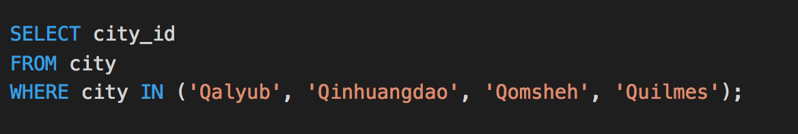

* The second query is based upon the information from the first query:

  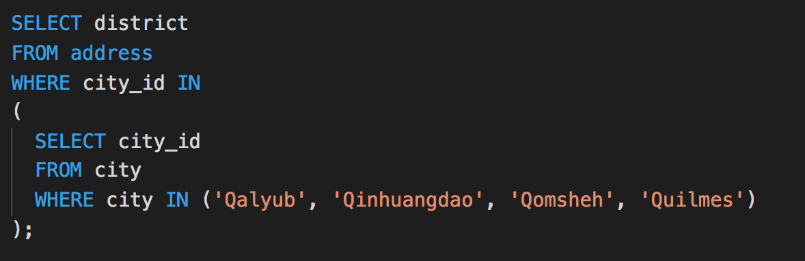

  * Because `district` is not available in the `city` table, we had to use the `city_id` from the `city` table and plug them into the `address` table.

* The bonus problem likewise requires querying information from the `city` table, with which the `address` table is queried. Then that information is used to query the `customer` table.

  

### 09. Instructor Do: Create Views (0:10)

* This activity will be a nice interlude from some of the heavy lifting we have been doing in MySQL. It is not crucial, so feel free to tweak the length and content as you deem appropriate.

* Up to this point, we have seen fairly long queries, especially when they involve joins and subqueries. Is there a way to somehow save a long query under a name, and run that name as a shortcut?

* Slack out the following query, and have your students run it:

  ````sql
          	SELECT s.store_id, SUM(amount) AS Gross
          		FROM payment p
          		JOIN rental r
          		ON (p.rental_id = r.rental_id)
          		JOIN inventory i
          		ON (i.inventory_id = r.inventory_id)
          		JOIN store s
          		ON (s.store_id = i.store_id)
          		GROUP BY s.store_id;
          		```
  ````

* The query is used to monitor the total sales from each store. As a company executive, it may be something you want to look up often. Instead of having to type this query, we can store it under a `view`:

  ```sql
  CREATE VIEW total_sales AS
  SELECT s.store_id, SUM(amount) AS Gross
  FROM payment p
  JOIN rental r
  ON (p.rental_id = r.rental_id)
  JOIN inventory i
  ON (i.inventory_id = r.inventory_id)
  JOIN store s
  ON (s.store_id = i.store_id)
  GROUP BY s.store_id;
  ```

* Point out that the query is identical to the one above, except for the first line:

  ```sql
  CREATE VIEW total_sales AS
  ```

* We saved a `view` under the name `total_sales`. Then the rest of the query follows `AS`.

* Run the query. Then to execute this view, we simply type:

  ```sql
  SELECT *
  FROM total_sales;
  ```

* Easy! Now ask a student to guess how we might delete a view:

  ```sql
  DROP VIEW total_sales;
  ```

* For the remainder of the activity, students will take a few minutes and create, as well as drop, their own views.

### 10. Partners Do: A View with a Roomful of Queries (0:10)

* **Instructions**: [Activities/04-Par_View_Room_Queries/README.md](Activities/04-Par_View_Room_Queries/README.md)

* In this activity, students will pair up and practice their joins and subquery skills, as well as build out a view.

* Slack out the [instructions](Activities/04-Par_View_Room_Queries/README.md) and [image](Activities/04-Par_View_Room_Queries/Images/subquery.png) to the class.

### 11. Instructor Do: Review A View with a Roomful of Queries (0:05)

* **Files**: [Activities/04-Par_View_Room_Queries/Solved/room.sql](Activities/04-Par_View_Room_Queries/Solved/room.sql)

* Take this time to review the solution to the last activity, and to answer any questions.

* Explain that two pieces of information are required in the query: the title of a film, and the number of its copies in the system.

  

### 12. Instructor Do: Outer Joins (0:15)

* Introduce outer joins by first discussing inner joins. In the latter, which we have already seen, two columns must match. However, there are cases in which columns from tables do not match perfectly. For example, where a column from one table may contain values, its parallel column from the other table may be null.

* To illustrate this example, ask your students to first examine two tables: `film` and `film_actor`.

  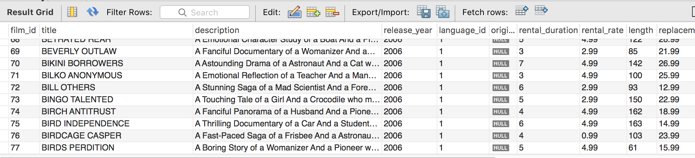
  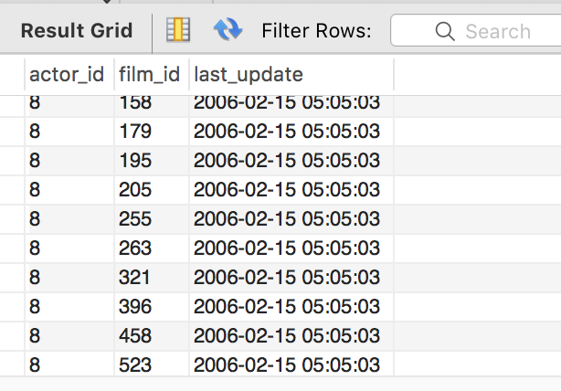

* They both have a `film_id` column that we can use to join the two tables together. An inner join might look like this:

  ```sql
  SELECT *
  FROM film f
  INNER JOIN film_actor fa
  ON (f.film_id = fa.film_id)
  ```

* However, the table `film_actor` has several rows that do not contain matching `film_id` values from the `film` table. These rows will not be shown in an inner join because the value from one column isn't matched by the value of the other.

* To perform an outer join in such a scenario, we would type the following query (but don't run it yet):

  ```sql
  SELECT *
  FROM film f
  LEFT OUTER JOIN film_actor fa
  ON (f.film_id = fa.film_id)
  WHERE fa.film_id IS NULL;
  ```

* Explain that in MySQL, `NULL` simply means a lack of value. For example, strings, such as 'Wild things', or numbers, such as 123 or zero, are not null. `NULL` means that nothing has been entered into the database.

* Give the class a moment to examine the code, then ask how they expect the results to look.

  * All columns from the `film` table would appear
  * All columns from the `film_actor` table would appear
  * But only the only rows from the `film` table to appear would be ones where the matching columns in the `film_actor` table are NULL.

* Now run the query:

  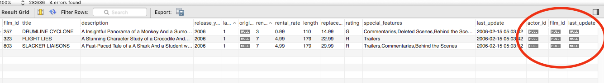

* Point out that the three columns to the right are from the `film_actor` table. They are displayed here because films with `film_id` numbers 257, 323, and 803 do not exist in that table. In other words, they are NULL.

* At this point, some of your students may experience confusion. Let's go through some slides to visualize some of the joins that we have been learning about.

* Open the [slides](Slides/joins.pptx) and explain that inner joins, which we are most familiar with, are represented by the Venn diagram at the top center. That is, in order for data to be displayed from two tables, there have to be matching columns from both tables. In terms of code, `ON(a.name = b.name)` means that MySQL searches for instances where the `name` column from table `a` is the same as the `name` column from table `b`.

* Contrast that with the left outer join, which we have just seen in this activity. It is represented in the top left corner in the Venn diagram. In this join, the first table must have the column specified in the `ON` clause. For example, `ON(a.name = b.name)`, in an outer join, means that the first, or the "left" table, must have data in the `name` column. For the second, or the "right" table, however, MySQL will display the row even if the specified column is null, or has no data in it.

* Explain that right outer joins are very similar, except that this time, it is the left, or table listed first, that has the option of being NULL in the specified column, whereas it is obligatory in the second, or the "right" table.

* Explain that other types of joins exist, but that these are the most commonly used joins.

* Have the students pair up with a partner to explain inner and left outer joins to each other.

* Answer any questions before moving on.

### 13. Instructor Do: Where the Wildcards Are (0:05)

* This activity will be light: a brief respite from the more serious activities. You will demonstrate the use of wildcards in MySQL queries, after which students will take a few minutes to practice their new skill.

* Propose the following scenario to the class: suppose that you want to find out the name of an actor, but you only know that his last name begins with "Will." Is there a way to display all actors whose names begin with those letters? Yes, we can do so by using wildcards. A wildcard can be used to substitute zero, one, or multiple characters in a string.

* Demonstrate the following code:

  ```sql
  SELECT *
  FROM actor
  WHERE last_name LIKE 'Will%';
  ```

* Ask the class to take a stab at explaining the query.

  * We identify the use of a wildcard with the keyword `LIKE`
  * `%` tells us that our query can substitute zero, one, or multiple characters in its place. For example, all of the following will match: `Will`, `Willa`, and `Willows`.

* Give your students a minute or so to practice the use of the `%` wildcard.

* Next, introduce the single character wildcard: `_` by demonstrating the following code. With the underscore, one, and only one, character must take its place in the query.

  ```sql
  SELECT *
  FROM actor
  WHERE first_name LIKE '_AN';
  ```

* The query returns two names: `Dan` and `Ian`. Again, `LIKE` indicates the use of a wildcard, and `_AN` instructs MySQL to return all actors whose first name contains three letters, the second and third of which are "AN."

* Answer any questions from students.

* Students will use the remaining time to practice using both wildcards.

### 14. Instructor Do: Revisit Subqueries (0:10)

* **Files**:

  * [Activities/05-Ins_Revisit_Subqueries/Solved/subqueries.sql](Activities/05-Ins_Revisit_Subqueries/Solved/subqueries.sql)
  * [Activities/05-Ins_Revisit_Subqueries/Images/sakila_schema.svg](Activities/05-Ins_Revisit_Subqueries/Images/sakila_schema.svg)

* Up to this point, the subqueries we have seen are relatively simple. In this activity, we will look at more convoluted examples, but tell your students not to be afraid. We can perform complex nested subqueries using the same principles that we've learned so far.

* We begin with a question: how many people have rented the film "Blanket Beverly"?

* The solution is available below as well.

* In order to answer this question systematically, we must first identify which tables we will need for our query. It is easy to generate a diagram of the schema in MySQL Workbench <https://stackoverflow.com/questions/2488/auto-generate-database-diagram-mysql>. Send out the [schema](Activities/05-Ins_Revisit_Subqueries/Images/sakila_schema.svg) to the class. Note that the SVG should be opened with a web browser.

* The schema makes it easier to identify which tables we need, and which keys we will use to link our subqueries. The schema is an SVG file and can be opened with a web browser.

  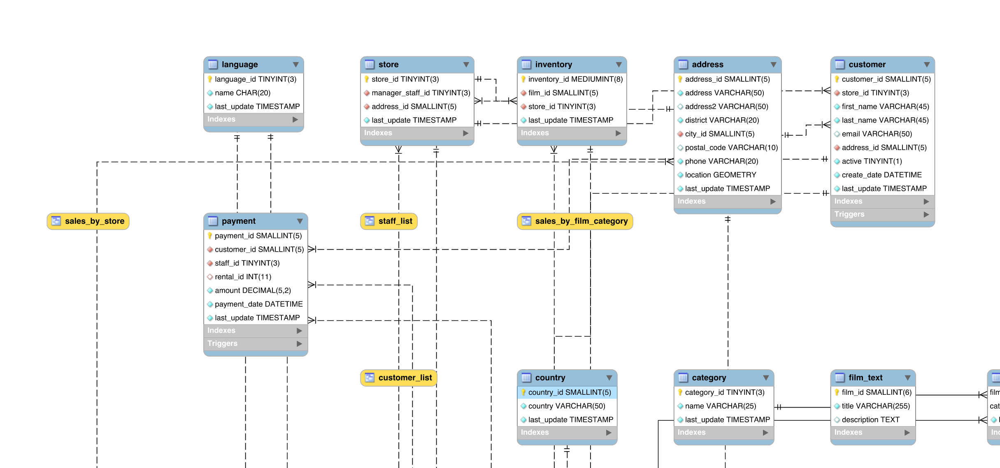

* Tell your students that we will need to start with the table `customer` and end with the table `film`, since we are counting how many customers have rented this specific film. Which tables and keys will serve as the intermediaries, or bridges, between these two tables?

* First, we start with the `customer` table and examine its keys. What other tables share its keys? A good place to look is the primary key, which in this table is `customer_id`. Ask the class to identify other tables, if any, that share the same key. One possibility is the table `payment`.

* At this point, have the class pair up and perform this step for the rest of the subqueries. After five minutes or so, bring the class back together for discussion. Keep in mind that the code below is not the only possible solution!

* We need to connect `payment` with the next table. One possibility is with the table `rental` using the key `rental_id`, which they have in common.

* We then need to connect to the next table. We can connect to the `inventory` table using the key `inventory_id`.

* Finally, we can connect to the `film` table using the key `film_id`, which it has in common with the `inventory` table. In our final subquery, we query the film title, "Blanket Beverly."

* Here is a sample query:

  ```sql
  SELECT COUNT(*)
  FROM customer
  WHERE customer_id IN
  (
   SELECT customer_id
   FROM payment
   WHERE rental_id IN
   (
    SELECT rental_id
    FROM rental
    WHERE inventory_id IN
    (
     SELECT inventory_id
     FROM inventory
     WHERE film_id IN
     (
      SELECT film_id
      FROM film
      WHERE title = 'Blanket Beverly'
     )
    )
   )
  );
  ```

* Finally, run the query, which should tell us that twelve people have rented this film.

* Address any questions before moving on.

### 15. Students Do: Mine the Subquery (0:10)

* **Files**:

  * [Activities/06-Stu_Mine_the_Subquery/README.md](Activities/06-Stu_Mine_the_Subquery/README.md)

* Students will further practice subqueries in this activity.

* Students may choose to do this activity by themselves, or in pairs.

### 16. Instructor Do: Review Mine the Subquery (0:05)

* **Files**:

  * [Activities/06-Stu_Mine_the_Subquery/Solved/mine.sql](Activities/06-Stu_Mine_the_Subquery/Solved/mine.sql)

* Review the solution to the last activity, and answer any questions that students may have.

* A possible solution to the first problem is as follows:

  

  * Again, it is recommended to start from the most specific piece of information (or bottom up). In this case, the inner most subquery retrieves the `film_id` of the given film title.
  * That information is used to retrieve the `actor_id`, which in turn is used to retrieve the names of the actors who appear in the film.

* A possible solution to the second problem is as follows:

  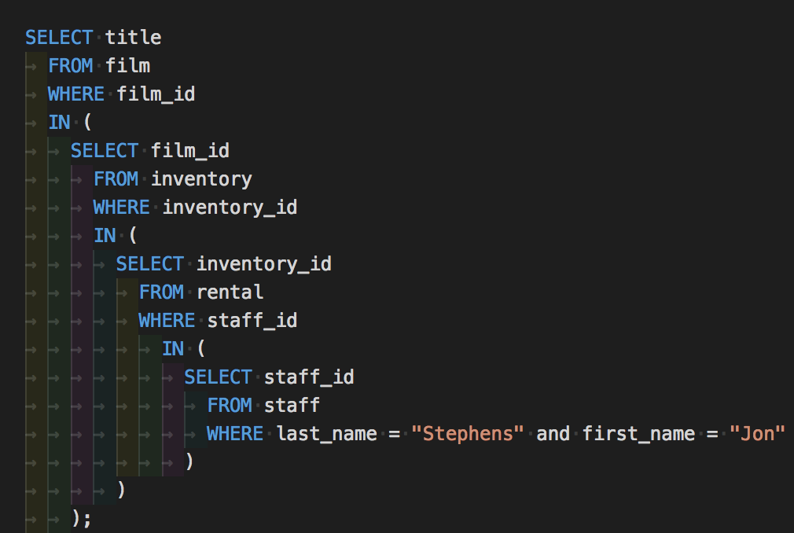

  * Similarly to the first problem, the query begins with the most specific piece of information and works its way up.
  * The employee name is used to query his `staff_id`.
  * The `staff_id` is used to retrieve the `inventory_id` from rentals.
  * The `inventory_id` is then used to retrieve the `film_id`, which in turn is used to retrieve the relevant film titles.

- - -

### 17. BREAK (0:40)

- - -

### 18. Instructor Do: Intro to Foreign Keys (0:20)

* **Files**:

  * [Activities/07-Ins_Foreign_Keys/seed.sql](Activities/07-Ins_Foreign_Keys/Resources/seed.sql)

* We will delve further into concepts of table design with this activity, in which the student is introduced to the concept of foreign keys.

* Tell your students that up to this point in the `sakila` database, we've been dealing with multiple tables that share columns with matching data. They are the basis of joins that we have been performing.

* Ask this question to the class: Suppose that we have two tables that share the same column. What would happen if we updated the data in that column in one of the two tables? What would happen to the data in the same column in the other table? They would no longer match! This would be a problem, one that is solved by using a constraint called foreign keys.

  * A foreign key is a link between tables. The foreign key in a first table "points" to, or is linked to, the primary key in a second table.

  * A foreign key also prevents invalid data from being entered into a column. The data being entered **has** to be a value from the referenced column.

* Let's walk through an example to illustrate foreign keys.

* Slack out the [code](Activities/07-Ins_Foreign_Keys/Resources/seed.sql) to the class.

1. In MySQL Workbench, switch to the `animals_db` with `USE animals_db;`.

2. Create a table called `animals_all` with the following code:

   ```sql
   CREATE TABLE animals_all (
   id INTEGER(11) AUTO_INCREMENT NOT NULL,
   animal_species VARCHAR(30) NOT NULL,
   owner_name VARCHAR(30) NOT NULL,
   PRIMARY KEY (id)
   );
   ```

3. So far so good. We insert some rows into our new table:

   ```sql
   INSERT INTO animals_all (animal_species, owner_name)
   VALUES ("Dog", "Bob");

   INSERT INTO animals_all (animal_species, owner_name)
   VALUES ("Fish", "Bob");

   INSERT INTO animals_all (animal_species, owner_name)
   VALUES ("Cat", "Kelly");

   INSERT INTO animals_all (animal_species, owner_name)
   VALUES ("Dolphin", "Aquaman");
   ```

4. We now view our table with:

   ```sql
   SELECT * FROM animals_all;
   ```

   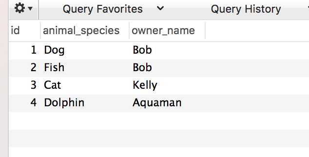

5. Good! But none of this is new. We will now create a new table. Paste the following into MySQL workbench and run it:

   ```sql
   CREATE TABLE animals_location (
   id INTEGER(11) AUTO_INCREMENT NOT NULL,
   location VARCHAR(30) NOT NULL,
   animal_id INTEGER(10) NOT NULL,
   PRIMARY KEY (id),
   FOREIGN KEY (animal_id) REFERENCES animals_all(id)
   );
   ```

* Pause for a moment to go over the above. Explain that we've created a column called `animal_id`:

  ```sql
  animal_id INTEGER(10) NOT NULL,
  ```

  * Wait! There's more. Whereas the **primary key** of this table is the `id` column, we now have the `animal_id` column as a **foreign key**. Explain the features of the following line:

    ```sql
    FOREIGN KEY (animal_id) REFERENCES animals_all(id)
    ```

    * Explain that `FOREIGN KEY (animal_id)` identifies the `animal_id` column as a foreign key. More on this in a second.
    * Next, `REFERENCES animals_all(id)` tells us that `animal_id` references, or is linked to, the `id` column in the `animals_all` table.
    * Finally, remind your students that the `id` column is the primary key of the `animals_all` table, while `animal_id` is a foreign key in the `animals_location` table. Both columns, even though they have different names, are designed to contain the same data. In fact, MySQL will complain if we try to change the data in only one of these columns, as we will soon see. Explain also that it is generally a good idea to name foreign key columns to make clear what data they refer to.

6. Now that we've created our second table, we will populate, or fill, it with some rows of data. Run the following code:

   ```sql
   INSERT INTO animals_location (location, animal_id)
   VALUES ("Doghouse", 1);

   INSERT INTO animals_location (location, animal_id)
   VALUES ("Fish tank", 2);

   INSERT INTO animals_location (location, animal_id)
   VALUES ("Bed", 3);

   INSERT INTO animals_location (location, animal_id)
   VALUES ("Ocean", 4);
   ```

7. ...and view the table:

   ```sql
   SELECT * FROM animals_location;
   ```

   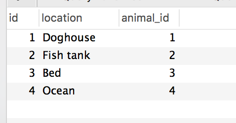

8. Great! Now let's try to insert a new row into the `animals_location` table:

   ```sql
   INSERT INTO animals_location (location, animal_id)
   VALUES ("River", 5);
   ```

   * Error! Give your students a minute to examine why.

   * It is because the `animal_id` column is a foreign key that is pegged to the `id` column in the `animals_all` table. So why, exactly, can't we insert the row above? It's because `id` 5 doesn't exist in the `animals_all` table!

   * So let's now try to insert a row whose `animal_id` DOES correspond to an `id` number in the `animals_all` table:

     ```sql
     INSERT INTO animals_location (location, animal_id)
     VALUES ("River", 4);
     ```

   * And it works! Demonstrate it with `SELECT * FROM animals_all;`

     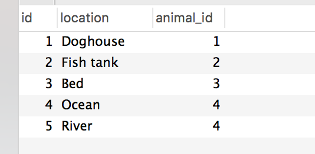

* Let's take a step back and think about foreign keys a little more. Ask students if they can think of other real-world cases where the use of foreign keys makes sense.

  * States/countries in addresses: Tell your students to think back to the `sakila` database, where street addresses, cities, and countries were stored in different tables. So if we were to change the address of a customer who moved to a different country, for example, all the information across the tables would need to change. This is called maintaining the _referential integrity_.

  * ID number of employees: In a database where the ID number of an employee is used in multiple tables, what happens if the employee's ID number should change? It would need to be changed across all the tables that contain it.

* Emphasize that using foreign keys to build relationships between data is a strong suit of relational databases, hence the name.

### 19. Partners Do: Foreign Keys (0:10)

* **Files**:

  * [Activities/08-Par_Foreign_Keys/README.md](Activities/08-Par_Foreign_Keys/README.md)
  * [Activities/08-Par_Foreign_Keys/Unsolved/foreign_keys.sql](Activities/08-Par_Foreign_Keys/Unsolved/foreign_keys.sql)

* In this activity, students will pair up and create tables with foreign keys.

### 20. Instructor Do: Review Foreign Keys (0:05)

* **Files**:

  * [Activities/08-Par_Foreign_Keys/Solved/foreign_keys.sql](Activities/08-Par_Foreign_Keys/Solved/foreign_keys.sql)

* A table called `customer_email` is created.

  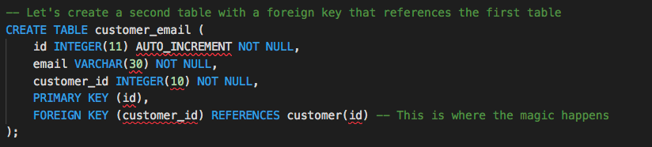

  * Its `customer_id` is a foreign key that references `id` of the `customer` table.

* The `customer_phone` table is also created and references the same column as its foreign key:

  

* The `customer` table was populated in the familiar way:

  

* To populate the `customer_email` table, we can use information from the already populated table:

  

  * Repeat the same process to populate the `customer_phone` table.

### 21. Instructor Do: Introduction to Unions (0:10)

* **Files**:

  [Activities/09-Ins_Unions/unions.sql](Activities/09-Ins_Unions/Solved/unions.sql)

* Unions are perhaps a less crucial topic than some others covered in this lesson, so adjust the timing as you see fit.

* We are now back to using the `sakila` database.

* Begin this activity by reminding your class that when we perform joins, we bring columns from separate tables side-by-side. We can also stack data vertically through an operation called union. Demonstrate a simple union with the following:

  ```sql
  SELECT actor_id AS id, first_name
  FROM actor
  WHERE actor_id between 1 and 5

  UNION

  SELECT customer_id AS id, first_name
  FROM customer
  WHERE customer_id between 6 and 10;
  ```

  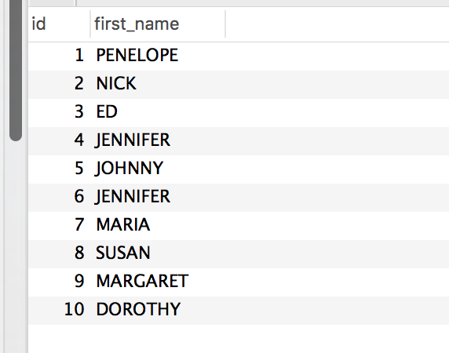

* Explain that by default, MySQL excludes duplicate entries from the result. Ask a student how to query for titles in the table `film` that begin with the letters `AC`:

  ```sql
  SELECT title
  FROM film
  WHERE title LIKE 'AC%';
  ```

* Next, ask another student how we would use union to combine the above with all `title` from the table `film_text`:

* We simply append `SELECT title FROM film_text` to the original query, along with the keyword `UNION`.

  ```sql
  SELECT title
  FROM film
  WHERE title LIKE 'AC%'
  UNION
  SELECT title
  FROM film_text;
  ```

  

* Again, point out that, even though the two tables contain the same titles, duplicates have been filtered out.

* Explain that in cases when we want to display all duplicate entries, we can use the key words `UNION ALL`. Give the students a minute to repeat the above query with `UNION ALL` instead of `UNION`.

  ````sql
          SELECT title
          FROM film
          WHERE title LIKE 'AC%'
          UNION ALL
          SELECT title
          FROM film_text;
          		```
          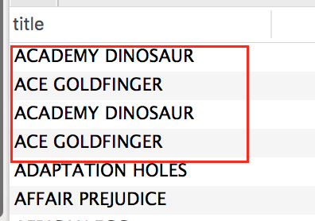
  ````

* As we can see, films whose titles begin with `AC` have not had their duplicate entries filtered out this time.

* Answer any questions before moving on to the activity.

### 22. Students Do: Unions (0:10)

* **Instructions**:

  * [Activities/10-Stu_Unions/README.md](Activities/10-Stu_Unions/README.md)

* This activity will reinforce student practice of unions, and contrast the vertical operation of unions with the horizontal joins that we have been performing.

### 23. Instructor Do: Review Unions (0:05)

* **Files**:

  * [Activities/10-Stu_Unions/Solved/unions.sql](Activities/10-Stu_Unions/Solved/unions.sql)

* This activity is optional. Because unions are fairly intuitive, do the review only if time allows. Otherwise, have the students examine the solution outside the class.

* The first problem simply requires the union of the `COUNT` of rows from `city` and `country`.

  

* The second problem requires a bit more work. In the proposed solution, customer IDs from the `customer` and `customer_list` tables are brought together with `UNION ALL`.

  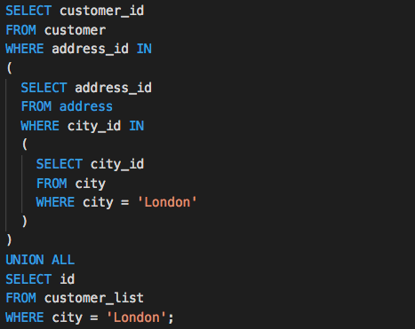

  * Customer IDs from `customer_list` can simply be narrowed down with `WHERE city = 'London'`.
  * To retrieve customer IDs from the `customer` table, subqueries are performed across `address` and `city` tables.

- - -

### LessonPlan & Slideshow Instructor Feedback

* Please click the link which best represents your overall feeling regarding today's class. It will link you to a form which allows you to submit additional (optional) feedback.

* [:heart_eyes: Great](https://www.surveygizmo.com/s3/4381674/DataViz-Instructor-Feedback?section=10.3&lp_useful=great)

* [:grinning: Like](https://www.surveygizmo.com/s3/4381674/DataViz-Instructor-Feedback?section=10.3&lp_useful=like)

* [:neutral_face: Neutral](https://www.surveygizmo.com/s3/4381674/DataViz-Instructor-Feedback?section=10.3&lp_useful=neutral)

* [:confounded: Dislike](https://www.surveygizmo.com/s3/4381674/DataViz-Instructor-Feedback?section=10.3&lp_useful=dislike)

* [:triumph: Not Great](https://www.surveygizmo.com/s3/4381674/DataViz-Instructor-Feedback?section=10.3&lp_useful=not%great)

- - -

### Copyright

Trilogy Education Services (C) 2018. All Rights Reserved.
