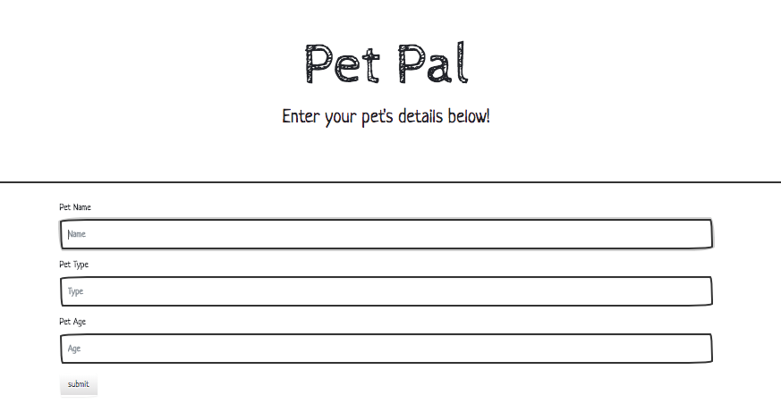
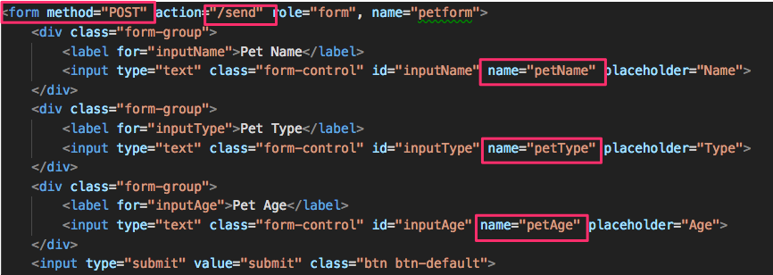

## 15.3 Thanks a Plot!

### Overview

Today's lesson will show students how to create full-stack visualizations using Flask, Plotly, and SQLAlchemy. Finally, students will deploy an app to Heroku.

### Sample Class Video (Highly Recommended)

* To view an example class lecture visit (Note video may not reflect latest lesson plan): [Class Video](https://codingbootcamp.hosted.panopto.com/Panopto/Pages/Viewer.aspx?id=6cf74021-94bc-4b11-95c0-a86700f782dc)

- - -

### Class Objectives

* Students will be able to use Flask to render a Plotly visualization to the browser.

* Students will use Flask to serve data to a Plotly frontend.

- - -

### 01. Instructor Do: Welcome Students (0:05)

* Welcome students, and reassure them that JavaScript will become easier with practice and that this week will give them a lot of opportunity to do just that.

### 02. Instructor Do: Basic Flask (0:15)

* In this activity, you will demonstrate a basic Flask app that uses Plotly to create a chart.

  * Inform the students that their objective for this demonstration is to familiarize themselves with creating an API endpoint with Flask, then calling it from the front end with Plotly and D3.

* First, start the server with `python app.py` in the directory, and open `localhost:5000` in your browser:

  

* Next, open `app.py` and begin to walk through the code with the class. We begin with the second route, `/line`:

  

* Ask students what they think this route will do, then open the browser with this route in the URL:

  

  * As expected, the data is returned as JSON.


* Next, discuss the default route, `/`:

  

* Ask your students what they think this route will do.

  * It uses flask's `render_template()` method to **serve** the `index.html` file, which is located in the `templates` directory.

  


* Now walk through the code in `index.html`:

  


* This is an emphatic point: An API call is made from `index.html` to the `/line` route. This is the same `/line` route from `app.py`.

  * The data is returned in the callback function as `data`, and a Plotly line chart is created using the data.

* Ask students to pair up with a partner to discuss the sequence of events.

  1. Flask serves the file `index.html` with the default route.
  2. Inside `index.html`, an AJAX call is placed to the `/line` route.
  3. Flask route `/line` is activated, and it serves the requested data to the front end.
  4. Plotly uses the received data to display the line chart.

* Answer any remaining questions before moving on.

### 03. Students Do: Never Gonna Give You Up (0:20)

* In this activity, students will create an app displaying a pie chart of Rick Astley's _Never Gonna Give You Up_ lyrics.

### 04. Instructor Do: Review Activity (0:05)

* Display the working solution to the class:

  

* The server sends the information necessary to create this pie chart:

  

  * The documentation is here, if necessary: <https://plot.ly/javascript/pie-charts/>

  * A Plotly pie chart needs `labels` and `values`

  * The labels and values that have been zipped earlier are brought into `data`.


* The front end places an API call to the server to receive this information:

  

  * The API route of `/pie` is placed by `d3.json()`.

  * The information sent from the server is received in the callback function as `data`.
  * A pie chart is constructed using this data, and placed on the DOM element with the ID `pie`.

### 05. Instructor Do: A Full-stack Emoji App (0:15)

* The goal of activity is to familiarize students with the components of a full-stack app with a database, a server with API routes, and a front-end that calls those API routes.

* Demonstrate the working app to students:

  

* Explain that much of the below, except for defining the `class` of the database, is boiler plate:

  

* Next, walk the class through the first route:

  

  * The route is `/emoji_char`.
  * The `results` returns from the database the first ten rows in the `emoji_char` and `score` columns (as Python objects, of course).
  * The data above can be accessed with `results[0]` and `results[1]`, respectively.
  * The data are inserted into a dictionary named `plot_trace`. The current route returns the JSON form of this data.

* Now let's turn to the front end, which defines the API call made to the `/emoji_char` route:

  

  * `d3.json()` places an API call to the `/emoji_char` route.
  * The JSONified form of `plot_trace` from the server is returned in a callback function here as `response`.
  * Before passing this information to Plotly, it is made an array and assigned to the variable `data`.
  * With `Plotly.plot()`, a bar chart is placed in the `div` that has the ID `bar`.

* Answer any questions at this point.

* As the above are important concepts, have students pair up with a partner, and take a few minutes to explain to each other the following:

  * What happens in database setup?
  * What happens inside the flask route?
  * What happens with the API call?

* Reconvene the class, and go over the events that take place with the dropdown menu selection.

* Ask the class how to create a dropdown menu in HTML, then show them this code:

  

  * The three `option` items represent each dropdown item.
  * `onchange="getData(this.value)"`: when the user selects an option different from the current one from the dropdown menu, the function `getData()`, which we define, is called.
  * The argument to the above function is the value of the option item, represented by `this.value`.

* Next, explain the `getData()` function:

  

  * `d3.json()` places an API call to the route (which is passed into the function as its parameter)
  * From the API call it obtains data
  * It then calls the `updatePlotly()` function, which will update the chart on the page.

* The `updatePlotly()` function simply restyles the plot with the new information:

  

* On the Flask backend, the route is created, database is queried, and a JSON form of the response is returned:

  

  * Explain that we can use bring in a SQLAlchemy query object into pandas. This is simply an alternative method of returning data.
  * We could also have bypassed pandas altogether, as in the first route.
  * pandas method `tolist()` is used to convert the data into a list.
  * Do not dwell on the details; this code is here for students' reference.

### 06. Students Do: Bigfoot Afoot (0:25)

* In this activity, students will create a full-stack application comprising a database, server, and front end.

### 07. Instructor Do: Review Activity (0:10)

* Demonstrate the working solution in the browser:

  

* In the Flask route, most of the work was done for the students.

  

  * The only required portion here is to convert the dataframe into a dictionary with `to_dict()` and return its JSONified form.

* Now turn to `app.js`:

  

  * The URL is `/data`, the same route from Flask.
  * `d3.json()` places an API call to the URL, and receives data as `response`.
  * `x` is an array of the months of sighting, returned by `response.map(data => data.months)`
  * A plot is constructed with the data from the API call, and displayed on the browser.

### 08. Everyone Do: Flask Requests (0:20)

* This is an important activity, in which we will cover GET and POST routes. Feel free to demonstrate the code, or have the class code along with you, whichever you deem more appropriate for your class.

* Start `app.py` and open the browser to the `/send` endpoint:

  

  * It displays a very simple form.
  * Enter the information of yourself, or one of your students, and click `submit`.

* Now navigate to `/api/data`:

  

  * It now displays, in JSON, the data submitted from the form.

* Up to this point, we have created Flask routes to **serve** information.

* Explain that we can also create routes to **receive** information.

* Open `app.py` and explain the code to the class.

* Explain that we begin with an empty list called `my_data`, and return the information in the list when the `/api/data` route is called:

  

* Now explain how we **receive** information from the HTML form:

  

  * In the `/send` route, two methods are possible: `GET` and `POST`.

* Have students pair up for a few minutes to research and to discuss `GET` and `POST` methods, the so-called HTML verbs.

* Bring the class back together, and discuss the two methods. Direct the class to <https://www.w3schools.com/tags/ref_httpmethods.asp>.

  * In brief, the GET method is used by the client to retrieve data with the browser, and the POST method is used to submit data.

* In light of this information, ask the class to take a look at the `/send` route, and figure out what is going on:

  

  * If the method is POST, the `nickname` and `age` from the form are saved to the `my_data` list.
  * After submitting, the web page says, "Thanks for the form data!"
  * If the method is GET (i.e. not POST), `form.html` is rendered.

* Demonstrate the above on the browser again.

* Reiterate that the `/send` route has two possibilities: one to display the form, and another to submit and save the data from the form.

* Turn now to the code in `form.html`, and ask students for their observations:

  

  * The `POST` method is specified in the `<form>` tag.
  * The route name, `/send`, is specified as `action`.
  * Two pieces of data here that are submitted to the POST route are `nickname` and `age`.
  * Upon clicking the `submit` button, the data is submitted to the server.

* Send the code to the class. In the remaining time, students will examine and play around with the code.

- - -

### 09. BREAK (0:40)

- - -

### 10. Instructor Do: Flask & SQLAlchemy (0:15)

* So far, we have gone over retrieving and submitting information with GET and POST routes. But the data is not permanently saved, and is lost when we quit the server app.

* Inform the class that we'll now add this important functionality by writing to a SQL database.

* Note to the class that much of the code in the route remains familiar:

  

  * The route provisions for both GET and POST methods.

  * However, instead of appending the submitted information to a Python list, a new object as instantiated as `pet`.

  * And subsequently, the object is added by the SQLAlchemy session, and committed. In other words, the information is written to the SQL database.

* If you like, take a moment to go over the class `Pet` that models the database, but do not dwell too long.

  

* Bring to your class's attention that the existing database is dropped each time that the server is started because of `db.drop_all()`. Getting rid of this line in the code would make the database persistent.

  

* The `/pets` route, which retrieves data from the database, is much the same as before:

  

* Demonstrate the application in the browser.

  


* If time allows, you might also query the database file with sqlite3 to demonstrate the app.

  


* Answer any questions that students may have.

### 11. Students Do: Pet Pals (0:25)

* In this activity, students will build a full stack app with a SQL database, and use the database information to dynamically build a chart in Plotly.

### 12. Instructor Do: Review Activity (0:10)

* Open the browser to the `/send` route, and show that the form collects three pieces of information:

  

  * Pet's name
  * Pet type
  * Pet's age

* Open `form.html` and verify that `petName`, `petType`, and `petAge` are submitted with the POST method.

  

* Next, open `app.py`. Show that we create a `Pet` class with four columns: id, name, type, and age.

  

* Quickly go over the `/send` route. Students should be familiar by this point with the code in this route.

  

  * The GET route returns `form.html`
  * The POST route submits pet info to Flask, which is added to the SQL database with `db.session.add()` and `db.session.commit()`.
  * Mention that `redirect()`, after posting the data, redirects the user to another URL.
  * Feel free to send out this link on the 302 code: <https://en.wikipedia.org/wiki/HTTP_302>

* Next, go over the `/api/pals` route, which sends data to Plotly in the front end.

  

  * The SQLAlchemy query queries the database for the number of pets by type.
  * This data is packaged into a dictionary named `pet_data`, then returned in JSON form.

* In the `/api/names` route, the names of all the pets are queried from the database.

  

  * The names are returned as a list of tuples.
  * One way to flatten out such structures is through `np.ravel()`.

* Next, turn to `app.js` in the `static` directory.

  

* The major points to emphasize here are that:

  * `d3.json()` places an API call to the `/api/pals` route.
  * The data is received as `response` (or another arbitrarily named callback argument).
  * And plotted with `Plotly.newPlot()`.

* This was a challenging activity that required students to integrate what they have learned up to this point, and to juggle multiple moving pieces. Inform them that we'll next go over deploying such an app to the web.

### 13. Instructor Do: Refactoring Code (0:15)

* In this activity, you will introduce students to refactoring code, or the process of reorganizing code to improve its logical structuring.

* First, open the directory and discuss `__init__.py`

  

  * It can be a blank file, as it is in this case.
  * It marks its parent directory as a Python package.
  * Students who are curious about `__init__.py` can consult this link, which provides further information: <https://stackoverflow.com/questions/448271/what-is-init-py-for>

* Open `initdb.py`. Ask students to parse the import statement.

  

* In the `pet_pals` directory, there is `app.py`. From it, import `db`, which is a running instance of SQLAlchemy.

  

  * `pet_pals.app` here, then, means `app.py` in `pet_pals`.

* Next, open `models.py`

  

  * The class model of the SQL table is defined here.
  * Here, too, `db` is imported from `app.py`.
  * Unlike in previous examples, the model for the database has been separated out. This concept is called the separation of concerns: <https://stackoverflow.com/questions/98734/what-is-separation-of-concerns>.
  * Separation of concerns leads to better organized code and easier troubleshooting.


* In `app.py`, explain that `DATABASE_URL` would be replaced by the connection string to the cloud database during deployment on Heroku, for example.

  

### 14. Everyone Do: Heroku Deployment (0:20)

* In this activity, we will deploy the Pet Pals application to Heroku. This step consists of 3 main parts:

  1. Prepare the application with additional configuration files (`Procfile` and `requirements.txt`)
  2. Create the Heroku application
  3. Prepare the Heroku database

#### Part 1: Configuration Files

* If you haven't already, send the code from the previous activity to the class.

* Start by creating a new conda environment just for this app. All of our project dependencies will be installed in this environment. Note: This should only contain python 3.6 and not anaconda.

```sh
conda create -n pet_pals_env python=3.6
```

* Make sure to activate this new environment before proceeding.

```sh
source activate pet_pals_env
```

* Next, we install `gunicorn` with `pip install gunicorn`. Explain that gunicorn is a high performance web server that can run their Flask app in a production environment.

* Because this app will use Postgres, we also install `psycopg2` with `pip install psycopg2`.

* Make sure to install any other dependencies that are required by the application. This may be `Pandas`, `flask-sqlalchemy`, or any other Python package that is required to run the app. **Test the app locally to make sure that it works!**


```
pip install gunicorn
pip install psycopg2
pip install flask
pip install flask-sqlalchemy
pip install pandas
```

* Test the app by first initializing the database:

```sh
python initdb.py
```

* Run the app using the following:


```
FLASK_APP=pet_pals/app.py flask run
```

* Now that all of the the project dependencies are installed, we need to generate the `requirements.txt` file. This file is a list of the Python packages required to run the app, we run `pip freeze > requirements.txt`. Heroku will use this file to install all of the app's dependencies.

* The final configuration file that we need is `Procfile`. This file is used by Heroku to run the app.


```
touch Procfile
```

* Open Procfile in vscode and add the following line:


```
web: gunicorn pet_pals.app:app
```

* Explain that `pet_pals` is the name of the folder that contains your app as a python package (i.e. the name of the folder with the `__init__.py` file in it).

#### Part 2: Creating the Heroku App

* On Heroku, go to the `Deploy` section of your app's homepage, and follow the steps to deploy the app.

  

#### Part 3: Preparing the Database

* After creating a new app on Heroku, navigate to `Resources`:

  

  * Under `Add-ons`, add `Heroku Postgres`. Make sure to use the free version.

* Click on the add on, then navigate to settings and click on `Reveal Config Variables`.

* The connection string to the database should now be available:

  

* Heroku will automatically assign this URI string to the `DATABASE_URL` environment variable that is used within `app.py`. The code that is already in `app.py` will be able to use that environment variable to connect to the Heroku database.

  ```python
  # DATABASE_URL will contain the database connection string:
  app.config['SQLALCHEMY_DATABASE_URI'] = os.environ.get('DATABASE_URL', '')
  # Connects to the database using the app config
  db = SQLAlchemy(app)
  ```

* After adding the database, the final step is to initialize the database. To do this, we use the heroku cli. From the terminal, type the following:


```
heroku run initdb.py
```

* Your database is now initialized, and you can open the application using `heroku open` from the terminal.

- - -

### LessonPlan & Slideshow Instructor Feedback

* Please click the link which best represents your overall feeling regarding today's class. It will link you to a form which allows you to submit additional (optional) feedback.

* [:heart_eyes: Great](https://www.surveygizmo.com/s3/4381674/DataViz-Instructor-Feedback?section=15.3&lp_useful=great)

* [:grinning: Like](https://www.surveygizmo.com/s3/4381674/DataViz-Instructor-Feedback?section=15.3&lp_useful=like)

* [:neutral_face: Neutral](https://www.surveygizmo.com/s3/4381674/DataViz-Instructor-Feedback?section=15.3&lp_useful=neutral)

* [:confounded: Dislike](https://www.surveygizmo.com/s3/4381674/DataViz-Instructor-Feedback?section=15.3&lp_useful=dislike)

* [:triumph: Not Great](https://www.surveygizmo.com/s3/4381674/DataViz-Instructor-Feedback?section=15.3&lp_useful=not%great)

- - -

### Copyright

Coding Boot Camp © 2017. All Rights Reserved.
