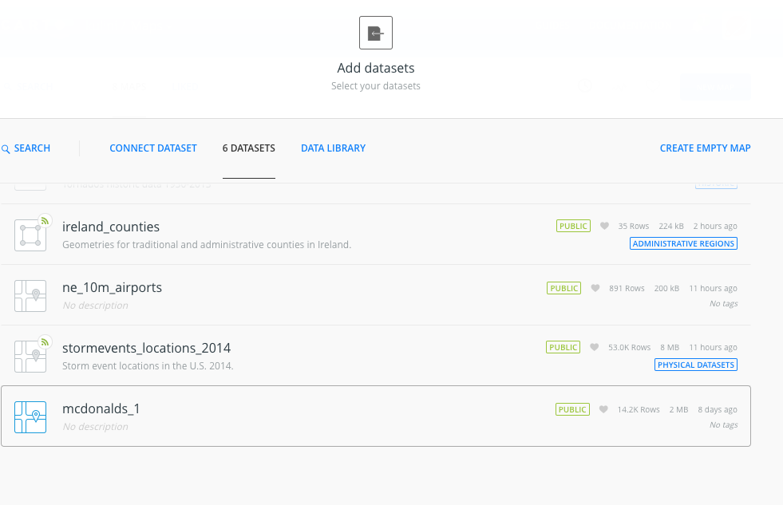
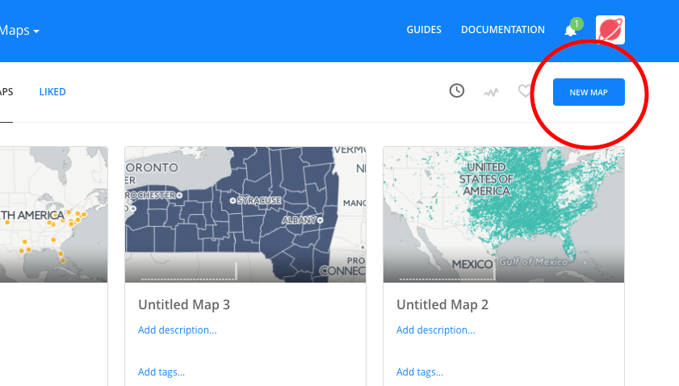
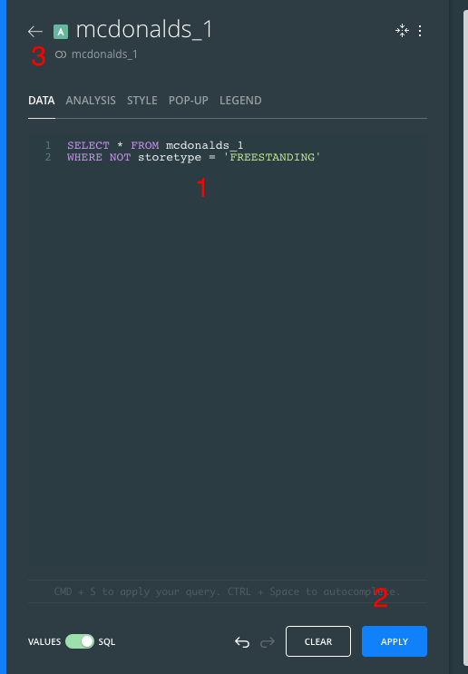
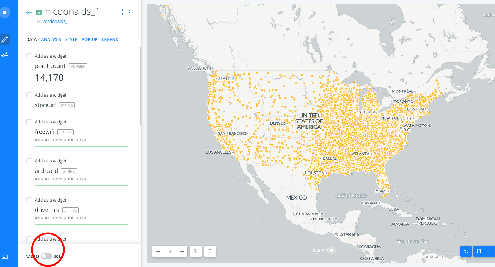
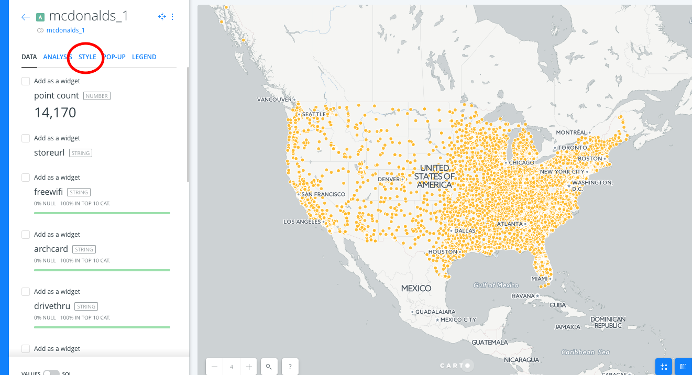
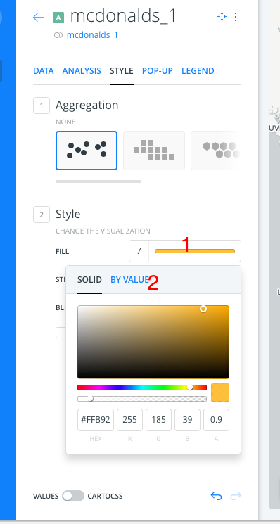
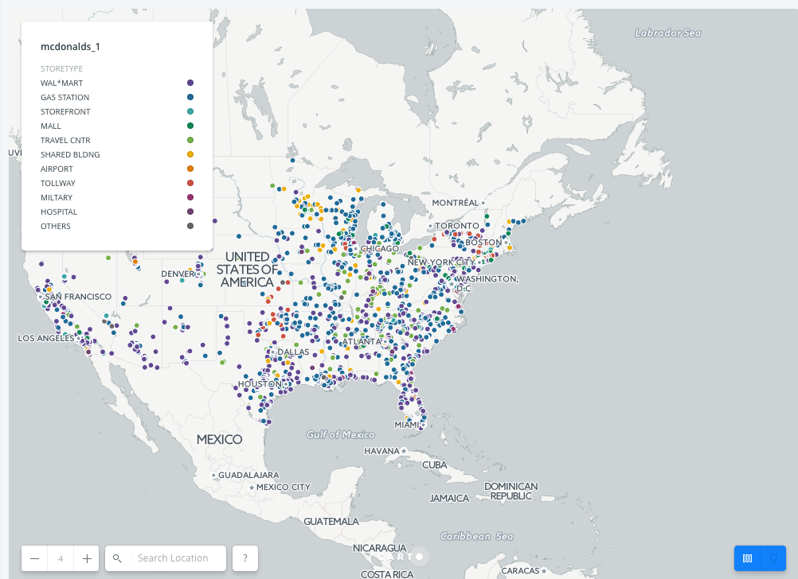
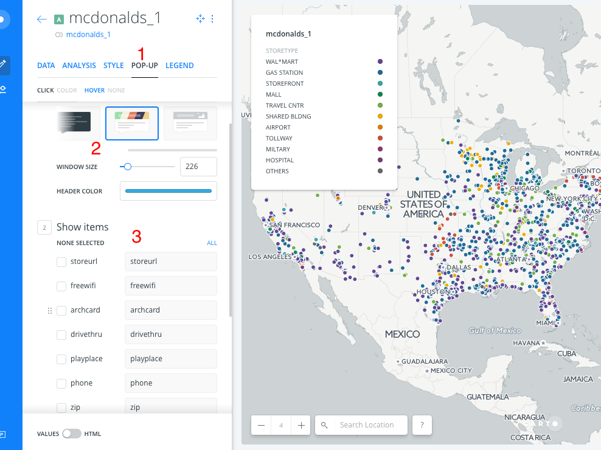
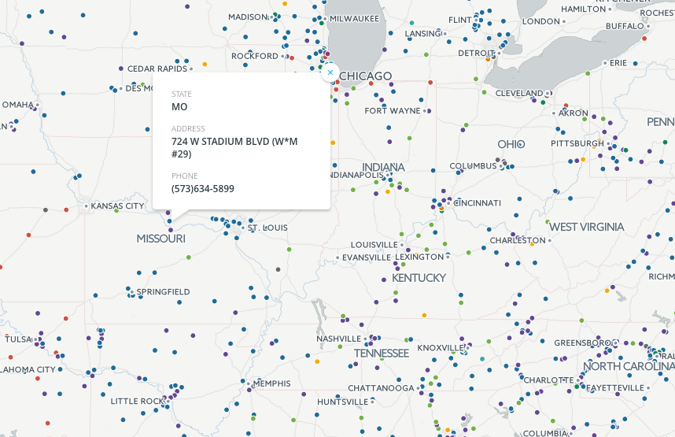

# Legend and Popups

In this activity we colored markers by `storetype` using the GUI. We added a legend and popups to our markers to display some information about each McDonald's location.

## Instructions

We will add a legend to the map which will provide information on how to interpret the map. We will also add popups to individual markers that will provide information specific only to that marker.

1. From the dashboard, create a new map, select the McDonald's dataset, then select the data layer:

   

   

   

2. We will then use a SQL query to select for McDonald's that aren't freestanding locations. That is, we will only select for locations inside a Wal\*Mart, an airport, etc. This is to reduce the density on the map.

3. Toggle `VALUES` at the bottom of the screen to `SQL`:

   

4. Modify the SQL query to exclude freestanding locations, click APPLY, then click on the back arrow to return to the previous screen.

   

5. Now click on McDonald's layer icon again, then the `STYLE` tab:

   

6. Click directly on the color bar, next to `FILL`, then on `BY VALUE`. Finally, click on `storetype`. A legend will be automatically created for you, differentiating the various types of McDonald's locations by color. Note that, if you like, it is also possible to customize the legend by clicking on `LEGEND`. Under `Select Style`, click on `CUSTOM` to further customize information and styling of the map legend.

   

   

7. Neat! Let's now add popups to each marker, displaying the location's address and phone number. Click on the `POPUP` tab, choose from one of the several stylings, then select which informational items to show:

   

8. Publish the map, and now you should be able to click on (or hover over, depending on which option you chose for your popups) a marker for more info:

   

- - -

* View a [working demo](https://ceckenrode.carto.com/builder/08dc274a-f85f-11e6-926e-0e05a8b3e3d7/embed)
