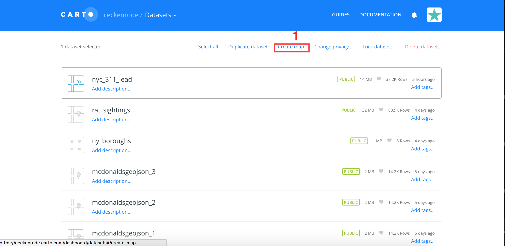

# Choropleth Lead

In this activity, we will use two datasets, a polygon map of the 5 boroughs of New York and GeoJSON containing all of the lead related complaints in New York. We will combine these datasets to create a choropleth map displaying the number of lead-related complaints in each borough.

## Instructions

* We will use two datasets for this activity: 

  1. A dataset containing the geographical information of the boroughs. We will use this to create a base-map.

  2. A dataset containing information about lead-related complaints in New York. We will use this to create an info-layer.

* Our first dataset will be from the data library already available on CARTO. From the `DATA LIBRARY` tab under `Datasets`, choose the `ny_boroughs` dataset. If it is not available on CARTO's website, it is also available in the [Data Folder](Data).

  

* Take a moment to examine the ny_boroughs dataset from within CARTO. Although the CSV file is several megabytes in size, the information actually contained within is sparse, only pertaining to the geographical coordinates of New York City:

  

* Now, we will obtain the dataset of 311 lead related complaints. This is supplied inside the [Data Folder](Data) as `nyc-311-lead.csv`. The lead data has already filtered through 311 Requests (non-emergency requests in NYC) for lead-related complaints.

* Once the file has been obtained, we will need to upload it to CARTO. On the landing page, click on `Maps` to access the drop-down menu, then on the `NEW DATASET` button in the new page.

  

  

* Now click on `CONNECT DATASET`, followed by `Data file`. Upload `nyc-311-lead.csv`. This may take a few moments to complete. If you haven't already, upload the `ny_boroughs` dataset from here as well.

* Now we create our base map with `ny_boroughs` dataset. From the dashboard, click on the `NEW MAP` button. It should be available under the `DATASETS` tab. Select the dataset, then create a new map.

  

* Click on `ADD ANALYSIS`

  

* Click next on the `Intersect second layer` option, which will allow us to merge the two datasets.

  

* Under `Aggregate intersection` select the correct dataset for lead complaints. `OPERATION` should display `COUNT`. When you click `APPLY`, it will take CARTO a few moments to process the information.

  

* Finally, we style our map. As we have done previously, we click on the `STYLE` tab, followed by the `FILL` color bar, then under `BY VALUE`, `count_vals_density`. `count_vals` and `count_vals_density` are new columns that have been created by joining the two datasets. We end up with a choropleth map of lead related complaints in NYC!

* Select the column `count_vals` instead of `count_vals_density`, and watch what happens to the map shading. With `count_vals`, the borough with the highest number of complaints will be shaded the darkest, whereas, with `count_vals_density`, the borough with the darkest shading will have the highest concentration of lead related complaints. `count_vals_density` is often represented as a decimal number. This is the number of complaints divided by the polygon area.

  

## Bonus

Add popups to display the borough name and number of lead-related complaints when clicked on.

- - -

* View a [working demo](https://ceckenrode.carto.com/builder/999017e0-f39d-11e6-bacf-0ee66e2c9693/embed)
